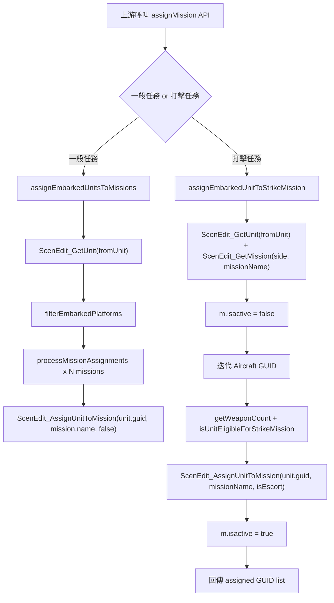

# assignMission — 任務指派與出擊名單篩選模組

> 原始碼：`src/modules/assignMission.lua`

**職責**：從母艦/基地的 embarked units 中篩選符合條件的平台，並指派到兩類任務流程（一般任務與打擊任務）。

---

## 概觀

`assignMission` 是任務分派的薄層服務，集中處理「可否被派遣」判定與 `ScenEdit_AssignUnitToMission` 呼叫。  
模組本身不建立任務，也不負責目標選取，主要接收上游已整理好的 mission descriptor 後執行單位分配。

此模組分成兩條路徑：

1. `assignEmbarkedUnitsToMissions(...)`：供兩棲/運補流程使用，依平台型別與 DBID 先做過濾，再對多個 mission 逐一填補名額。
2. `assignEmbarkedUnitToStrikeMission(...)`：供 Strike Planner 使用，針對航空平台檢查掛載武器與待命狀態後分派至指定打擊任務。

模組會直接改動平台與任務狀態，例如把符合條件的平台 `manualSpeed` 設為 `"OFF"`、暫時關閉 mission 的 `isactive` 後再恢復啟用。

---

## 主要機制說明

### 1) Embarked 平台篩選（一般任務）

- `filterEmbarkedPlatforms(baseUnit, platformType, platformDBID)` 先讀取 `baseUnit.embarkedUnits[platformType]`。
- 每個 GUID 透過 `GameApi.ScenEdit_GetUnit` 取得單位，僅保留 `unit.dbid == platformDBID` 的平台。
- 命中者會被設為 `unit.manualSpeed = "OFF"`，再進入後續任務分派。

### 2) 任務可分派條件（一般任務）

- `canAssignUnitToMission(unit, mission)` 條件：
  - 單位尚未在任何 mission（`not unit.mission`）
  - 且 `mission.loadoutId == 0` 或 `unit.loadoutdbid == mission.loadoutId`
- `processMissionAssignments(filteredPlatforms, mission)` 會累計成功數，達到 `mission.unitCount` 即停止。
- 若 `ScenEdit_AssignUnitToMission` 失敗，會繼續嘗試下一架/下一艘，不會直接中止整個 mission。

### 3) 打擊任務資格判定

- `getWeaponCount(unitGuid, weaponDBID)` 讀取 `ScenEdit_GetLoadout(unitGuid)`，回傳指定 `wpn_dbid` 的 `wpn_current`。
- `isUnitEligibleForStrikeMission(unit, weaponCount, unitDBID)` 條件：
  - `unit.readytime_v == 0`
  - `unit.mission == nil`
  - `weaponCount > 0` 或 `unit.dbid == unitDBID`
- 意義：可用武器不足時，仍可透過 `unitDBID` 做特定機型強制納入。

### 4) 打擊任務啟閉控制

- `assignEmbarkedUnitToStrikeMission(...)` 先取得任務物件 `m`，立即設 `m.isactive = false`。
- 分派迴圈僅處理 `airbase.embarkedUnits.Aircraft`，成功指派才增加 `count` 與結果陣列。
- 結束前若 mission 尚未啟用，會設回 `m.isactive = true`，最後回傳成功指派 GUID 清單。

---

## 流程圖



---

## Public API

| 函式 | 參數 | 回傳 | 說明 |
|---|---|---|---|
| `assignEmbarkedUnitsToMissions(fromUnit, platformType, platformDBID, missions)` | 母單位 GUID、平台型別、平台 DBID、mission descriptor 陣列 | `nil` | 篩選 embarked 平台後，依各 mission 的 `unitCount/loadoutId` 分派單位 |
| `assignEmbarkedUnitToStrikeMission(fromUnit, unitCount, weaponDBID, unitDBID, missionName, isEscort)` | 基地 GUID、需派遣數量、武器 DBID、機型 DBID、任務名、護航旗標 | `table<integer, string>\|nil` | 對航空平台做掛載/待命條件判定並分派到打擊任務，回傳成功名單 |

---

## 相依與整合

### 直接相依

- `src.utils.gameApi`
  - `ScenEdit_GetUnit`
  - `ScenEdit_AssignUnitToMission`
  - `ScenEdit_GetLoadout`
  - `ScenEdit_GetMission`

### 主要上游呼叫者

- `src/modules/landingOps/amphibiousLogistics.lua`
  - `processShipAssignments(...)`
  - `transferAndAssignTransportAircraft(...)`
- `src/modules/strikePlanner/airTaskingOrder.lua`
  - `assignPackageUnits(...)`

### 觸發脈絡

- 兩棲運補路徑：由 landing ops 定時/事件流程觸發，完成 cargo transfer 後立即呼叫本模組分派。
- 空中打擊路徑：由 strike planner 排程執行，在 package mission 建立後呼叫本模組填入 striker/escort 等機隊。

---

## 核心資料結構（本模組關注欄位）

```text
CMO__Unit (base/airbase)
├── guid
├── side
└── embarkedUnits
    ├── Aircraft: string[]  # GUID list
    └── Boat: string[]      # GUID list

CMO__Unit (embarked platform)
├── guid
├── dbid
├── mission
├── loadoutdbid
├── readytime_v
└── manualSpeed

SBJ__LandingMissionDescriptor
├── name
├── unitCount
└── loadoutId
```

---

## config / constants / saveData 引用整理

### config

本模組未直接讀取 `config.*`。

### constants

本模組未直接讀取 `constants.*`。

### saveData

本模組未直接讀寫 `saveData`，狀態由上游模組管理。

---

## 相關模組連結

- [attackManager](attackManager.md)
- [strikePlanner 系統架構](strikePlanner/README.md)
- [landingOps 系統架構](landingOps/README.md)
