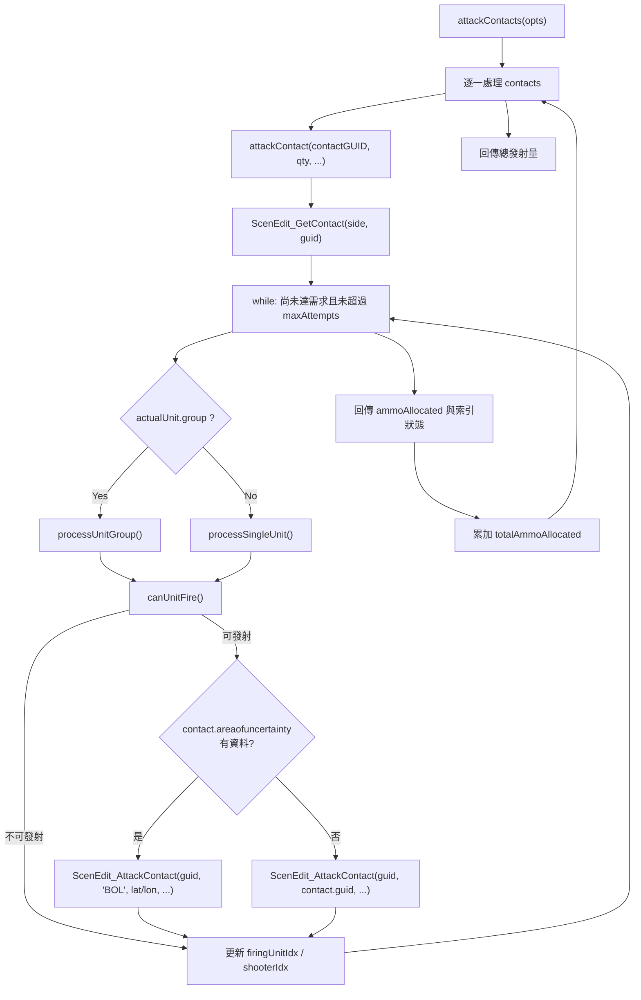

# attackManager — 火力分配與攻擊執行模組

> 原始碼：`src/modules/attackManager.lua`

**職責**：依目標需求彈量、發射單元狀態與既有武器分配，執行對地/對面目標攻擊並回傳已分配彈量。

---

## 概觀

`attackManager` 是通用攻擊執行層，供地面火力、艦隊火力與排程腳本重用。  
它不負責挑選目標，也不管理任務節奏，而是專注在「現在是否可打、可以打多少、由誰打」。

模組核心流程分為兩層：

1. `attackContacts(opts)`：多目標迭代入口，維持 `firingUnitIdx / shooterIdx` 跨目標輪轉。
2. `attackContact(...)`：單目標分配引擎，針對單位或群組逐次嘗試發射直到滿足條件或達到嘗試上限。

交戰檢核集中於 `canUnitFire`，會依序檢查 Doctrine（Hold Fire）、可用彈量、掛載分配上限與目標既有分配量，避免不必要發射。

---

## 主要機制說明

### 1) 目標既有分配量檢查

- `getAmmoAllocatedForTarget(contactGUID, sideName)` 透過 `GameApi.ScenEdit_WeaponAllocation("", contactGUID, sideName)` 彙總 `qtyAssigned`。
- 若目標已達需求彈量，`canUnitFire` 直接拒絕，並記錄 `constants.TAGS.ATTACK_MANAGER` log。

### 2) 單位可發射判定

`canUnitFire(unit, contact, weaponInfo, totalAmmoRequested)` 檢查：

- Doctrine 是否為 `weapon_control_status_land == 2`（Hold）
- `availableWeapons > 0`
- `assignedWeapons < maxWeapons`
- 目標現有分配量是否尚未滿足需求

### 3) 群組與單機處理差異

- 群組路徑：`processUnitGroup(...)` 使用 `group.unitlist[shooterIdx]` 指向本次射手，成功後依群組末端決定是否切到下一 firing unit。
- 單機路徑：`processSingleUnit(...)` 直接對當前單機計算一次發射量並嘗試攻擊。

### 4) 不確定區目標的 BOL 發射

`processUnitGroup` 與 `processSingleUnit` 在實際呼叫 `ScenEdit_AttackContact` 前會檢查 `contact.areaofuncertainty`：

- 若有不確定區（`#contact.areaofuncertainty > 0`），改用 `"BOL"` 目標字串並帶入 `contact.latitude` / `contact.longitude`，讓武器以 BOL 模式發射至最後已知座標
- 否則使用 `contact.guid` 直接鎖定目標

兩條分支在其餘參數（`mode`、`qty`、`mount`、`weapon`）保持一致。

### 5) 輪轉與防呆

- `attackContact` 以 `maxAttempts = 50` 限制迴圈，避免異常配置造成長時間循環。
- 每次循環更新 `firingUnitIdx` 與 `shooterIdx`，可在多波次/多目標下平均使用發射資源。

---

## 流程圖

---

## Public API

| 函式 | 參數 | 回傳 | 說明 |
|---|---|---|---|
| `attackContact(contactGUID, ammoToAllocate, firingUnits, firingUnitIdx, shooterIdx, weaponDBID, sideName)` | 單一目標 GUID、需求彈量、發射單元清單與輪轉索引 | `{ firingUnitIdx, shooterIdx, ammoAllocated }` | 針對單一目標執行分配與攻擊，並回傳下一輪索引 |
| `attackContacts(opts)` | `opts.contacts`, `opts.qty`, `opts.firingUnits`, `opts.weaponDBID`, `opts.sideName` | `integer` | 迭代多目標，累計總發射量；`sideName` 預設 `constants.SIDES.ENEMY` |

---

## 相依與整合

### 直接相依

- `src.utils.gameApi`：`ScenEdit_GetContact`、`ScenEdit_GetUnit`、`ScenEdit_GetDoctrine`、`ScenEdit_WeaponAllocation`、`ScenEdit_AttackContact`
- `src.utils.gameUtils`：`getWeaponInfo`
- `src.utils.logger`：`log` / `error`
- `src.core.constants`：`TAGS.ATTACK_MANAGER`、`SIDES.ENEMY`

### 主要上游呼叫者

- `src/modules/strikePlanner/fireSupportPlan.lua`
- `src/modules/landingOps/init.lua`
- `src/scripts/china/scheduledStrikePlanner.lua`

---

## config / constants / saveData 引用整理

### config

本模組未直接存取 `config.*`。

### constants

| 路徑 | 用途 |
|---|---|
| `constants.TAGS.ATTACK_MANAGER` | 記錄不可發射原因（彈量不足、分配已滿、目標已足量） |
| `constants.SIDES.ENEMY` | `attackContacts` 的預設 `sideName`（`China`） |

### saveData

本模組不直接讀寫 `saveData`，由上游模組整理目標與 firing units 後傳入。

---

## 相關模組連結

- [strikePlanner 系統架構](strikePlanner/README.md)
- [fireSupportPlan](strikePlanner/fireSupportPlan.md)
- [landingOps 系統架構](landingOps/README.md)

