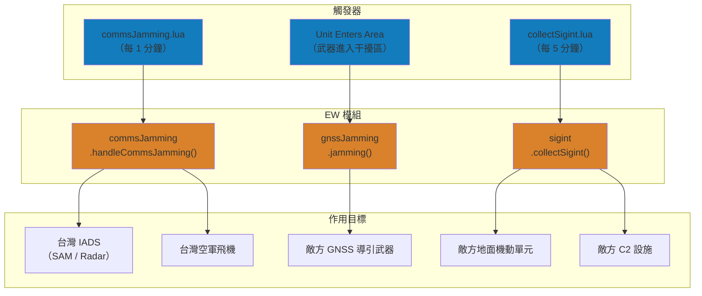
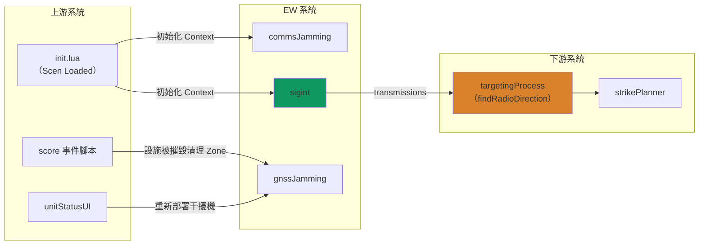
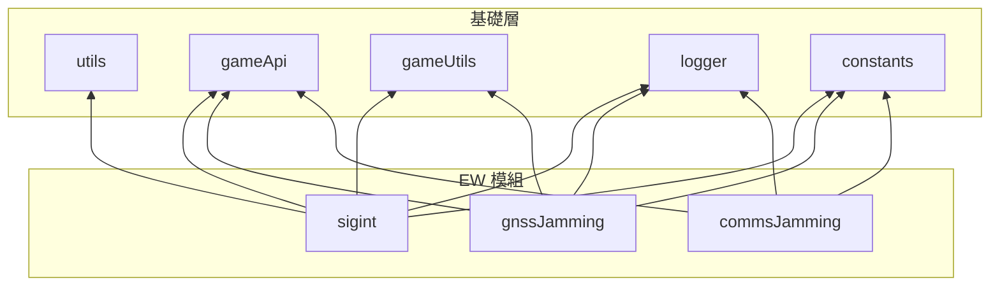

# Electronic Warfare 系統架構

本文件說明 `src/modules/ew/` 的整體設計架構、模組間協作關係及資料流。各模組的詳細說明請參閱對應文件。

---

## 概述

Electronic Warfare（電子戰）系統模擬台海衝突中的三種電子戰能力：通訊干擾、GNSS 導航干擾與通訊情報蒐集。系統同時支援中國與台灣/美國雙方使用，依陣營配置不同的作戰參數與目標。

- **通訊干擾**（Comms Jamming）：中國電戰機對台灣 IADS 雷達/SAM 與空中飛機的通訊實施干擾
- **GNSS 干擾**（GNSS Jamming）：雙方部署地面干擾設施，對敵方 GNSS 導引武器實施航路偏移
- **通訊情報蒐集**（SIGINT）：中國/美國偵察機對敵方地面機動單元與 C2 設施進行無線電偵測

### 電子戰能力對應

| 能力 | 對應模組 | 攻擊方 → 防禦方 | 說明 |
|:-:|---|---|---|
| **通訊干擾** | [commsJamming](commsJamming.md) | 中國 → 台灣 | 降低 IADS 通訊品質、迫使飛機 RTB |
| **導航干擾** | [gnssJamming](gnssJamming.md) | 中國 ↔ 台灣 | 偏移 GNSS 導引武器航路 |
| **情報蒐集** | [sigint](sigint.md) | 中國/美國 → 對方 | 偵測敵方無線電發射源、累積 autodetectable |

---

## 模組一覽

| 模組 | 原始碼 | 職責 |
|---|---|---|
| [commsJamming](commsJamming.md) | `commsJamming.lua` | 通訊干擾狀態機、策略模式選擇干擾方式、飛機通訊品質監控 |
| [gnssJamming](gnssJamming.md) | `gnssJamming.lua` | GNSS 干擾區域管理、武器航路偏移、干擾設施生命週期 |
| [sigint](sigint.md) | `sigint.lua` | 偵測機率計算、訊號三角定位模擬、偵測等級累積/衰減 |

---

## 系統架構圖

### 觸發方式與資料流



### 與其他系統的串接



---

## 核心資料結構

### 通訊干擾

```
saveData.c.commsJamming
└── jammers: table<string, SBJ__AircraftContext>
    └── AircraftContext
        ├── guid / OODA
        ├── commsLevel / commsBase
        ├── commsThreshold
        └── outofcomms: number

saveData.t.iads (作用目標)
├── rocc: table<string, SBJ__C2Context>
│   └── C2Context
│       ├── sam: table<string, SBJ__RadarContext>
│       └── radar: table<string, SBJ__RadarContext>
└── taaoc: table<string, SBJ__C2Context>
    └── C2Context
        └── sam: table<string, SBJ__RadarContext>

SBJ__RadarContext (被干擾目標)
├── guid / name
├── isOutOfComms: boolean
└── outofcomms: number (狀態計數器)
```

### GNSS 干擾

```
config.*.gnssJamming
└── jammers: table<string, SBJ__GNSSJammerDescriptor>
    └── GNSSJammerDescriptor
        ├── name: string (單元名稱)
        ├── zoneName: string (Zone 描述)
        ├── point: CMO__Location (部署座標)
        ├── radius: number (干擾半徑 nm)
        └── randomRadius: number (部署隨機偏移 nm)
```

### SIGINT

```
saveData.*.sigint
├── reconAircraft: table<string, SBJ__AircraftContext>
│   └── AircraftContext
│       ├── guid / OODA
│       ├── commsLevel / commsBase
│       ├── commsThreshold
│       └── outofcomms: number
└── transmissions: table<string, SBJ__TransmissionRecord>
    └── TransmissionRecord
        ├── name / guid / msg / type
        ├── latitude / longitude
        ├── currentDetectionLevel: number
        ├── autodetectable: boolean
        ├── firstDetected / lastDetected
        ├── detectionCount / confidence
        └── contacts: table
```

---

## 模組依賴關係



---

## 設定檔參考

### config.lua（運行期配置）

| 設定路徑 | 用途 |
|---|---|
| `config.c.commsJamming.limit` | 每架干擾機最多同時干擾目標數 |
| `config.c.commsJamming.range` | 干擾有效範圍 (nm) |
| `config.c.commsJamming.mode` | 干擾模式（`omnidirectional` / `directional`） |
| `config.c.commsJamming.baseJammingPower` | 干擾基礎功率 |
| `config.c.commsJamming.effectivenessFormula` | 全向干擾效果公式參數 |
| `config.c.commsJamming.distanceThresholds` | 距離分類門檻 (nm) |
| `config.c.commsJamming.aewSupport` | AEW 通訊支援加成 |
| `config.c.commsJamming.aircraftDefaults` | 飛機通訊預設值 |
| `config.c.gnssJamming.jammers` | 中國側 GNSS 干擾機部署定義 |
| `config.c.gnssJamming.gnssGuidedWeapons` | 可被干擾的 GNSS 導引武器清單 |
| `config.c.gnssJamming.radius` | 中國側干擾有效半徑 (nm) |
| `config.t.gnssJamming.jammers` | 台灣側 GNSS 干擾機部署定義 |
| `config.t.gnssJamming.gnssGuidedWeapons` | 可被干擾的 GNSS 導引武器清單 |
| `config.t.gnssJamming.radius` | 台灣側干擾有效半徑 (nm) |
| `config.c.sigint.maxCount` | SIGINT 偵測次數門檻（超過後 autodetectable） |
| `config.c.sigint.maxRange` | SIGINT 最大偵測距離（與 transmissions 比較） |
| `config.c.sigint.detectionThreshold` | 保證偵測距離 (nm) |
| `config.c.sigint.maxDetectionRange` | 最大偵測距離範圍 |
| `config.c.sigint.formulaConstants` | 偵測機率與訊號偏差公式參數 |
| `config.c.sigint.detectionSkipProbability` | 效能最佳化隨機跳過機率 |
| `config.u.sigint.*` | US 側 SIGINT 配置（引用 China 側參數） |

### constants.lua（不可變常數）

| 常數路徑 | 用途 |
|---|---|
| `constants.PLATFORMS.Y9` | Y-9 電戰機 DBID |
| `constants.PLATFORMS.J15D` | J-15D 電戰機 DBID |
| `constants.PLATFORMS.J16D` | J-16D 電戰機 DBID |
| `constants.PLATFORMS.GPS_JAMMER` | GPS 干擾設施 DBID |
| `constants.PLATFORMS.RC135V` | RC-135V 偵察機 DBID（US） |
| `constants.PLATFORMS.Y9DZ` | Y-9DZ 偵察機 DBID（China） |
| `constants.PLATFORMS.C2` | C2 指揮中心 DBID |
| `constants.PLATFORMS.BUNKER_SECTOR_CONTROL_STATION` | 掩體管制站 DBID |
| `constants.ZONE_TYPES.STANDARD` | 標準區域類型（Zone 建立/移除） |
| `constants.UNIT_CONDITIONS.AIRBORNE` | 空中狀態檢查 |
| `constants.UNIT_TYPES.AIRCRAFT` | 飛機單元類型過濾 |

---

## 相關檔案

| 檔案 | 說明 |
|---|---|
| `src/scripts/china/ew/commsJamming.lua` | 通訊干擾排程腳本（每 1 分鐘觸發） |
| `src/scripts/china/ew/collectSigint.lua` | 中國 SIGINT 蒐集腳本（每 5 分鐘觸發） |
| `src/scripts/us/collectSigint.lua` | 美國 SIGINT 蒐集腳本（每 5 分鐘觸發） |
| `src/scripts/score/taiwaneseAssetIsDestroy.lua` | 台灣資產被摧毀時清理 GNSS Zone |
| `src/scripts/score/destroyUnits.lua` | 單元被摧毀時清理 GNSS Zone |
| `src/modules/integratedAirDefenseSystem.lua` | IADS 系統（commsJamming 的目標來源） |
| `src/modules/strikePlanner/targetingProcess.lua` | 目標獲取（消費 SIGINT transmissions） |
| `src/core/init.lua` | 系統初始化（建立 EW Context） |
| `src/core/config.lua` | 運行期配置 |
| `src/core/constants.lua` | 不可變常數 |
