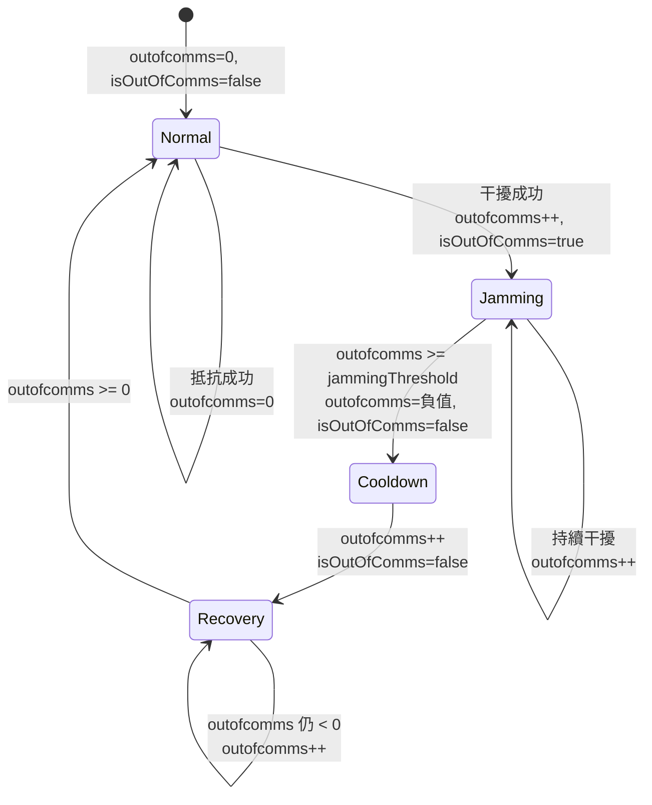
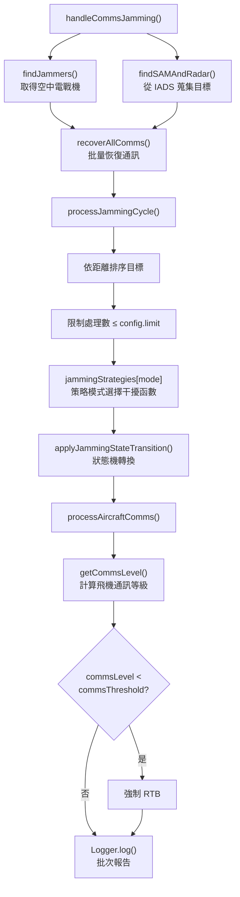

# commsJamming — 通訊干擾

> 原始碼：`src/modules/ew/commsJamming.lua`

**職責**：中國電戰機對台灣 IADS 雷達/SAM 實施通訊干擾，並監控台灣空軍飛機通訊品質

---

## 概述

commsJamming 模擬電子戰中的通訊干擾作戰。系統每 1 分鐘觸發一次，由中國空中電戰機（Y-9、J-15D、J-16D）對台灣 IADS 下轄的 SAM/雷達實施通訊干擾，同時評估台灣飛機的通訊品質，通訊品質低於門檻時強制 RTB。

核心設計採用**策略模式**選擇干擾方式（全向/指向），以及**狀態機**管理干擾→冷卻→恢復的生命週期。

---

## 通訊等級計算

通訊等級（commsLevel）決定單元是否能維持有效通訊，由四個因素加總：

```
commsLevel = initialComms + jammerImpact + AEWSupport + ROCCSupport
```

| 因素 | 計算方式 | 說明 |
|---|---|---|
| `initialComms` | 固定值 (-20) | 干擾基底（負值） |
| `jammerImpact` | `baseJammingPower + distance^distanceExponent` | 所有空中干擾機的累積影響 |
| `AEWSupport` | 依距離分類查表 + 隨機偏差 | 所有空中 AEW 的通訊支援加成 |
| `ROCCSupport` | 依距離分類查表 + 隨機偏差 | 僅取第一個有效 ROCC 的支援 |

距離分類（`distanceThresholds`）：

| 分類 | 距離門檻 (nm) | AEW 加成 |
|---|---|---|
| close | < 100 | 400 |
| medium | < 200 | 350 |
| far | < 300 | 250 |
| distant | < 400 | 150 |

---

## 干擾策略（Strategy Pattern）

透過 `config.c.commsJamming.mode` 選擇干擾模式：

| 模式 | 函數 | 判定邏輯 |
|---|---|---|
| `omnidirectional` | `omnidirectionalJammingWithDistance` | `sqrt(1 - (distance^base / range^range))` > `random()/2` |
| `directional` | `directionalJammingWithDistance` | 距離 < `random(75,100)` 且航向偏差 < `random(12,18)` |

全向模式計算效果值（0-1），與隨機值比較決定是否干擾成功。指向模式同時檢查距離與干擾機航向對準目標的角度偏差。

---

## 干擾狀態機

每個被追蹤的 `RadarContext` 維護兩個狀態欄位：`isOutOfComms`（布林）與 `outofcomms`（整數計數器）。



### 通訊恢復

獨立的 `recoverComms` 函數處理恢復邏輯：

- 已干擾（`isOutOfComms = true`）：遞增計數直到超過 `recoveryTime` 門檻，然後重置
- 未干擾但遊戲引擎顯示通訊中斷：強制恢復（修正不一致狀態）

---

## 主要執行流程



---

## 目標蒐集

`findSAMAndRadar` 遍歷 IADS 結構蒐集所有防空單元：

```
saveData.t.iads
├── rocc → sam[] + radar[]
└── taaoc → sam[]
```

結果以 `table<guid, RadarContext>` 形式回傳，避免重複（同一 GUID 只保留一次）。

---

## 公開 API

| 函數 | 說明 |
|---|---|
| `handleCommsJamming(commsJammingConfig, saveData)` | 主入口：執行干擾循環、通訊恢復、飛機品質監控 |
| `initCommsJammersContext(commsJammingCtx, sideName, aircraftDefaults)` | 初始化干擾機 Context（掃描 Y-9/J-15D/J-16D） |

---

## 相關模組

- [gnssJamming](gnssJamming.md) — 同屬 EW 子系統的 GNSS 干擾
- [sigint](sigint.md) — 同屬 EW 子系統的情報蒐集
- `integratedAirDefenseSystem` — 提供干擾目標（IADS 結構中的 SAM/Radar）
- [系統架構](README.md)
