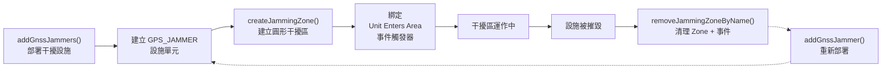
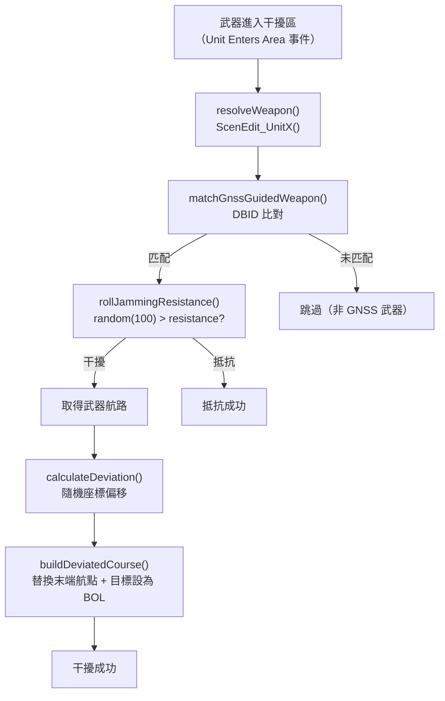

# gnssJamming — GNSS 導航干擾

> 原始碼：`src/modules/ew/gnssJamming.lua`

**職責**：部署 GNSS 干擾設施、管理干擾區域、對進入區域的 GNSS 導引武器實施航路偏移

---

## 概述

gnssJamming 模擬 GPS/GNSS 干擾作戰。與 commsJamming 的定時輪詢模式不同，gnssJamming 採用**事件驅動**架構：在地面部署干擾設施後建立圓形干擾區，當敵方 GNSS 導引武器進入區域時觸發 "Unit Enters Area" 事件，即時對武器航路實施偏移。

此模組支援**雙方使用**：中國與台灣各自配置不同的干擾機部署點、干擾半徑與可干擾武器清單。

---

## 干擾機生命週期



### 部署階段

`addGnssJammers` 對每個 `GNSSJammerDescriptor` 執行：

1. `GameUtils.tryAddUnit()` — 在指定座標（含隨機偏移 `randomRadius`）建立 GPS_JAMMER 設施
2. `ScenEdit_SetEMCON("OECM=Active")` — 啟動電子反制
3. `GameUtils.newArea()` — 以設施為中心建立圓形區域（半徑 = `descriptor.radius`）
4. `ScenEdit_AddZone()` — 建立 Standard Zone（type = -925）
5. `GameUtils.unitEntersAreaEvent()` — 綁定事件觸發器（目標：敵方武器 `TargetType = 6`）

### 清理階段

當干擾設施被摧毀（由 score 事件腳本觸發），`removeJammingZoneByName` 執行：

1. 刪除 Zone 內所有參考點
2. 移除 Standard Zone
3. 移除 Unit Enters Area 事件觸發器
4. 注意：僅清理 Zone，不刪除單元本體（已被摧毀）

---

## 干擾處理流程



### 航路偏移細節

- 偏移量：經緯度各 `random(-100, 100) / 10^4`，約 0.01 度（約 1.1 km）
- 航點處理：替換最後一個航點為偏移座標，保留前段航路不變
- 目標設定：`target.guid = "BOL"`（Bearing Only Launch），使武器失去目標鎖定

### 可干擾武器

| 中國側設定（干擾台灣武器） | 台灣側設定（干擾中國武器） |
|---|---|
| JDAM (50% 抗性) | 東風 FD-280 (50%) |
| 萬劍彈 WAN CHIEN (50%) | 長劍 CJ-10A (50%) |
| Harpoon II (50%) | AKD-88 (50%) |
| JSOW (50%) | LS-6-500 (50%) |
| SLAM-ER (50%) | CS/BBC-5 (50%) |

---

## 描述器結構

干擾機透過 `SBJ__GNSSJammerDescriptor` 定義，統一管理建立、部署與移除：

```
GNSSJammerDescriptor
├── name: string          -- 單元名稱（如 "1st Bn, 1st ECM Bde"）
├── zoneName: string      -- Zone 描述（唯一識別）
├── point: CMO__Location  -- 部署座標（可為 nil 表示延遲部署）
├── radius: number        -- 干擾有效半徑 (nm)
└── randomRadius: number  -- 部署位置隨機偏移 (nm)
```

---

## 公開 API

| 函數 | 說明 |
|---|---|
| `jamming(config, sideName)` | 干擾處理入口：解析武器、比對 DBID、擲骰抗性、偏移航路 |
| `addGnssJammer(descriptor, sideName)` | 建立單一 GNSS 干擾機（指定座標，不含隨機偏移） |
| `addGnssJammers(jammerDescriptors, sideName)` | 批量建立干擾機（含隨機位置偏移） |
| `removeJammers(jammerDescriptors, sideName)` | 移除所有干擾機（單元 + Zone + 事件） |
| `removeJammingZoneByName(jammerDescriptors, sideName, name)` | 依名稱移除特定 Zone（僅清理 Zone，不刪單元） |

---

## 相關模組

- [commsJamming](commsJamming.md) — 同屬 EW 子系統的通訊干擾
- [sigint](sigint.md) — 同屬 EW 子系統的情報蒐集
- `unitStatusUI` — UI 互動觸發干擾機重新部署
- `taiwaneseAssetIsDestroy` / `destroyUnits` — 設施被摧毀時觸發 Zone 清理
- [系統架構](README.md)
