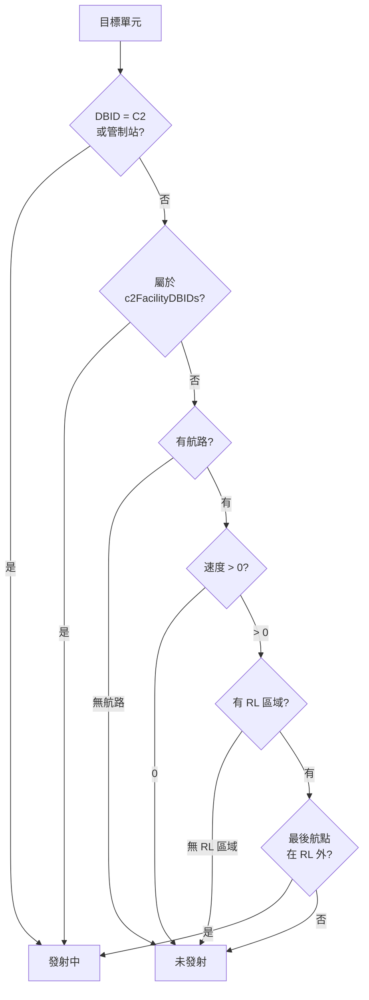
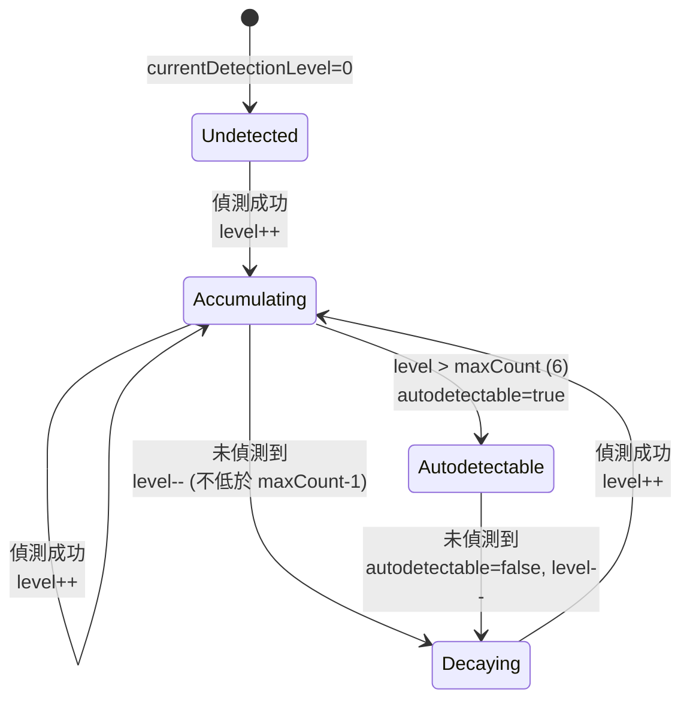
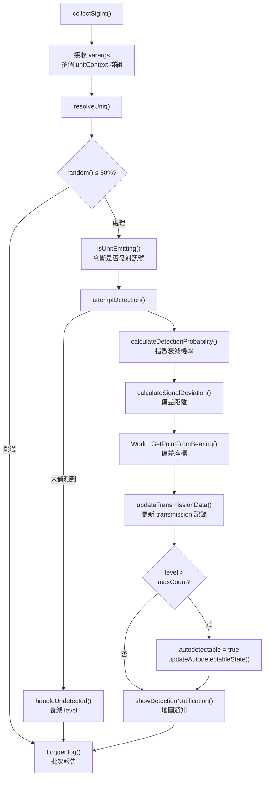

# sigint — 通訊情報蒐集

> 原始碼：`src/modules/ew/sigint.lua`

**職責**：偵察機對敵方地面單元與 C2 設施進行無線電訊號偵測，累積偵測等級並串接打擊規劃

---

## 概述

sigint（Signals Intelligence）模擬通訊情報蒐集作戰。系統每 5 分鐘觸發一次，由空中偵察機（中國 Y-9DZ / 美國 RC-135V）對敵方地面機動單元與 C2 設施進行無線電訊號偵測。

核心機制包含：
1. **指數衰減偵測機率** — 距離越遠偵測機率越低
2. **訊號三角定位模擬** — 偵測位置含距離相關的隨機偏差
3. **偵測等級累積/衰減** — 多次偵測後設為 `autodetectable`，未偵測到則衰減

SIGINT 的 `transmissions` 資料被 `targetingProcess` 的 `findRadioDirection` 篩選函數消費，實現偵察→打擊的 Kill Chain 串接。

---

## 偵測機率模型

使用指數衰減函數模擬電磁波偵測特性：

```
P(x) = e^(-k * x^p)

k = 1/450（衰減率）
p = 0.8（距離冪次）
```

| 距離範圍 | 偵測機率 |
|---|---|
| <= 60 nm | 100%（保證偵測） |
| 60-300 nm | 指數衰減 |
| >= 300-340 nm | 0%（超出範圍，上限含隨機性） |

---

## 訊號三角定位偏差

偵測位置不是精確座標，而是加入基於距離的偏差，模擬遠距離三角定位的不精確性：

```
baseDeviation = baseCoefficient * distance^3.8518 / powerDivisor
randomDeviation = random()^2 函數 * distance^2.25 函數
totalDeviation = baseDeviation + randomDeviation
```

偏差距離隨偵測距離增大而增大，偏差方向完全隨機（`random(0, 359)` 度方位角）。最終偵測座標由 `World_GetPointFromBearing` 從實際位置沿隨機方位角偏移 `totalDeviation` 距離計算得出。

---

## 發射判定邏輯

`isUnitEmitting` 判斷目標是否正在發射無線電訊號：



- **C2 / 管制站 / C2 設施**：永遠發射訊號（固定設施）
- **機動單元**：僅在移動中且正離開 RL 區域（裝填/隱蔽點）時發射

---

## 偵測等級累積/衰減



- 每次偵測成功：`currentDetectionLevel + 1`
- 超過 `maxCount`（6）：設定 `autodetectable = true`（讓其他系統自動偵測到該單元）
- 每次未偵測到：`currentDetectionLevel - 1`（但不低於 `maxCount - 1`）
- 若已 `autodetectable` 而未偵測到：重置 `autodetectable = false`（訊號衰減）

---

## 主要執行流程



---

## 雙方使用配置

| 設定 | 中國側 | US 側 |
|---|---|---|
| 偵察機 | Y-9DZ | RC-135V |
| 目標 | 台灣 SRBM/GLCM/MLRS/ASCM + ROCC/TAAOC | 中國 MLRS/SRBM/GLCM + C2 |
| SIGINT Context | `saveData.c.sigint` | `saveData.u.sigint` |
| 配置參數 | `config.c.sigint` | `config.u.sigint`（引用 China 側） |

---

## 與 strikePlanner 的串接

SIGINT 的 `transmissions` 資料被 `targetingProcess.lua` 的 `findRadioDirection` 篩選函數使用：

1. 合併地面目標與 C2 設施的感測器接觸
2. 計算每個接觸與 `transmissions` 中各無線電源的距離
3. 僅保留距離 <= `maxRange` 且偵測次數 > `maxCount` 的目標
4. 產出的目標供 `dynamicFireSupportPlan` / `dynamicATOInsertion` 生成打擊任務

---

## 公開 API

| 函數 | 說明 |
|---|---|
| `collectSigint(config, sigintContext, sideName, isShown, sigintConfig, ...)` | 主入口：接收多個 unitContext 群組，執行偵測、更新 transmission |
| `initReconAircraftContexts(sigintContext, sideName, aircraftDefaults)` | 初始化偵察機 Context（掃描 RC-135V / Y-9DZ） |
| `calculateDetectionProbability(distance, config)` | 偵測機率計算（@internal，公開供測試使用） |

---

## 相關模組

- [commsJamming](commsJamming.md) — 同屬 EW 子系統的通訊干擾
- [gnssJamming](gnssJamming.md) — 同屬 EW 子系統的 GNSS 干擾
- [targetingProcess](../strikePlanner/targetingProcess.md) — 消費 `transmissions` 資料進行目標篩選
- [系統架構](README.md)
