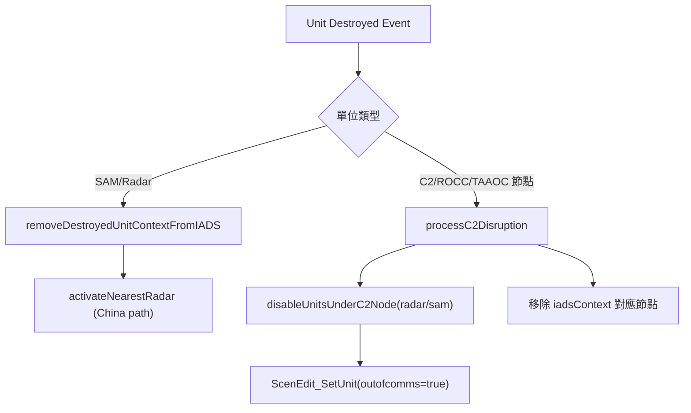

# integratedAirDefenseSystem.lua

中國/台灣 IADS（Integrated Air Defense System）核心模組，負責 C2 節點關聯初始化、毀傷後節點維護與備援雷達啟用。

> Source: `src/modules/integratedAirDefenseSystem.lua`

責任摘要：維護 `saveData.c.iads` 與 `saveData.t.iads` 的 C2/ROCC/TAAOC 關聯，並對單位摧毀事件執行通聯與防空網重配置。

---

## 概觀

此模組封裝 IADS 的三類操作：初始化、毀傷處理、設施生命週期。初始化分成中國 C2（含隨機設施）與台灣 ROCC/TAAOC 兩條路徑，皆會把雷達/SAM 轉換為同一套 context 结构。

毀傷處理由 score event scripts 觸發。當 C2 類節點被摧毀，模組會將其轄下 radar/sam 標記為 `outofcomms`；當一般 radar/sam 被摧毀，則只從對應 context 移除該節點，並視情況啟用最近備援雷達。

特殊動作 `addC2Facilities.lua` 會呼叫本模組先刪再建 C2 設施，最後重建 `saveData.c.iads.c2` 對應。

---

## 主要機制

1. **C2 節點中斷擴散**：`processC2Disruption` 會掃描 `c2/rocc/taaoc` 對應 GUID，逐筆把轄下單位 `ScenEdit_SetUnit({ outofcomms = true })`。
2. **局部毀傷同步**：`removeDestroyedUnitContextFromIADS` 以 `destroyedUnit:inArea(area)` 判斷命中 C2 區域後，從 `sam` 或 `radar` map 移除。
3. **備援雷達啟用**：`activateNearestRadar` 先找專用雷達（JY-26/YLC-8B），找不到才退而求其次選 SAM 雷達（HQ-22/S300/S400/HQ-12）。
4. **中國 C2 建模**：`initC2FacilitiesContext` 先選每個 deployment 的隨機 C2 設施，再將同區域 SAM/雷達掛入該 C2。
5. **台灣 IADS 建模**：`initIADSContexts` 依 `config.t.iads.rocc/taaoc` 描述區域與節點名稱，關聯對應平台到 ROCC 或 TAAOC context。

---

## 流程圖



---

## Public API

| 函式 | 參數 | 回傳 | 說明 |
|---|---|---|---|
| `processC2Disruption` | `iadsContext, c2` | `nil` | C2/ROCC/TAAOC 節點毀傷後，停用轄下單位並移除節點 |
| `removeDestroyedUnitContextFromIADS` | `c2TypeContext, type, destroyedUnit` | `nil` | 從指定 C2 context 移除被摧毀 radar/sam |
| `activateNearestRadar` | `config, sideUnits, destroyedRadar` | `nil` | 啟用距離最近且符合優先級的備援雷達 |
| `addC2Facilities` | `iadsConfig` | `boolean` | 依部署設定新增中國 C2 設施 |
| `initC2FacilitiesContext` | `iadsConfig, iadsContext` | `boolean` | 建立中國 `c2` context 並掛接 SAM/雷達 |
| `initIADSContexts` | `iadsConfig, iadsContext` | `nil` | 建立台灣 `rocc/taaoc` context |
| `removeC2Facilities` | `iadsConfig` | `boolean` | 移除中國側既有 C2 設施 |

---

## 關鍵資料結構（saveData）

```text
saveData
├── c.iads
│   ├── enabled: boolean
│   └── c2: table<string, SBJ__C2Context>
└── t.iads
    ├── enabled: boolean
    ├── rocc: table<string, SBJ__C2Context>
    └── taaoc: table<string, SBJ__C2Context>

SBJ__C2Context
├── name, msg, guid
├── areas: string[]
├── sam: table<string, SBJ__IADSUnitCtx>
└── radar: table<string, SBJ__IADSUnitCtx>  -- taaoc 無此欄位
```

---

## config / constants 引用

### config

| 路徑 | 用途 |
|---|---|
| `config.radarDistance` | `activateNearestRadar` 的搜尋距離上限（由呼叫端傳入） |
| `config.c.iads.c2FacilityDBIDs` | 新增/初始化/刪除中國 C2 設施時的 DBID 白名單 |
| `config.c.iads.randomRadius` | C2 設施隨機部署半徑 |
| `config.c.iads.c2Deployments` | 中國 C2 佈署點（座標、區域、名稱） |
| `config.t.iads.rocc` | 台灣 ROCC 節點描述 |
| `config.t.iads.taaoc` | 台灣 TAAOC 節點描述 |

### constants

| 路徑 | 用途 |
|---|---|
| `constants.SIDES.ENEMY` / `constants.SIDES.PLAYER` | 陣營側查詢與刪除 |
| `constants.UNIT_TYPES.FACILITY` | 設施類型篩選 |
| `constants.TAGS.INTEGRATED_AIR_DEFENSE_SYSTEM` | 模組日誌標籤 |
| `constants.PLATFORMS.JY26` / `YLC8B` | 專用雷達 |
| `constants.PLATFORMS.HQ22` / `S300` / `S400` / `HQ12` | 中國 SAM 系統 |
| `constants.PLATFORMS.CUSTOMED_SAM` / `PAC3` | 台灣 ROCC SAM |
| `constants.PLATFORMS.FPS117` / `TPS43F` / `HR3000` / `GE592` | 台灣 ROCC 雷達 |
| `constants.PLATFORMS.TC2` / `SKY_GUARD` | 台灣 TAAOC SAM |

---

## 相關模組

- `src/core/init.lua`：場景載入時初始化 IADS context
- `src/scripts/score/destroyUnits.lua`：中國單位毀傷事件觸發 IADS 更新
- `src/scripts/score/taiwaneseAssetIsDestroy.lua`：台灣單位毀傷事件觸發 IADS 更新
- `src/scripts/china/specialActions/addC2Facilities.lua`：手動重建中國 C2 設施

