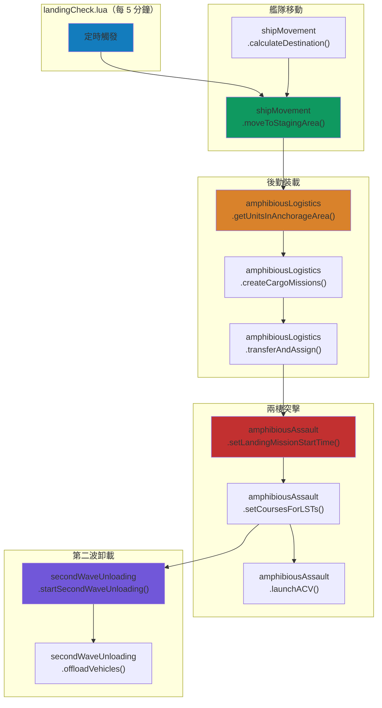
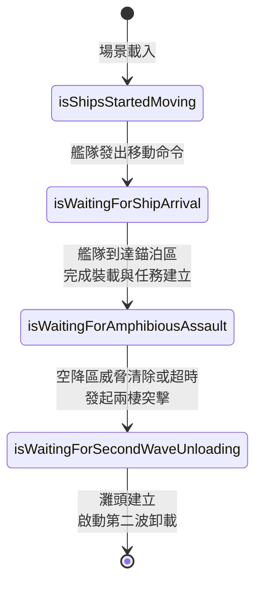
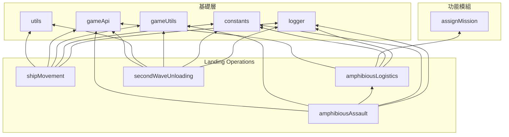

# Landing Operations 系統架構

本文件說明 `src/modules/landingOps/` 的整體設計架構、模組間協作關係及資料流。各模組的詳細說明請參閱對應文件。

---

## 概述

Landing Operations 是中國陣營的兩棲登陸作戰系統，模擬從艦隊集結到灘頭建立的完整登陸流程。系統分為四個核心階段：

- **艦隊移動**：登陸艦從集結區移動至錨泊區，依艦型分層佈置陣形
- **後勤裝載**：貨物轉移至登陸載具（直升機、登陸艇），建立運輸任務
- **兩棲突擊**：LST 搶灘、ACV 兩棲戰車發射、直升機空中突擊
- **第二波卸載**：駁船與 RORO 船組成後勤橋樑，卸載重型裝備

### 登陸作戰階段對應

| 作戰階段 | 對應模組 | 說明 |
|:-:|---|---|
| **集結** | [shipMovement](shipMovement.md) | 各型登陸艦從集結區航向錨泊區 |
| **裝載** | [amphibiousLogistics](amphibiousLogistics.md) | 貨物轉移、運輸任務建立、單元指派 |
| **突擊** | [amphibiousAssault](amphibiousAssault.md) | ACV 發射、LST 搶灘、任務時序設定 |
| **卸載** | [secondWaveUnloading](secondWaveUnloading.md) | 駁船/RORO 船後勤鏈、車輛卸載 |

---

## 模組一覽

| 模組 | 原始碼 | 職責 |
|---|---|---|
| [shipMovement](shipMovement.md) | `shipMovement.lua` | 登陸艦隊移動至錨泊區與 SAG 護航編隊佈陣 |
| [amphibiousLogistics](amphibiousLogistics.md) | `amphibiousLogistics.lua` | 貨物操作、平台裝載與任務指派 |
| [amphibiousAssault](amphibiousAssault.md) | `amphibiousAssault.lua` | ACV 發射、LST 航向設定與兩棲突擊協調 |
| [secondWaveUnloading](secondWaveUnloading.md) | `secondWaveUnloading.lua` | 駁船-RORO 後勤鏈建立與車輛卸載 |

---

## 系統架構圖

### 整體作戰流程



### 狀態機流程



---

## 核心資料結構

### 兩棲作戰狀態

```
saveData.c.amphibOps
├── startTime: string                    -- 作戰開始時間
├── isTesting: boolean                   -- 測試模式（瞬間移動）
├── isShipsStartedMoving: boolean        -- 階段旗標：艦隊移動中
├── isWaitingForShipArrival: boolean     -- 階段旗標：等待到達
├── isWaitingForAmphibiousAssault: boolean -- 階段旗標：等待突擊
├── isWaitingForSecondWaveUnloading: boolean -- 階段旗標：等待第二波
├── amphibiousAssaultStartTime: number|nil  -- 突擊開始時間戳
├── airlandingMissionStartTime: number|nil  -- 空降任務開始時間
├── calculationResult: table<string, SBJ__OperationZoneCalculationResult>
│   └── OperationZoneCalculationResult
│       ├── name: string                 -- 作戰名稱
│       └── result: table<string, SBJ__ShipCalculationResult>
│           └── ShipCalculationResult
│               ├── locations: CMO__Location[]  -- 預算位置陣列
│               ├── locationIndex: number       -- 目前分配索引
│               └── dbid: number                -- 平台 DBID
└── barges: table<string, SBJ__BargeEntry>
    └── BargeEntry
        ├── guid: string                 -- 駁船 GUID
        ├── bridgeGUID: string|nil       -- 後勤橋 GUID
        └── roros: string[]              -- 配對的 RORO 船 GUID
```

---

## 模組依賴關係



---

## 設定檔參考

### config.lua（運行期配置）

| 設定路徑 | 用途 |
|---|---|
| `config.c.amphibOps.periodOfTime` | 突擊等待超時時間（秒） |
| `config.c.amphibOps.cargoList` | 各艦型貨物清單（依艦型索引） |
| `config.c.amphibOps.cargoListForTransfer` | 轉移用貨物清單（依作戰群組索引） |
| `config.c.amphibOps.missionStartime` | 各載具類型任務延遲時間 |
| `config.c.amphibOps.formationSettings` | 編隊設定（間距、速度、航向） |
| `config.c.amphibOps.operations` | 作戰區域定義（集結區→錨泊區） |
| `config.c.amphibOps.operationalZones` | 作戰區設定（錨泊區、ACV 區、任務） |
| `config.c.amphibOps.transportAircraft` | 運輸機配置（空降部隊） |
| `config.c.amphibOps.sag` | SAG 護航編隊描述符 |
| `config.c.triggers.amphibiousOps.startTime` | 兩棲作戰觸發開始時間 |

### constants.lua（不可變常數）

| 常數路徑 | 用途 |
|---|---|
| `constants.PLATFORMS.TYPE_075` | 075 型兩棲攻擊艦 DBID |
| `constants.PLATFORMS.TYPE_076` | 076 型兩棲攻擊艦 DBID |
| `constants.PLATFORMS.TYPE_071` | 071 型船塢登陸艦 DBID |
| `constants.PLATFORMS.TYPE_072III` | 072III 型坦克登陸艦 DBID |
| `constants.PLATFORMS.TYPE_072A` | 072A 型坦克登陸艦 DBID |
| `constants.PLATFORMS.TYPE_073A` | 073A 型登陸艦 DBID |
| `constants.PLATFORMS.FERRY` | 民用渡輪 DBID |
| `constants.PLATFORMS.BARGE` | 駁船 DBID |
| `constants.PLATFORMS.ZBD05` | ZBD-05 兩棲步兵戰車 DBID |
| `constants.PLATFORMS.ZTD05` | ZTD-05 兩棲突擊車 DBID |
| `constants.PLATFORMS.TYPE_052D` | 052D 型驅逐艦 DBID |
| `constants.PLATFORMS.TYPE_054A` | 054A 型護衛艦 DBID |
| `constants.PLATFORMS.BRIDGE` | 後勤浮橋設施 DBID |
| `constants.PLATFORMS.HPJ_38` | H/PJ-38 130mm 艦砲武器 ID |
| `constants.SIDES.ENEMY` | 中國陣營名稱 |
| `constants.CONTACT_TYPES.FACILITY_MOBILE` | 可移動設施接觸類型 |
| `constants.PLATFORM_TYPES.AIRCRAFT` | 航空器平台類型 |
| `constants.PLATFORM_TYPES.BOATS` | 小艇平台類型 |

---

## 相關檔案

| 檔案 | 說明 |
|---|---|
| `src/scripts/china/amphibiousOps/landingCheck.lua` | 主排程腳本（每 5 分鐘觸發），驅動整體狀態機 |
| `src/scripts/china/amphibiousOps/launchACV.lua` | ACV 發射事件腳本（單元進入區域觸發） |
| `src/scripts/china/amphibiousOps/offloadVehicles.lua` | 車輛卸載事件腳本（單元進入區域觸發） |
| `src/scripts/china/amphibiousOps/neutralizeAirlandingZone.lua` | 空降區壓制腳本（SAG 進入區域觸發） |
| `src/modules/assignMission.lua` | 任務指派模組 |
| `src/modules/strikePlanner/attackManager.lua` | 打擊管理（SAG 艦砲射擊） |
| `src/modules/unitStatusUI.lua` | 單元狀態監控（灘頭建立判定） |
| `src/core/config.lua` | 運行期配置 |
| `src/core/constants.lua` | 不可變常數 |
| `src/core/saveData.lua` | 持久化狀態管理 |
