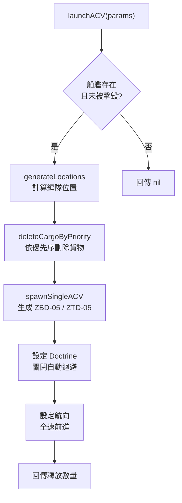
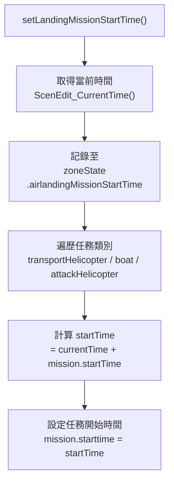

# amphibiousAssault — 兩棲突擊協調

> 原始碼：`src/modules/landingOps/amphibiousAssault.lua`

**職責**：協調 ACV 釋放、LST 航至泛水編波區航向設定、任務時序設定與空/機降區威脅評估

---

## 概述

amphibiousAssault 負責登陸作戰的第三階段——兩棲突擊。系統協調三項核心作業：

1. **任務時序設定**：計算各登陸任務（直升機、氣墊船、攻擊直升機）的開始時間，確保各波次按既定間隔投入
2. **LST 航向設定**：驅動在錨泊區的 LST 向泛水編波區前進，同時引導 SAG 至兩棲載具集結區
3. **ACV 釋放**：從登陸艦刪除貨物並生成兩棲戰車單位，以編隊形式向灘頭推進

系統透過 `landingCheck.lua` 的狀態機驅動，在空/機降區威脅清除（敵方地面接觸目標數低於門檻）或等待超時後自動發起突擊。

---

## ACV 發射機制

ACV（兩棲步兵戰鬥車）發射是兩棲突擊的核心。系統從 LST/渡輪刪除貨物並在船側生成兩棲戰鬥車單位：

### ACV 類型優先序

| 優先順序 | 車型 | 常數 | 說明 |
|:-:|---|---|---|
| 1 | ZBD-05 | `constants.PLATFORMS.ZBD05` | 兩棲步兵戰鬥車 |
| 2 | ZTD-05 | `constants.PLATFORMS.ZTD05` | 兩棲突擊車 |

`deleteCargoByPriority` 依序嘗試刪除各型 ACV，以 `remaining` 計數器確保不超過總需求數。

### 釋放腳本觸發

`launchACV.lua` 事件腳本（Unit Remains in Area）在 ACV 區域內觸發：

1. 判斷船艦是否為 Ferry 或 LST（`isFerryOrLST`）
2. 取得對應作戰區（`getShipZone`）
3. 發射 5 輛 ACV
4. 若貨物已清空（`count == 0`），將船艦指派至基地並 RTB

---

## 任務時序設定

任務類別與延遲：

| 類別 | 配置路徑 | 延遲（秒） |
|---|---|---|
| transportHelicopter | `missionStartime.transportHelicopter` | 2520 / 4320 / 5520 / 6720 |
| boat | `missionStartime.boat` | 2460 / 3660 |
| attackHelicopter | `missionStartime.attackHelicopter` | 2400 |

---

## LST 航向設定

`setCoursesForLSTs` 驅動兩類艦船移動：

### LST 航至泛水編波區

| 步驟 | 說明 |
|---|---|
| 過濾 | 在 `lstAnchorageArea` 內的 Ship 類型單元 |
| 排除 | RORO 和 Barge（`isLST` 檢查，排除 `NON_LST_NAMES`） |
| 計算目的地 | 從當前位置依 `bearing` 和 `distance` 投影 |
| 設定速度 | `zone.lstSettings.speed` |

### SAG 移動

| 步驟 | 說明 |
|---|---|
| 取得 SAG 群組 | 依 `descriptor.groupName` |
| 設定航向 | 前往 `amphibiousVehicleStagingArea` |

---

## 空降區威脅評估

`countContactsInArea` 計算空/機降區內的目標數量：

- 篩選條件：`contact.typed == FACILITY_MOBILE`（地面可移動設施）
- 結果用於 `landingCheck.lua` 判斷是否可發起突擊
- 當接觸數 < `operation.contactThreshold` 或等待超時，觸發突擊

---

## 公開 API

| 函數 | 說明 |
|---|---|
| `setLandingMissionStartTime(zone, zoneState)` | 設定單一作戰區的登陸任務開始時間 |
| `setCoursesForLSTs(zone, units, operation, sagLookup)` | 設定 LST 航至泛水編波區航向與 SAG 移動 |
| `countContactsInArea(contacts, area)` | 計算區域內目標數量 |
| `launchACV(params)` | 從登陸艦釋放兩棲步兵戰鬥車 |
| `isFerryOrLST(ship)` | 判斷艦船是否為渡輪或 LST |
| `getShipZone(amphibOpsConfig, ship)` | 取得艦船所在的作戰區 |

---

## 相關模組

- [amphibiousLogistics](amphibiousLogistics.md) — `launchACV` 呼叫 `AmphibiousLogistics.deleteCargo` 刪除貨物
- [secondWaveUnloading](secondWaveUnloading.md) — 後續階段：灘頭建立後啟動第二波卸載
- [shipMovement](shipMovement.md) — 前置階段：艦隊佈陣
- [系統架構](README.md)
