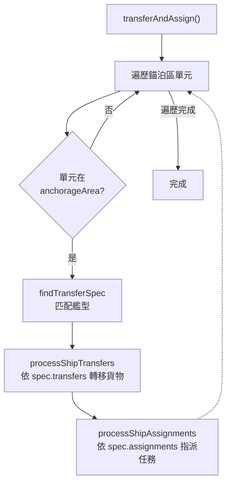

# amphibiousLogistics — 兩棲後勤裝載與任務指派

> 原始碼：`src/modules/landingOps/amphibiousLogistics.lua`

**職責**：管理登陸艦的貨物轉移、運輸任務建立與登陸載具任務指派

---

## 概述

amphibiousLogistics 負責登陸作戰的第二階段——後勤裝載。當登陸艦隊到達錨泊區後，系統依艦型將貨物（車輛、步兵、裝備）從母艦轉移至搭載的直升機與登陸艇，同時建立貨物運輸任務（Cargo Mission）並指派登陸載具執行。

系統採用**資料驅動分派**（Data-Driven Dispatch）架構，透過 `SHIP_TRANSFER_SPECS` 描述符表定義各艦型的貨物轉移規格與任務指派規則，避免針對每型艦船寫硬編碼邏輯。

此外，模組也提供第二波作戰時的貨物重新裝載（`retransferCargos`），用於補充已耗盡彈藥的運輸載具。

---

## 資料驅動分派機制

`SHIP_TRANSFER_SPECS` 定義了各艦型的完整裝載規格：

```
SHIP_TRANSFER_SPECS[]
└── TransferSpec
    ├── dbids: number[]                  -- 適用艦型 DBID
    ├── manifestKey: string              -- 貨物清單索引鍵
    ├── transfers[]                      -- 貨物轉移規則
    │   ├── platform: string             -- 目標平台類型（Aircraft/Boats）
    │   ├── configKey: string            -- 區域配置鍵
    │   └── loadoutIdx: integer          -- 掛載索引
    └── assignments[]                    -- 任務指派規則
        ├── platform: string             -- 平台類型
        └── configKey: string            -- 區域配置鍵
```

### 艦型對應規格

| 艦型 | manifestKey | 轉移目標 | 任務指派 |
|---|---|---|---|
| Type 075 / Type 076 | `type075` | 氣墊船（loadout 1）、運輸直升機（loadout 1, 2） | 氣墊船、運輸直升機、攻擊直升機 |
| Type 071 | `type071` | 氣墊船（loadout 1）、運輸直升機（loadout 1） | 氣墊船、運輸直升機 |

---

## 貨物操作流程



### 貨物轉移細節

`transferCargo` 函數將母艦貨物分配至搭載平台：

1. 取得母艦的搭載單元清單（`embarkedUnits`）
2. 依平台 DBID 與掛載 ID（`loadoutdbid`）匹配目標載具
3. 對每個匹配的載具執行 `updateCargo`：從母艦刪除貨物、在載具上建立對應貨物
4. 支援共用貨物清單（所有載具相同）與個別貨物清單（依索引分配）

---

## 錨泊區監控

`getUnitsInAnchorageArea` 監控艦隊到達狀態：

| 檢查項目 | 說明 |
|---|---|
| 艦型過濾 | 僅計算 `AMPHIBIOUS_SHIP_DBIDS` 中的兩棲艦船 |
| 移動狀態 | 若有艦船 `unitstate != "Unassigned"` 則判定仍在移動 |
| 區域判定 | 艦船須在 `anchorageArea` 或 `lstAnchorageArea` 內 |

### 兩棲艦船 DBID 對照

| 艦型 | 常數路徑 |
|---|---|
| Type 075 LHD | `constants.PLATFORMS.TYPE_075` |
| Type 076 LHD | `constants.PLATFORMS.TYPE_076` |
| Type 071 LPD | `constants.PLATFORMS.TYPE_071` |
| Type 072III LST | `constants.PLATFORMS.TYPE_072III` |
| Type 072A LST | `constants.PLATFORMS.TYPE_072A` |
| Type 072A (2) LST | `constants.PLATFORMS.TYPE_072A_2` |
| Type 073A LST | `constants.PLATFORMS.TYPE_073A` |
| Ferry | `constants.PLATFORMS.FERRY` |
| Barge | `constants.PLATFORMS.BARGE` |

---

## 公開 API

| 函數 | 說明 |
|---|---|
| `getUnitsInAnchorageArea(zone, filteredUnits)` | 取得錨泊區內艦船清單及移動狀態 |
| `createCargoMissions(zone)` | 為作戰區建立貨物運輸任務 |
| `transferAndAssign(zone, unitsInAnchorageArea)` | 執行貨物轉移並指派登陸載具至任務 |
| `transferAndAssignTransportAircraft(transportAircraft)` | 陸基運輸機貨物轉移與任務指派 |
| `retransferCargos(zone, units)` | 第二波作戰的貨物重新裝載 |
| `updateCargo(fromUnit, toUnit, cargoItem)` | 單筆貨物從來源轉移至目標 |
| `deleteCargo(fromUnit, cargoItem)` | 從單元刪除指定貨物 |
| `transferCargo(fromUnit, platformType, platformDBID, loadoutDBID, cargoItems)` | 依平台規格轉移貨物至搭載單元 |

---

## 相關模組

- [shipMovement](shipMovement.md) — 前置階段：艦隊移動至錨泊區
- [amphibiousAssault](amphibiousAssault.md) — 後續階段：ACV 釋放時呼叫 `deleteCargo`
- `assignMission` — `transferAndAssign` 呼叫 `AssignMission.assignEmbarkedUnitsToMissions`
- [系統架構](README.md)
