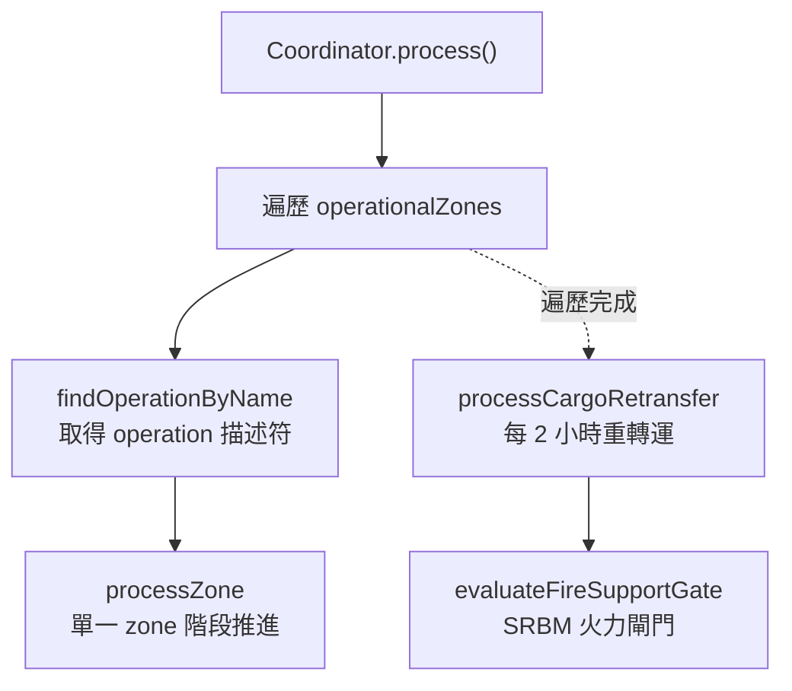
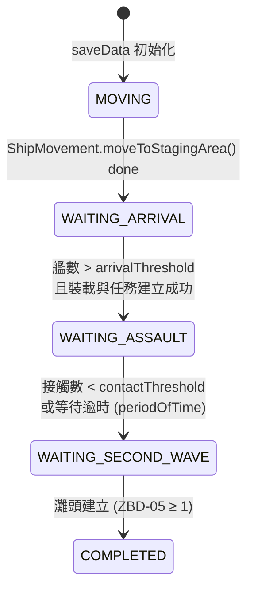
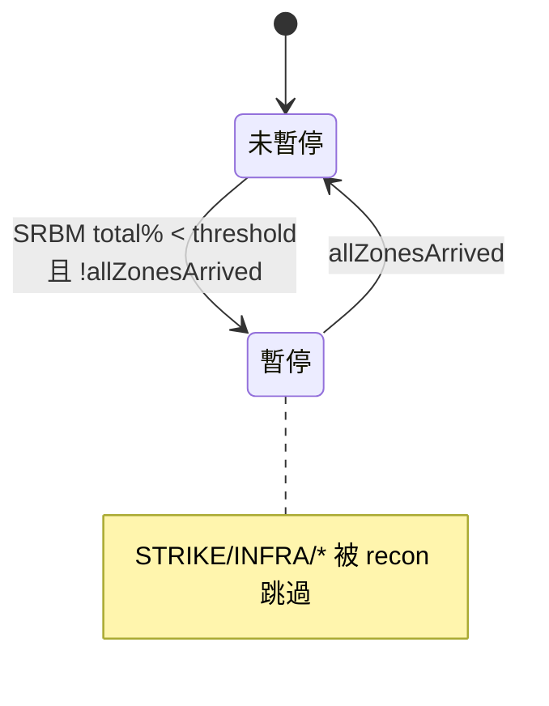
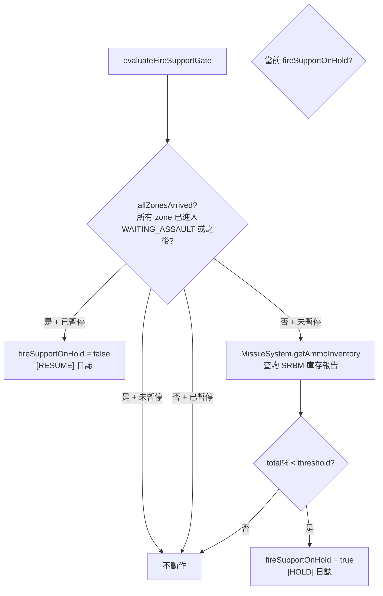

# coordinator — 兩棲作戰流程協調

> 原始碼：`src/modules/landingOps/coordinator.lua`

**職責**：驅動各作戰區（zone）的階段機推進、貨物重轉運、火力支援暫停閘門

---

## 概述

coordinator 是 Landing Operations 的主流程引擎，由 `landingCheck.lua` 每 5 分鐘呼叫 `Coordinator.process` 一次。本模組僅負責流程編排與狀態判斷，實際動作委派給 `shipMovement`、`amphibiousLogistics`、`amphibiousAssault`、`secondWaveUnloading` 等子模組。

職責切分為三條主線：

1. **逐區階段推進**：對每個 `operationalZone` 依當前 `phase` 執行對應動作（移動 → 等待到達 → 兩棲突擊 → 第二波卸載）
2. **貨物重轉運**：對已啟動空/機降任務的 zone，每 2 小時觸發一次貨物重新裝載
3. **火力支援暫停閘門**：依 SRBM 彈藥水平與各 zone 到位狀況，動態暫停／恢復偵察驅動的 SRBM 打擊

---

## 主流程

---

## 單一 zone 階段機

各 phase 轉換條件：

| 起始 phase | 觸發條件 | 對應動作 |
|---|---|---|
| `MOVING` | `saveData.c.amphibOps.startTime` 到達 | `ShipMovement.moveToStagingArea` |
| `WAITING_ARRIVAL` | `units > zone.arrivalThreshold` 且非移動中 | `createCargoMissions` + `transferAndAssign`（含 Taoyuan 特例） |
| `WAITING_ASSAULT` | 接觸 < `contactThreshold` 或 `elapsed >= periodOfTime` | `setLandingMissionStartTime` + `setCoursesForLSTs` |
| `WAITING_SECOND_WAVE` | 灘頭建立（ZBD-05 ≥ 1） | `startSecondWaveUnloading` |

---

## Taoyuan 特例

`handleTaoyuanTemporarySetup` 僅在 Taoyuan 進入 `WAITING_ASSAULT` 時觸發：

1. 對運輸機隊執行貨物轉移與任務指派（`AmphibiousLogistics.transferAndAssignTransportAircraft`）
2. 委派 [`Recon.insertEntry(saveData.c.recon, config.c.recon.template.GJ11_RECON)`](../strikePlanner/recon.md) 排入一架 GJ-11 偵察任務

由於未傳入 `startTime`，`insertEntry` 以當前遊戲時間為起飛錨點，並自行完成範本深拷貝、`takeoffTime`/`endTime` 推算、欄位重設（`hasLaunched`/`isFinished`/`trackingTargetGUID`）與寫入佇列。插入是**有條件**的：偵察佇列中沒有可錨定的衛星空窗、或同 `templateId` 的 UAV 已覆蓋該空窗時就不插入（GJ-11 偵察當輪不啟動），兩棲流程其餘部分不受影響。

---

## 貨物重轉運

`processCargoRetransfer` 維護長期作戰下的後勤循環：

- 對所有 zone 檢查 `zoneState.airlandingMissionStartTime`
- 距上次裝載超過 `3600 * 2` 秒（2 小時）時，呼叫 `AmphibiousLogistics.retransferCargos`
- 重轉運成功後重設計時器

---

## 火力支援暫停閘門

`evaluateFireSupportGate` 防止 SRBM 在艦隊抵達錨泊區之前耗盡彈藥。閘門狀態存於 `saveData.c.amphibOps.fireSupportOnHold`（boolean），由 [strikePlanner/recon](../strikePlanner/recon.md) 於排程偵察驅動打擊時讀取，用以跳過 `STRIKE/INFRA/*` 映射。

### 狀態轉移

### 判定流程

### 設計重點

- **單調釋放**：phase 機只往前推進，「所有 zone 到位」一旦達成即永久釋放，不會在 HOLD/RESUME 間反覆 toggle
- **省一次查詢**：已 `fireSupportOnHold=true` 時直接 return，避免重複呼叫 `getAmmoInventory`
- **防禦性**：`saveData.c.ground.srbm` 缺失時靜默 return（測試保存或部分初始化情境）

### 已抵達狀態定義

local 常數 `ARRIVED_PHASES` 涵蓋：

- `WAITING_ASSAULT`
- `WAITING_SECOND_WAVE`
- `COMPLETED`

---

## 公開 API

| 函數 | 說明 |
|---|---|
| `process(config, saveData, contacts, currentTime, filteredShips)` | 主入口：執行全 zone 階段推進、貨物重轉運、火力閘門更新 |
| `evaluateFireSupportGate(config, saveData)` | 依 SRBM 庫存與 zone 狀態維護 `fireSupportOnHold` 旗標 |

---

## 資料寫入摘要

| 路徑 | 寫入時機 |
|---|---|
| `saveData.c.amphibOps.zoneStates[zoneName].phase` | 階段轉換 |
| `saveData.c.amphibOps.zoneStates[zoneName].amphibiousAssaultStartTime` | 進入 `WAITING_ASSAULT` |
| `saveData.c.amphibOps.zoneStates[zoneName].airlandingMissionStartTime` | `setLandingMissionStartTime` 與重轉運後 |
| `saveData.c.amphibOps.fireSupportOnHold` | 閘門 HOLD / RESUME |
| `saveData.c.recon.queue` | Taoyuan 特例經 `Recon.insertEntry` 插入 GJ-11 偵察項目（有衛星空窗才插入） |

---

## 設定檔參考

| 設定路徑 | 用途 |
|---|---|
| `config.c.amphibOps.periodOfTime` | `WAITING_ASSAULT` 等待逾時上限（秒） |
| `config.c.amphibOps.fireSupportHoldThreshold` | SRBM 總彈量百分比下限；低於此值且尚未到位即進入 HOLD |
| `config.c.amphibOps.operationalZones[].arrivalThreshold` | 認定艦隊抵達錨泊區的最低艦數 |
| `config.c.amphibOps.operations[].contactThreshold` | 空/機降區可接受的最大接觸數 |

---

## 相關模組

- [shipMovement](shipMovement.md) — Phase 1：艦隊移動
- [amphibiousLogistics](amphibiousLogistics.md) — Phase 2：裝載
- [amphibiousAssault](amphibiousAssault.md) — Phase 3：突擊
- [secondWaveUnloading](secondWaveUnloading.md) — Phase 4：第二波卸載
- [missileSystem/init](../missileSystem/init.md) — `getAmmoInventory` 提供火力閘門所需的庫存報告
- [strikePlanner/recon](../strikePlanner/recon.md) — Taoyuan 特例呼叫 `Recon.insertEntry` 排 GJ-11 偵察；recon 反向讀取 `fireSupportOnHold` 跳過 `STRIKE/INFRA/*`
- [系統架構](README.md)
