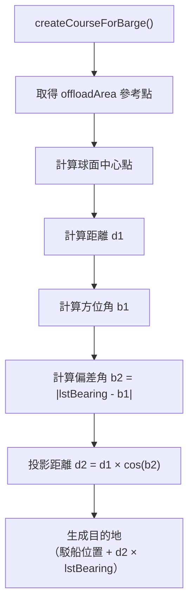
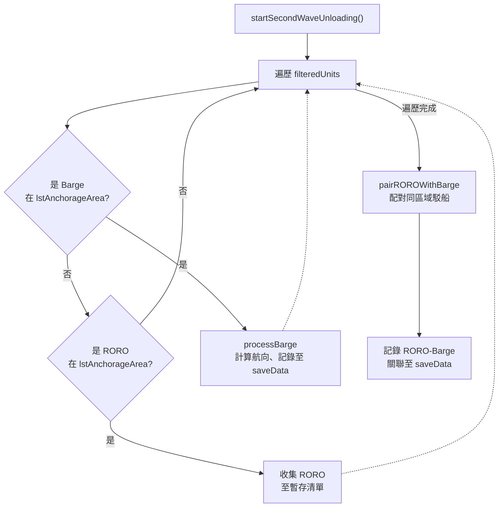
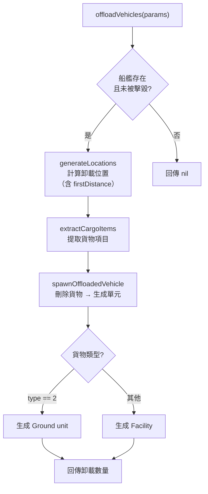
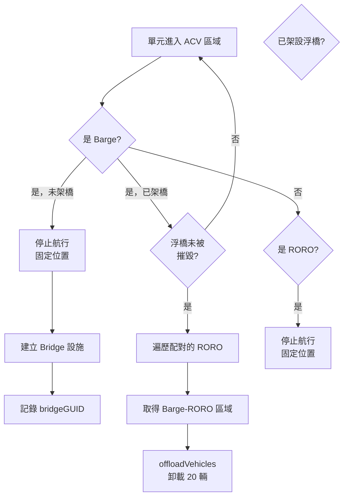

# secondWaveUnloading — 第二波卸載作業

> 原始碼：`src/modules/landingOps/secondWaveUnloading.lua`

**職責**：管理駁船-RORO 後勤鏈建立、重型車輛卸載與灘頭浮橋部署

---

## 概述

secondWaveUnloading 負責登陸作戰的第四階段——第二波重裝備卸載。當灘頭由第一波 ACV 建立後，系統啟動駁船（Barge）與 RORO 船的後勤鏈：

1. **駁船搶灘**：計算駁船從錨泊區到卸載區的航向，投影至 LST 搶灘航線
2. **RORO 跟隨**：RORO 船與同區域駁船配對，跟隨駁船前進
3. **浮橋架設**：駁船到達灘頭後停止並架設後勤浮橋（Bridge Facility）
4. **車輛卸載**：透過後勤鏈（RORO → 駁船 → 灘頭）卸載重型裝備

本模組由兩個事件腳本驅動：`landingCheck.lua`（啟動第二波）和 `offloadVehicles.lua`（執行卸載）。

---

## 駁船-RORO 後勤鏈

### 駁船航向計算

`createCourseForBarge` 使用球面幾何投影計算航向：

1. 取得卸載區（`offloadArea`）的參考點
2. 計算參考點的球面中心點（`calculateSphericalCenter`）
3. 計算駁船至中心點的距離（d1）與方位角（b1）
4. 利用 LST 搶灘方位角計算投影距離：`d2 = d1 × cos(b2)`
5. 在 LST 搶灘方位線上生成目的地

### RORO 航向計算

`createCourseForRORO` 生成兩段航路：

| 航路段 | 計算方式 | 說明 |
|:-:|---|---|
| 第一段 | 從 RORO 位置依 LST 方位與距離投影 | 向灘頭方向接近 |
| 第二段 | 駁船目的地座標 | 匯合至駁船位置 |

---

## 第二波啟動流程

### 配對規則

RORO 與 Barge 的配對依據「同區域」原則：`barge:inArea(roro.zone.lstAnchorageArea)` 為 true 時配對。一個駁船可配對多個 RORO 船。

---

## 車輛卸載機制

`offloadVehicles` 從船艦貨物中提取車輛並生成地面單元：

### 貨物類型對應

| `item.Type` | 生成單元類型 |
|:-:|---|
| 2 | `Ground unit` |
| 其他 | `Facility` |

---

## 浮橋與卸載事件腳本

`offloadVehicles.lua`（Unit Enters Area）的執行邏輯：

---

## 查詢 API

| 函數 | 說明 |
|---|---|
| `isBridgeDestroyed(saveData, ship)` | 檢查駁船浮橋是否被摧毀 |
| `hasExtendedBridge(saveData, ship)` | 檢查駁船是否已架設浮橋 |
| `getBargeROROZone(amphibOpsConfig, barge, roro)` | 取得 Barge-RORO 配對的作戰區（需同區域且距離 < 1nm） |

## 作業 API

| 函數 | 說明 |
|---|---|
| `startSecondWaveUnloading(zone, saveData, filteredUnits)` | 啟動第二波卸載：駁船搶灘、RORO 配對（單一作戰區） |
| `offloadVehicles(params)` | 從船艦卸載車輛至灘頭 |

---

## 相關模組

- [amphibiousAssault](amphibiousAssault.md) — 前置階段：ACV 突擊與灘頭建立
- [amphibiousLogistics](amphibiousLogistics.md) — 第一波貨物裝載
- [系統架構](README.md)
