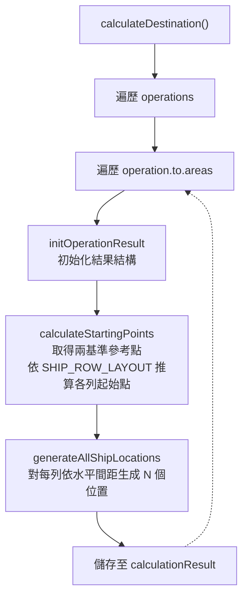
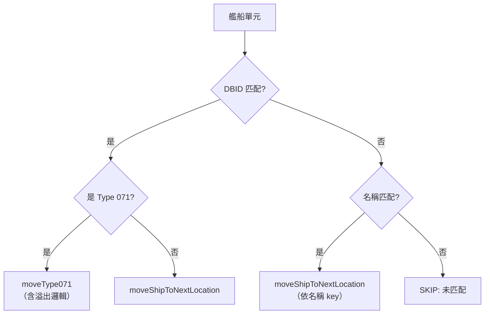

# shipMovement — 登陸艦隊移動與佈陣

> 原始碼：`src/modules/landingOps/shipMovement.lua`

**職責**：計算各型登陸艦的錨泊位置並驅動艦隊從集結區移動至預定陣位

---

## 概述

shipMovement 負責登陸作戰的第一階段——艦隊展開。系統將各型登陸艦（LHD/LPD/LST/渡輪/駁船/RORO）從集結區（Staging Area）移動至錨泊區（Anchorage Area），每型艦船在錨泊區中佔據不同的列位置，形成分層編隊。

位置計算分為兩步：首先透過 `calculateDestination` 預算所有錨泊位置，結果儲存至 `saveData.c.amphibOps.calculationResult`；接著 `moveToStagingArea` 在每次觸發時依序將集結區內的艦船分配至下一個可用位置。

SAG（水面行動群）護航編隊則獨立處理，以驅逐艦為中心、護衛艦左右翼展開陣型。

---

## 艦型分層佈局

錨泊區的艦船佈局以兩個基準點為起始，其餘艦型依垂直距離依序排列：

```
                       ← 水平方向（horizontalDistance）→

  LPD 區域:
  Type 075 起始點 ──→  [075] [075] [075] ...
  Type 071 起始點 ──→  [071] [071] [071] ...
  Type 076          →  [076] [076] ...
                        ↕ distanceBetweenLSTAndLPDArea
  LST 區域:
  Barge             →  [Barge] [Barge] ...
  RORO              →  [RORO] [RORO] ...
  Type 072A         →  [072A] [072A] ...
  Type 072III       →  [072III] [072III] ...
  Ferry             →  [Ferry] [Ferry] ...
  Type 071 (溢出)   →  [071] ...
  Type 073A         →  [073A] [073A] ...
```

### 列排列順序

| 順序 | 艦型 key | 基準來源 | 距離參數 |
|:-:|---|---|---|
| 1 | `type075` | 參考點 `startingPoints.type075` | — |
| 2 | `type071` | 參考點 `startingPoints.type071` | — |
| 3 | `type076` | 相對 `type071` | `verticalDistance` |
| 4 | `barge` | 相對 `type075` | `distanceBetweenLSTAndLPDArea` |
| 5 | `roro` | 相對 `barge` | `verticalDistance` |
| 6 | `type072a` | 相對 `roro` | `verticalDistance` |
| 7 | `type072iii` | 相對 `type072a` | `verticalDistance` |
| 8 | `ferry` | 相對 `type072iii` | `verticalDistance` |
| 9 | `type071InLSTArea` | 相對 `ferry` | `verticalDistance` |
| 10 | `type073a` | 相對 `type071InLSTArea` | `verticalDistance` |

---

## 位置計算流程



---

## 艦船匹配與移動

`moveToStagingArea` 透過 `matchAndMoveShip` 進行艦型匹配：

1. **DBID 匹配**：依 `SHIP_TYPE_DBIDS` 表比對艦船 DBID
2. **名稱匹配**：若 DBID 未命中，依 `NAME_TO_KEY` 表比對艦名（Ferry/RORO/Barge）
3. **Type 071 特殊處理**：當 LPD 區位置用盡時，溢出至 LST 區的 `type071InLSTArea`



---

## SAG 護航編隊

`handleSAG` 將 SAG 編隊移動至錨泊區，測試模式下以精確陣位佈置：

| 艦型 | 位置 | 說明 |
|---|---|---|
| Type 052D（第一艘） | 錨泊區終點 | 編隊中心 |
| Type 052D（第二艘） | 終點後方 1.5nm | 縱列跟隨 |
| Type 054A（第一艘） | 左翼 -45° × 1.5nm | 左翼護衛 |
| Type 054A（第二艘） | 右翼 +45° × 1.5nm | 右翼護衛 |

---

## 公開 API

| 函數 | 說明 |
|---|---|
| `calculateDestination(amphibOpsConfig, calculationResult)` | 預算所有作戰區域的艦船錨泊位置 |
| `moveToStagingArea(amphibOpsConfig, saveData, filteredUnits)` | 驅動艦隊從集結區移動至錨泊位置 |

---

## 相關模組

- [amphibiousLogistics](amphibiousLogistics.md) — 艦隊到達後的貨物裝載與任務建立
- [amphibiousAssault](amphibiousAssault.md) — LST 搶灘航向設定
- [系統架構](README.md)
