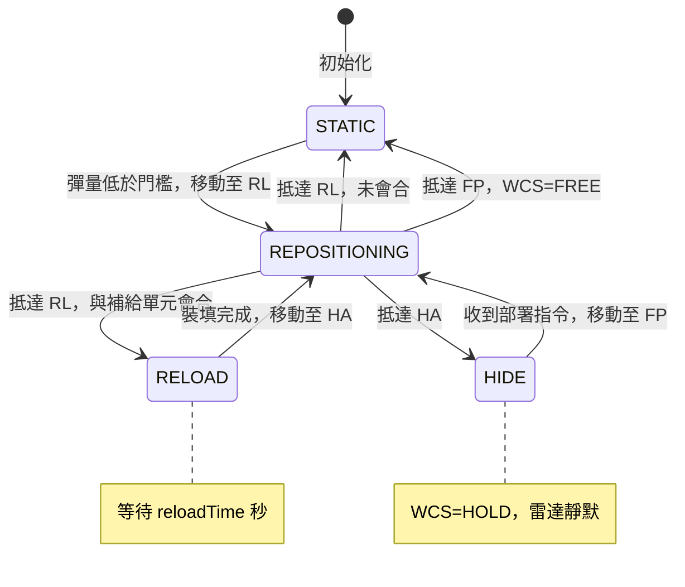
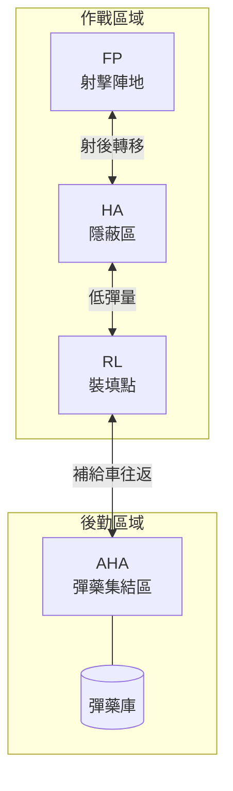
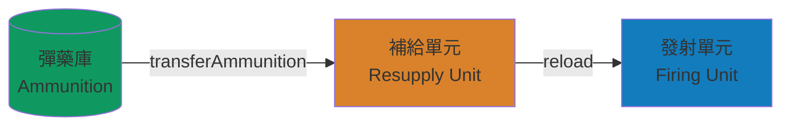
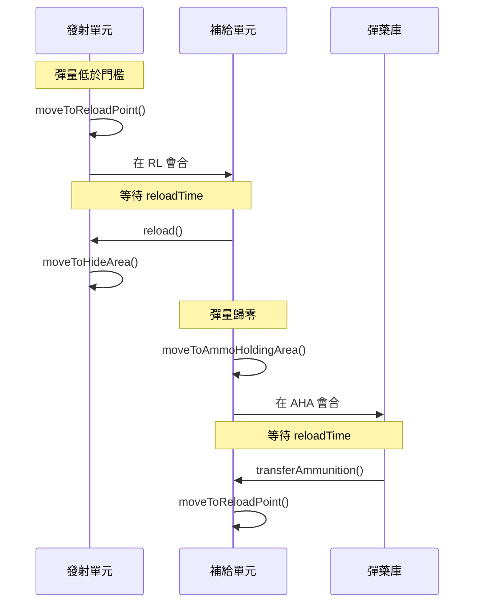
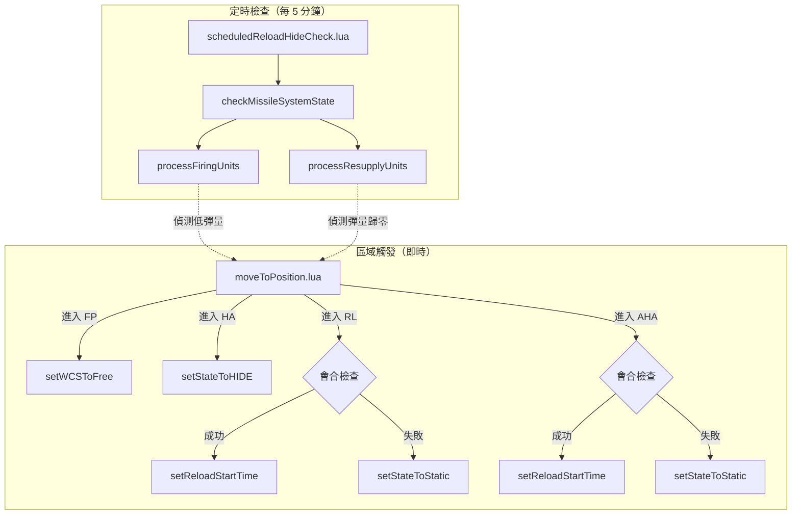

# Missile System 模組架構文件

本文件說明 `src/modules/missileSystem.lua` 的設計架構與運行流程。

## 概述

TEL（Transporter Erector Launcher）機動飛彈系統與 SAM（Surface-to-Air Missile）防空飛彈系統模組，管理發射單元、補給單元、彈藥庫三者之間的再裝填循環。採用 **狀態機 + 事件驅動** 架構。

支援的武器系統：`srbm`、`mrbm`、`mlrs`、`glcm`、`ascm`、`sam`

### SAM 整合

模組透過 `SAM_DBIDS` 查詢表辨識 SAM 平台，並自動調整武器管制行為：

| 平台 | DBID 常數 |
|------|-----------|
| PAC-3 | `PLATFORMS.PAC3` |
| Sky Guard | `PLATFORMS.SKY_GUARD` |
| TC-2 | `PLATFORMS.TC2` |
| TK-3（自訂） | `PLATFORMS.CUSTOMED_TK3` |
| S-300 | `PLATFORMS.S300` |
| S-400 | `PLATFORMS.S400` |
| HQ-12 | `PLATFORMS.HQ12` |
| HQ-22 | `PLATFORMS.HQ22` |

**WCS 差異**：SAM 平台使用 `weapon_control_status_air`，TEL 平台使用 `weapon_control_status_land`。

### 多武器 DBID 支援

`weaponDBID` 參數支援 `number|number[]`，允許單一發射單元配備多種彈藥類型。例如 PAC-3 連同時攜帶 MIM-104F PAC-3 與 PAC-2 飛彈。

彈量檢查（`isLowAmmo`）與裝填（`reload`）均會彙總所有武器 DBID 進行計算。

---

## 狀態機

### 狀態定義

| 狀態 | 值 | 說明 |
|------|:--:|------|
| `STATIC` | 0 | 靜止待命，可接受新指令 |
| `REPOSITIONING` | 1 | 正在移動至目標位置 |
| `RELOAD` | 2 | 已抵達裝填點，等待裝填完成 |
| `HIDE` | 3 | 已進入隱蔽區域，武器管制為 HOLD |

### 狀態轉移圖

---

## 位置類型

### 作戰區域定義

| 代號 | 名稱 | 用途 | Zone 類型 |
|:----:|------|------|-----------|
| `FP` | Firing Point | 射擊陣地，WCS 設為 FREE | Standard |
| `HA` | Hide Area | 隱蔽區，射後轉移用 | Standard |
| `RL` | Reload Point | 裝填點，發射單元與補給單元會合 | Standard |
| `AHA` | Ammo Holding Area | 彈藥集結區，補給單元與彈藥庫會合 | Standard |
| `MASK` | Mask | 地形遮蔽區 | Custom Environment |

### 位置關係圖

---

## 三級供應鏈

### 彈藥流向

### 補給循環時序圖

---

## 事件驅動架構

### 雙路徑觸發機制

---

## 單元建立與裝備管理

### 自訂 TK-3 掛載設定

當 `descriptor.dbid` 為 `PLATFORMS.CUSTOMED_TK3` 時，`addFiringUnit` 會呼叫 `configureCustomTK3Mounts` 執行以下操作：

1. 移除原有所有掛載
2. 安裝 6 組自訂武器掛載（DBID: 45）
3. 安裝 1 組感測器掛載（DBID: 1630）
4. 更新感測器偵測/追蹤弧段為全向

### 武器清理與重分配

`cleanupAndRedistributeWeapons` 於單元建立後執行：

1. 清空所有彈匣
2. 辨識並移除不在 `weaponDBIDs` 清單中的武器
3. 若為單一武器 DBID，將移除的彈藥數量轉移至目標武器

---

## 群組單元操作

模組透過 `getGroupUnits` 取得單元群組成員清單，所有屬性設定與彈藥操作均套用至群組內全部成員：

- `applyToGroupUnits(firingUnit, propsBuilder)` — 對群組內每個單元套用屬性
- `reloadUnit` / `isLowAmmo` — 遍歷群組成員彙總彈藥資訊

---

## 公開 API

### 初始化函數

| 函數 | 說明 |
|------|------|
| `addMissileSystems(groundForceCfg, sideName)` | 建立所有飛彈系統單元（含 TK-3 自訂掛載與武器清理） |
| `initEventTriggers(operationalAreas, positionTypes, sideName)` | 建立 Zone 和 UnitEntersArea 觸發器 |
| `initMissileSystemContexts(groundForceCfg, groundForceCtx)` | 初始化執行期 context |

### 狀態控制函數

| 函數 | 說明 |
|------|------|
| `setWCSToFree(firingUnitCtx, firingUnit, isAuto)` | 設定武器管制為 FREE（SAM: air / TEL: land） |
| `setStateToHIDE(firingUnitCtx, firingUnit, isAuto)` | 設定狀態為 HIDE，WCS=HOLD |
| `setStateToStatic(systemCtx, firingUnit, isAuto)` | 重設狀態為 STATIC |
| `setReloadStartTime(firingUnitCtx, firingUnit, isAuto)` | 開始裝填計時 |
| `moveToFiringPoint(firingUnitCtx, firingUnit)` | 移動至射擊陣地 |

### 查詢函數

| 函數 | 說明 |
|------|------|
| `isLowAmmo(firingUnit, percentage, weaponDBID)` | 檢查彈量是否低於門檻（支援多武器 DBID 彙總） |
| `isRepositioning(firingUnitCtx, isAuto)` | 檢查是否正在移動中 |
| `isMetWithResupplyUnits(systemCtx, unit, isAuto)` | 檢查發射單元是否與補給單元會合 |
| `isMetWithAmmoDepot(systemCtx, unit, isAuto)` | 檢查補給單元是否與彈藥庫會合 |

### 核心邏輯函數

| 函數 | 說明 |
|------|------|
| `reload(firingUnitCtx, resupplyUnitCtx, weaponDBID, sideName)` | 執行發射單元裝填（支援多武器 DBID） |
| `transferAmmunition(resupplyUnitCtx, ammoDepotCtx)` | 轉移彈藥庫彈藥至補給單元 |
| `checkMissileSystemState(systemCtx, isAuto, sideName)` | 檢查並處理所有單元狀態 |
| `handleSupplyAssetDestruction(unit, systemCtx)` | 處理補給資產被摧毀 |

---

## 相關檔案

| 檔案 | 說明 |
|------|------|
| `src/modules/missileSystem.lua` | 主模組 |
| `src/core/config.lua` | 各武器系統設定（含 SAM） |
| `src/core/constants.lua` | 狀態、位置類型、平台 DBID、武器 DBID 常數 |
| `src/scripts/china/missileSystem/moveToPosition.lua` | 中國區域觸發事件 |
| `src/scripts/china/missileSystem/scheduledReloadHideCheck.lua` | 中國定時檢查事件 |
| `src/scripts/taiwan/missileSystem/moveToPosition.lua` | 台灣區域觸發事件 |
| `src/scripts/taiwan/missileSystem/scheduledReloadHideCheck.lua` | 台灣定時檢查事件 |

---

## 自動 vs 手動模式

模組支援 `isAuto` 參數切換模式：

| 行為 | 自動模式 | 手動模式 |
|------|:--------:|:--------:|
| 偵測低彈量並移動 | Yes | No |
| 會合後開始裝填計時 | Yes | Yes |
| 裝填完成後自動移動至 HA | Yes | No |
| 狀態檢查 | 檢查 state | 直接返回 true |
