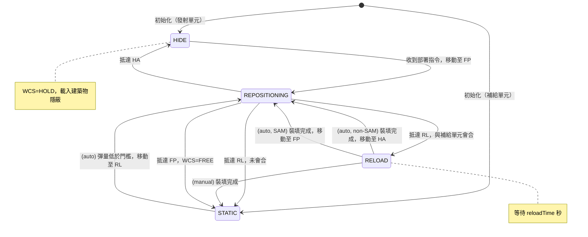
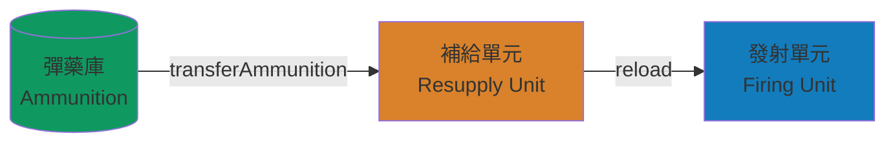
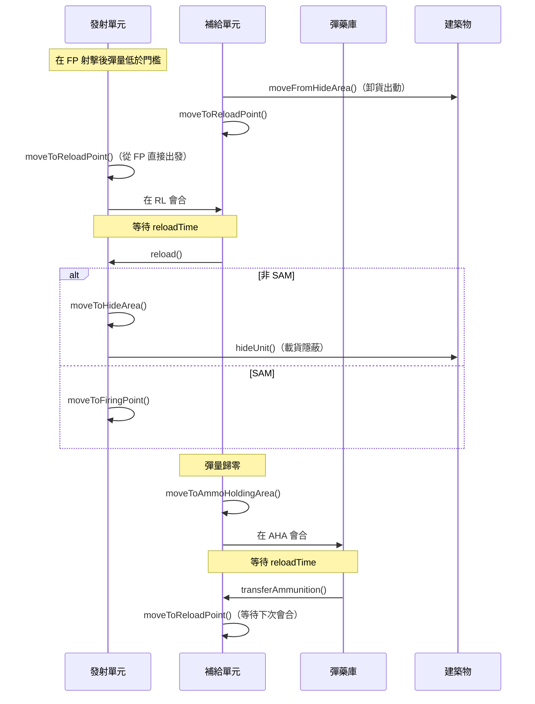
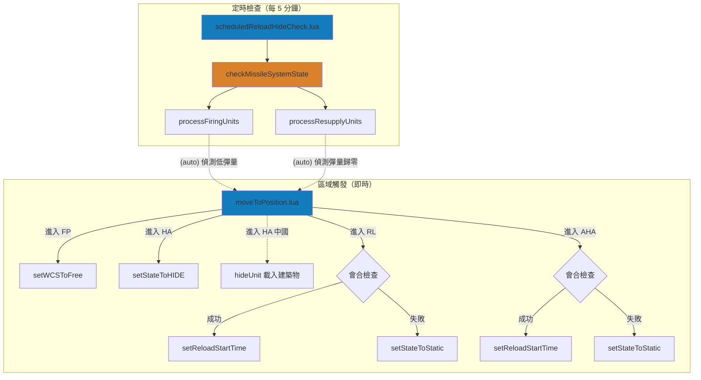

# missileSystem — TEL/SAM 飛彈系統管理

> 入口：`src/modules/missileSystem/init.lua`
>
> 子模組目錄：`src/modules/missileSystem/`

**職責**：管理 TEL 機動飛彈與 SAM 防空飛彈的狀態機、三級再裝填循環、建築物隱蔽機制及單元建立

---

## 概述

missileSystem 是雙陣營共用的飛彈系統核心模組，管理發射單元（Firing Unit）、補給單元（Resupply Unit）、彈藥庫（Ammunition Depot）三者之間的完整再裝填循環。系統採用 **狀態機 + 事件驅動** 架構，由兩種事件路徑觸發：**定時檢查**（每 5 分鐘輪詢單元狀態）與**區域觸發**（單元進入指定 Zone 時即時回應）。

支援的武器系統子類別：`srbm`、`mrbm`、`mlrs`、`glcm`、`ascm`、`sam`

模組透過 `isAuto` 參數區分自動模式（中國陣營，AI 控制）與手動模式（台灣陣營，玩家控制）。自動模式下，定時檢查會自動偵測低彈量並驅動完整後勤閉環；非 `sam` 系統走「RL → 裝填 → HA → 隱蔽」，`sam` 系統則走「RL → 裝填 → FP」，模擬 AI 陣營的自主後勤與防空待戰行為。手動模式下，模組僅處理會合後的裝填完成與區域觸發回應，轉移陣地與隱蔽等操作由玩家自行決定。

### SAM 整合

模組透過 `shared.lua` 內的 `SAM_DBIDS` 查詢表辨識 SAM 平台，自動調整武器管制目標（`weapon_control_status_air` vs `weapon_control_status_land`）：

| 平台 | DBID 常數 |
|------|-----------|
| PAC-3 | `PLATFORMS.PAC3` |
| Sky Guard | `PLATFORMS.SKY_GUARD` |
| TC-2 | `PLATFORMS.TC2` |
| TK-3（自訂） | `PLATFORMS.CUSTOMED_TK3` |
| 自訂 SAM | `PLATFORMS.CUSTOMED_SAM` |
| S-300 | `PLATFORMS.S300` |
| S-400 | `PLATFORMS.S400` |
| HQ-12 | `PLATFORMS.HQ12` |
| HQ-22 | `PLATFORMS.HQ22` |

### 多武器 DBID 支援

`weaponDBID` 參數支援 `number|number[]`，允許單一發射單元配備多種彈藥類型。彈量檢查（`isLowAmmo`）與裝填（`ammo.lua`）均會彙總所有武器 DBID 進行計算。

---

## 狀態機

### 狀態定義

| 狀態 | 值 | 說明 |
|------|:--:|------|
| `STATIC` | 0 | 靜止待命，可接受新指令 |
| `REPOSITIONING` | 1 | 正在移動至目標位置 |
| `RELOAD` | 2 | 已抵達裝填點，等待裝填完成 |
| `HIDE` | 3 | 已進入隱蔽區域，武器管制為 HOLD |

### 狀態轉移圖



---

## 位置類型與作戰區域

| 代號 | 名稱 | 用途 | Zone 類型 |
|:----:|------|------|-----------|
| `FP` | Firing Point | 射擊陣地，WCS 設為 FREE | Standard |
| `HA` | Hide Area | 隱蔽區，射後轉移用 | Standard |
| `RL` | Reload Point | 裝填點，發射單元與補給單元會合 | Standard |
| `AHA` | Ammo Holding Area | 彈藥集結區，補給單元與彈藥庫會合 | Standard |
| `MASK` | Mask | 地形遮蔽區，包含建築物供隱蔽 | Standard |

```mermaid
flowchart TB
    subgraph 作戰區域
        FP["FP<br>射擊陣地"]
        HA["HA<br>隱蔽區"]
        RL["RL<br>裝填點"]
    end

    subgraph 遮蔽區域
        MASK["MASK<br>地形遮蔽區"]
        BLDG["建築物<br>loadCargo 隱蔽"]
        MASK --- BLDG
    end

    subgraph 後勤區域
        AHA["AHA<br>彈藥集結區"]
        DEPOT[("彈藥庫")]
    end

    HA -->|部署| FP
    FP -->|低彈量| RL
    RL -->|裝填完成| HA / FP(SAM)
    HA ---|隱蔽| MASK
    RL <-->|補給車往返| AHA
    AHA --- DEPOT
```

---

## 三級供應鏈

### 彈藥流向



### 補給循環時序圖（自動模式）



---

## 事件驅動架構



---

## 建築物隱蔽機制

TEL 單元在隱蔽區（HA）時可載入 MASK 區域內的建築物，降低被偵察發現的風險。透過 CMO 的 cargo 機制實現：

1. **隱蔽（hideUnit）**：在 MASK 區域搜尋未被佔用的建築物，隨機選擇一棟，呼叫 `AmphibiousLogistics.loadCargo` 載入
2. **出動（moveFromHideArea）**：遍歷 MASK 區域內建築物，找到載有該單元的建築物並 `ScenEdit_UnloadCargo`

### 建築物搜尋條件

| 篩選條件 | 值 |
|----------|-----|
| TargetType | `FACILITY` |
| TargetSubType | `BUILDING_SURFACE` |
| SpecificUnitClass | `PLATFORMS.BUILDING` (448) |
| 搜尋範圍 | `operationalArea.mask.area` |

### MASK Zone 環境設定

目前 `MASK` 區僅建立為 `STANDARD` zone，並將 `operationalArea.uShapeVertices` 轉為 `operationalArea.mask.area` 供建築物搜尋使用，同時套用 `MASK` 對應顏色。模組目前**未設定** `landcoverheight` 或 `landcovertype`。

---

## 單元建立與裝備管理

### 掛載描述器（Mount Descriptors）

透過 `constants.MOUNT_DESCRIPTORS` 為特定平台配置自訂掛載。`addFiringUnit` 建立單元後檢查 `descriptor.mountDescriptors`，若存在則逐一安裝掛載。

| 平台鍵 | 掛載 DBID | 掛載數量 | 說明 |
|--------|:---------:|:--------:|------|
| `CUSTOMED_TK3` | 1630 | 1 | 感測器掛載 |
| `CUSTOMED_TK3` | 45 | 6 | 武器掛載 |
| `HF2E` | 2782 | 2 | HF-2E 發射架 |
| `CSS5_MOD5` | 1858 | 4 | DF-21D 發射架 |
| `CSS11_MOD1` | 4274 | 4 | DF-16A 發射架 |
| `CSS6_MOD3` | 1882 | 6 | DF-15B 發射架 |
| `CSS6_MOD2` | 4272 | 6 | DF-15C 發射架 |
| `CSS7_MOD2` | 4263 | 6 | DF-11A 發射架 |
| `CH_SSC_9` | 4276 | 8 | CJ-10A 發射架 |

### 武器清理與重分配

`cleanupAndRedistributeWeapons` 於單元建立後執行：

1. 清空所有彈匣（`ScenEdit_ClearAllMagazines`）
2. 遍歷掛載，移除不在 `weaponDBIDs` 清單中的武器
3. 若為單一武器 DBID，將移除的彈藥數量轉移至目標武器

---

## 自動 vs 手動模式

| 行為 | 自動模式 | 手動模式 |
|------|:--------:|:--------:|
| 偵測低彈量並移動至 RL | Yes | No |
| 觸發補給單元移動至 AHA | Yes | No |
| 會合後開始裝填計時 | Yes | Yes |
| 裝填完成後自動移動至 HA / FP | Yes（非 `sam` → HA；`sam` → FP） | No |
| 裝填完成後隱蔽補給單元 | Yes | No |
| 建立 trigger/mask zone 時設定顏色 | Yes | Yes |
| `isRepositioning` 狀態檢查 | 檢查 state | 直接返回 true |
| `isValidStateForMeeting` 狀態檢查 | 檢查 REPOSITIONING/RELOAD | 直接返回 true |

---

## 核心資料結構

### 設定資料（config）

```
config.{c|t}.ground
└── {srbm|mrbm|mlrs|glcm|ascm|sam}: SBJ__MissileSystemConfig
    ├── wpnDefault: number                 -- 預設彈藥數量
    ├── ammoThreshold: number              -- 低彈量百分比門檻
    ├── contactAge: number                 -- 接觸資訊有效秒數
    ├── reloadTime: number                 -- 裝填等待秒數
    ├── ammunitions: table<string, SBJ__AmmunitionUnitDescriptor>
    │   └── { guid, name, wpnCurrent, wpnDefault }
    ├── resupplyUnits: table<string, SBJ__ResupplyUnitDescriptor>
    │   └── { guid, name, unitCount, operationalArea, state,
    │         wpnCurrent, wpnDefault, ammunition, firingUnit }
    └── firingUnits: table<string, SBJ__FiringUnitDescriptor>
        └── { name, guid, dbid, operationalArea, state,
              weaponDBID, ammoThreshold, resupplyUnit, mountDescriptors? }
```

### 執行期資料（saveData）

```
saveData.{c|t}.ground
└── {srbm|mrbm|mlrs|glcm|ascm|sam}: SBJ__MissileSystemContext
    ├── enabled: boolean
    ├── reloadTime: number
    ├── firingUnits: table<string, SBJ__FiringUnitContext>
    │   └── { ...(繼承 Descriptor), reloadStartTime: number|nil }
    ├── resupplyUnits: table<string, SBJ__ResupplyUnitContext>
    │   └── { ...(繼承 Descriptor), reloadStartTime: number|nil }
    └── ammunitions: table<string, SBJ__AmmunitionContext>
        └── { guid, name, wpnCurrent, wpnDefault }
```

---

## 公開 API

### 初始化

| 函數 | 說明 |
|------|------|
| `addMissileSystems(groundForceCfg, sideName)` | 建立所有飛彈系統單元（含掛載配置與武器清理） |
| `initEventTriggers(operationalAreas, positionTypes, sideName)` | 建立 Zone 和 UnitEntersArea 觸發器 |
| `initMissileSystemContexts(groundForceCfg, groundForceCtx)` | 從 config 深拷貝至 saveData 的執行期 context |

### 狀態控制

| 函數 | 說明 |
|------|------|
| `setWCSToFree(firingUnitCtx, firingUnit, isAuto)` | 設定武器管制為 FREE（SAM: air / TEL: land） |
| `setStateToHIDE(firingUnitCtx, firingUnit, isAuto)` | 設定狀態為 HIDE，WCS=HOLD |
| `setStateToStatic(systemCtx, firingUnit, isAuto)` | 重設狀態為 STATIC，清除 reloadStartTime |
| `setReloadStartTime(firingUnitCtx, firingUnit, isAuto)` | 設定 RELOAD 狀態並記錄開始時間 |
| `moveToFiringPoint(firingUnitCtx, firingUnit)` | 移動至射擊陣地（FP） |

### 隱蔽

| 函數 | 說明 |
|------|------|
| `hideUnit(unitCtx, unit)` | 在 MASK 區域內找建築物並載入隱蔽 |
| `moveFromHideArea(unitCtx, unit)` | 從建築物卸貨出動 |

### 查詢

| 函數 | 說明 |
|------|------|
| `isLowAmmo(firingUnit, percentage, weaponDBID)` | 檢查彈量是否低於門檻（支援多武器 DBID 彙總） |
| `isRepositioning(firingUnitCtx, isAuto)` | 檢查是否正在移動中 |
| `hasMetResupplyUnit(systemCtx, unit, isAuto)` | 檢查發射單元是否與補給單元在 RL 會合 |
| `hasMetAmmoDepot(systemCtx, unit, isAuto)` | 檢查補給單元是否與彈藥庫在 AHA 會合 |

### 核心邏輯

| 函數 | 說明 |
|------|------|
| `checkMissileSystemState(systemCtx, isAuto, sideName)` | 定時檢查所有單元狀態，觸發裝填/移動 |
| `handleSupplyAssetDestruction(unit, systemCtx)` | 處理補給資產被摧毀（扣除對應彈藥） |

---

## 設定檔參考

### config.lua

| 設定路徑 | 用途 |
|---|---|
| `config.{c\|t}.ground.{type}.wpnDefault` | 預設彈藥數量 |
| `config.{c\|t}.ground.{type}.ammoThreshold` | 低彈量百分比門檻 |
| `config.{c\|t}.ground.{type}.reloadTime` | 裝填等待時間（秒） |
| `config.{c\|t}.ground.{type}.ammunitions` | 彈藥庫定義 |
| `config.{c\|t}.ground.{type}.resupplyUnits` | 補給單元定義 |
| `config.{c\|t}.ground.{type}.firingUnits` | 發射單元定義 |

### constants.lua

| 常數路徑 | 用途 |
|---|---|
| `constants.MISSILE_SYSTEM_STATE` | 狀態機列舉 |
| `constants.POSITION_TYPES` | 位置類型代號（FP/HA/RL/AHA/MASK） |
| `constants.OPERATIONAL_AREAS` | 各作戰區域座標定義 |
| `constants.PLATFORMS.*` | 平台 DBID |
| `constants.WEAPONS.*` | 武器 DBID |
| `constants.MOUNT_DESCRIPTORS` | 自訂掛載描述器 |
| `constants.WCS` | 武器管制狀態 |

---

## 相關檔案

| 檔案 | 說明 |
|------|------|
| `src/modules/missileSystem.lua` | 主模組 |
| `src/core/config.lua` | 各武器系統設定 |
| `src/core/constants.lua` | 狀態列舉、位置類型、平台/武器 DBID、作戰區域常數 |
| `src/scripts/china/missileSystem/moveToPosition.lua` | 中國 — UnitEntersArea 區域觸發 |
| `src/scripts/china/missileSystem/scheduledReloadHideCheck.lua` | 中國 — 每 5 分鐘定時檢查 |
| `src/scripts/taiwan/missileSystem/moveToPosition.lua` | 台灣 — UnitEntersArea 區域觸發 |
| `src/scripts/taiwan/missileSystem/scheduledReloadHideCheck.lua` | 台灣 — 每 5 分鐘定時檢查 |
| `src/modules/strikePlanner/fireSupportPlan.lua` | 上游：呼叫 `moveToFiringPoint` / `isLowAmmo` |
| `src/modules/strikePlanner/dynamicFireSupportPlan.lua` | 上游：檢查 `isLowAmmo` |
| `src/modules/landingOps/amphibiousLogistics.lua` | 依賴：`loadCargo` 用於建築物隱蔽 |
| `test/modules/missileSystem_spec.lua` | 單元測試 |
