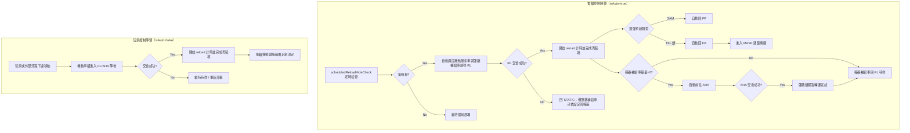

# Missile System 模組架構

本文件說明 `src/modules/missileSystem/` 的整體功能與在遊戲中的可見流程。各子模組實作細節請參閱對應文件。

---

## 模組定位

`missileSystem` 負責飛彈系統的再裝填、運補與掩蔽流程控制，核心目標有三個：

- 讓機動發射車與防空飛彈車具備持續火力支援能力（不是打一波就失能）
- 讓機動車組在補給與掩蔽間切換，提升生存性
- 把「補給鏈是否完整」轉化為遊戲內可見的戰力起伏

支援類別：`mlrs`、`srbm`、`mrbm`、`glcm`、`ascm`、`sam`。

---

## 在遊戲中可見的流程

**彈藥循環流程**

當機動發射車彈量低於門檻或剛在 FSP 射擊完時，模組會啟動補給流程：

- 進入 `stowTime` 等待視窗，模擬射擊／撤收時間，期間不立即機動
- stow 結束後若仍低於 `ammoThreshold`，機動發射車前往 RL（Reload Point，再裝填陣地）；若彈量已充足（FSP 收車情境），則直接回 HA
- 彈藥補給車從 MASK 建築拉出後與機動發射車在 RL 交會，進入再裝填計時
- 彈藥補給車彈量耗盡時，再前往 AHA（Ammo Holding Area，彈藥集結陣地）與彈藥儲備點交會
- 轉運完成後彈藥補給車回 RL 待命

**再裝填後的機動與存活流程**

- 非 SAM（TEL 類）：補完後回 HA（Hide Area，掩蔽陣地），可進一步進入 MASK 建築掩蔽
- SAM（防空飛彈車）：補完後優先回 FP（Firing Point，射擊陣地）恢復防空火網覆蓋

**區域觸發的即時更新機制**

當機動車組進入 FP/HA/RL/AHA 各陣地區域時，模組會立即更新狀態與武器管制。

**HA 與 RL 的掩蔽判定差異**

- 主要掩蔽觸發點是 `HA`：若 `hideOnEnterHA=true` **且機動發射車彈藥充足**，抵達 HA 才會執行 `Concealment.hideUnit(...)`；若已低於 `ammoThreshold` 則不自動掩蔽，以便接續前往 RL 補給
- `RL` 不會直接讓機動發射車進建築掩蔽
- 只有在 RL 未交會且 `hideResupplyOnRLNoMeeting=true` 時，才可能讓彈藥補給車回到掩蔽狀態

---

## 電腦控制與玩家控制陣營的流程差異

| 面向 | 電腦控制陣營（`isAuto=true`） | 玩家控制陣營（`isAuto=false`） |
|---|---|---|
| 低彈量後自動啟動運補 | 會 | 不會（依玩家/外部流程） |
| 抵達 HA 後自動掩蔽 | 彈藥充足才會（載入 MASK 建築）；低彈量則跳過以便繼續前往 RL 補給 | 預設不自動 |
| RL 未交會時彈藥補給車處理 | 依機制決定是否掩蔽 | 預設不掩蔽 |
| 再裝填流程完成後動作 | 自動回 FP/HA | 主要由手動決策延續 |

重點：電腦控制陣營採自動化流程，玩家控制陣營採手動流程。

---

## 補給流程總覽（電腦控制 / 玩家控制）

---

## 電腦控制陣營補給流程

電腦控制陣營的補給流程不只依賴`UnitEntersArea`事件觸發更新狀態，而是由定時檢查主動驅動：

- `scheduledReloadHideCheck.lua` 週期呼叫 `checkMissileSystemState(saveData.c.ground, true, constants.SIDES.ENEMY)`
- 機動發射車低彈量或剛完成 FSP 射擊時，先進入 `stowTime` 等待視窗（由 `firingUnitContext.stowStartTime` 記錄起點），倒數結束才實際機動，避免射擊後立即撤收
- stow 結束時若彈量已充足（典型 FSP 收車情境），直接回 HA；若仍低彈量，則自動觸發「機動發射車 + 彈藥補給車」同步前往 RL
- 彈藥補給車彈量歸零時，會自動觸發彈藥補給車前往 AHA 補給
- 機動發射車裝填完畢後，防空飛彈車自動回 FP；TEL 類自動回 HA
- 電腦控制陣營 `moveToPosition` 機制設定包含 `hideOnEnterHA=true`，抵達 HA 陣地且彈藥充足時自動執行建築掩蔽（低彈量單位不掩蔽，避免阻斷後續前往 RL 的補給流程）
- 電腦控制陣營亦可在 RL 未交會時，依 `hideResupplyOnRLNoMeeting=true` 讓彈藥補給車回到掩蔽狀態（不是機動發射車）

---

## 戰術效果（設計意圖對應）

| 設計機制 | 遊戲中的效果 |
|---|---|
| RL 交會 + 再裝填時間 | 形成射擊節奏與火力間隙，避免連續無限火力投射 |
| AHA 二級補給 | 補給流程可被中斷，摧毀彈藥儲存可成為有效戰術 |
| TEL 回 HA + 建築掩蔽 | 降低被持續偵蒐與反制打擊的機率 |
| SAM 補完回 FP | 防空火網覆蓋恢復較快，空域威脅起伏更明顯 |
| 狀態機（STATIC/REPOSITIONING/RELOAD/HIDE） | 流程可預期、可調校、可在 UI/事件中解讀 |

---

## 關鍵失效情境（劇本中可觀察）

**情境 A：彈藥補給車被摧毀**

- 對應資料欄位 `resupplyUnits[*].wpnCurrent` 會下降或歸零
- 機動發射車短期仍可作戰，但無法進行再裝填

**情境 B：彈藥儲備點被摧毀**

- 對應 `ammunitions[*].wpnCurrent` 歸零
- 彈藥補給車用盡後無法再裝填，該作戰區飛彈系統續戰力將衰退

**情境 C：未在同一陣地交會**

- 機動發射車與彈藥補給車若未在同一 RL 陣地交會，無法進入有效 `RELOAD` 完成狀態
- 彈藥補給車若未在同一 AHA 陣地與彈藥儲備點交會，將無法完成再裝填

---

## 參數用途對照（`config`）

| 參數路徑 | 說明 |
|---|---|
| `config.*.ground.<system>.ammoThreshold` | 再裝填啟動門檻 |
| `config.*.ground.<system>.reloadTime` | 再裝填所需時間 |
| `config.*.ground.<system>.stowTime` | 射擊／低彈量觸發後的 stow 等待時間 |
| `config.*.ground.<system>.resupplyUnits[*].unitCount` | 彈藥補給車數量 |
| `config.*.ground.<system>.ammunitions[*].wpnDefault` | 彈藥儲備點初始庫存 |
| `operationalArea` 的 FP/HA/RL/AHA 陣地位置 | 補給路徑與交會條件 |

---

## 模組依據與執行結果

**主要依據**

- `saveData.*.ground.*` 當前狀態
- `config.*.ground.*` 的機動車組與區域配置
- 想定事件：`UnitEntersArea`、定時腳本觸發

**主要結果**

- 機動車組移動與射擊管制命令（移動、武器管制）
- 彈藥庫存變化（機動發射車/彈藥補給車/彈藥儲備點）
- 利用 CMO `cargo` 裝載/卸載機制，模擬機動車組進入掩體或建築進行隱藏
- 事件trigger 與 zone 移除與創建結果（由玩家手動部署單位部署陣地）

---

## 與其他模組的整合（流程面）

| 整合點 | 實際作用 |
|---|---|
| `scheduledReloadHideCheck.lua` | 提供定時檢查，驅動再裝填、機動流程 |
| `moveToPosition.lua` | 機動車組進入陣地後，立即更新對應狀態與武器管制 |
| `strikePlanner/fireSupportPlan.lua` | FSP 射擊後寫入 `firingUnitContext.stowStartTime`，觸發 stow 等待視窗 |
| `addMissileSystems.lua` | 創建飛彈系統單位與 context，常用於測試/重部署 |
| `destroyUnits.lua` / `taiwaneseAssetIsDestroy.lua` | 彈藥車與彈藥庫戰損同步反映到庫存與後續火力支援能力 |
| `unitStatusUI.lua` | 將狀態與作戰區域可視化，利於除錯與調校 |

---

## 模組文件索引

- [init](init.md)
- [cycle](cycle.md)
- [movement](movement.md)
- [meeting](meeting.md)
- [ammo](ammo.md)
- [concealment](concealment.md)
- [deployment](deployment.md)
- [context](context.md)
- [triggers](triggers.md)
- [shared](shared.md)
