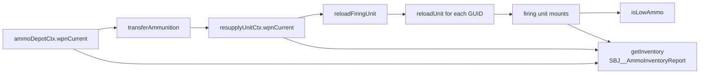

# ammo.lua

彈藥轉運、重裝與低彈量判斷模組。

> Source: `src/modules/missileSystem/ammo.lua`

責任摘要：維護彈藥補給車/彈藥儲備點庫存，並將彈藥實際裝填到機動發射車。

---

## 概觀

`ammo.lua` 同時處理三件事：

- `transferAmmunition`：彈藥儲備點 → 彈藥補給車
- `reloadFiringUnit`：彈藥補給車 → 機動發射車（含 group）
- `getInventory`：跨整個飛彈系統聚合彈藥庫存（firing / resupply / 彈藥儲備點）並產生百分比報告，供火力支援暫停閘門等上層判斷使用

模組支援 `weaponDBID` 為單值或陣列，會先用 `Shared.normalizeWeaponDBIDs` 做一致化，再逐一計算缺額與實際補入數量。

---

## 主要機制

- `reloadUnit` 依每種武器 `max - available` 計算缺口，再受 `resupplyUnitCtx.wpnCurrent` 上限約束。
- `reloadFiringUnit` 會遍歷group裡的 GUID 每個單位進行再裝填。
- `isLowAmmo` 將group與所有 `weaponDBID` 的 `available/max` 比率，比對門檻百分比。
- `getInventory` 聚合三個子總和：firing 由 `ScenEdit_GetUnit` + `getWeaponInfo` 即時查詢，resupply / ammunitions 由 context 中的 `wpnCurrent` / `wpnDefault` 累加；缺單位（找不到 unit）會被略過，max=0 時百分比固定 0 以避免除零。

---

## Public API

| 函式 | 參數 | 回傳 | 說明 |
|---|---|---|---|
| `transferAmmunition` | `resupplyUnitCtx, ammoDepotCtx` | `nil` | 從彈藥儲備點補滿彈藥補給車（受庫存限制） |
| `reloadUnit` | `unit, weaponDBID, resupplyUnitCtx` | `integer` | 單一 unit 裝填，回傳裝填量 |
| `reloadFiringUnit` | `firingUnitCtx, resupplyUnitCtx, weaponDBID, sideName` | `integer` | 機動車組裝填，回傳總裝填量 |
| `isLowAmmo` | `firingUnit, percentage, weaponDBID` | `boolean` | 低彈量判定 |
| `getInventory` | `systemCtx, sideName` | `SBJ__AmmoInventoryReport` | 聚合 firing / resupply / ammo 三類子總和並算出整體百分比 |

---

## 相關模組

- [shared](shared.md)
- [cycle](cycle.md)
- [meeting](meeting.md)
- [init](init.md)
