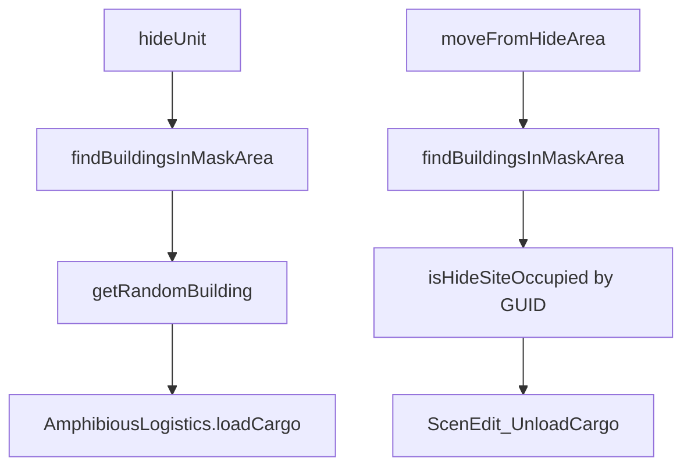

# concealment.lua

MASK 區建築隱蔽控制模組。

> Source: `src/modules/missileSystem/concealment.lua`

責任摘要：利用 CMO `cargo` 裝載/卸載機制，實作機動車組的隱藏與出掩蔽。

---

## 概觀

`concealment.lua` 透過 `unitsInArea` 於 `operationalArea.mask.area` 搜尋可用建築物，並配合 `AmphibiousLogistics.loadCargo` 將機動車組載入建築，模擬進掩體、建築隱蔽。

當機動車組需要再次機動時，`moveFromHideArea` 會掃描 mask 內建築 cargo，找到對應 GUID 後卸載。

此模組不決定何時隱蔽，時機由 `init.lua` 與 `cycle.lua` 流程控制。

---

## 主要機制

- `findBuildingsInMaskArea`: 只篩選己方 `BUILDING_SURFACE` 且 `PLATFORMS.BUILDING`。
- `getRandomBuilding`: 只從未占用建築中隨機挑選。
- `isHideSiteOccupied`: 支援「檢查任意占用」與「檢查指定 GUID 占用」。

---

## Public API

| 函式 | 參數 | 回傳 | 說明 |
|---|---|---|---|
| `isHideSiteOccupied` | `building, unitGUID?` | `boolean` | 判斷建築是否已有載貨或指定機動車組 |
| `findBuildingsInMaskArea` | `unitCtx, sideName` | `CMO__Unit[]|nil` | 取得 mask 區建築清單 |
| `getRandomBuilding` | `buildings` | `CMO__Unit|nil` | 隨機挑未占用建築 |
| `moveFromHideArea` | `unitCtx, unit` | `boolean, table?` | 卸載離開建築 |
| `hideUnit` | `unitCtx, unit` | `boolean, table?` | 載入建築隱蔽 |

失敗時第二個回傳值是 log 欄位表而非散文訊息，呼叫端直接併進自己的 row：

| `reason` | 附帶欄位 | 情境 |
|---|---|---|
| `no_buildings_in_mask` | `area` | `findBuildingsInMaskArea` 回 nil |
| `no_available_building` | `area` | 有建築但全數已被占用 |

`no_buildings_in_mask` 目前合併了兩種原因（side 查不到、`mask.area` 未設定）；要區分需改 `findBuildingsInMaskArea` 的回傳形狀。

---

## 相關模組

- [shared](shared.md)
- [init](init.md)
- [cycle](cycle.md)
