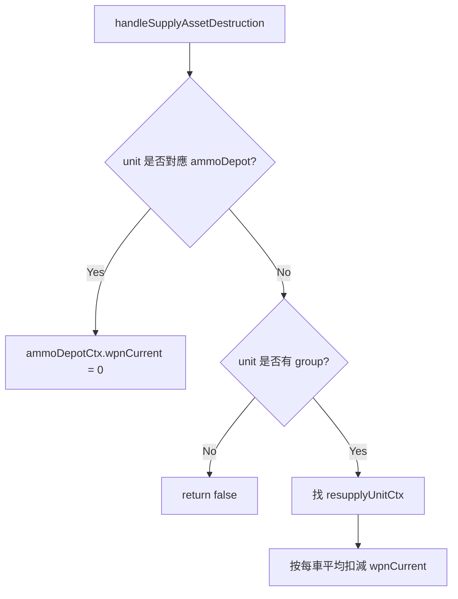

# context.lua

飛彈模組 runtime context 建立與補給資產戰損處理模組。

> Source: `src/modules/missileSystem/context.lua`

責任摘要：把 config 描述複製成 `saveData.*.ground.*` 形式，並在補給資產被擊毀時更新庫存。

---

## 概觀

`initMissileSystemContexts` 會深拷貝 `firingUnits/resupplyUnits/ammunitions`，避免直接共用配置表，並為 firing/resupply 初始化 `reloadStartTime = nil`。

`handleSupplyAssetDestruction` 會在分數腳本觸發時被呼叫：

- 若擊毀彈藥儲備點（非 group），直接將對應 `ammoDepotCtx.wpnCurrent = 0`
- 若擊毀彈藥補給車群組成員，按每車平均彈量扣減群組 `wpnCurrent`

---

## 主要機制

---

## Public API

| 函式 | 參數 | 回傳 | 說明 |
|---|---|---|---|
| `handleSupplyAssetDestruction` | `unit, systemCtx` | `boolean` | 補給資產戰損後同步修正庫存 |
| `initMissileSystemContexts` | `groundForceCfg, groundForceCtx` | `nil` | 初始化 runtime context |

---

## 相關模組

- [init](init.md)
- [deployment](deployment.md)
