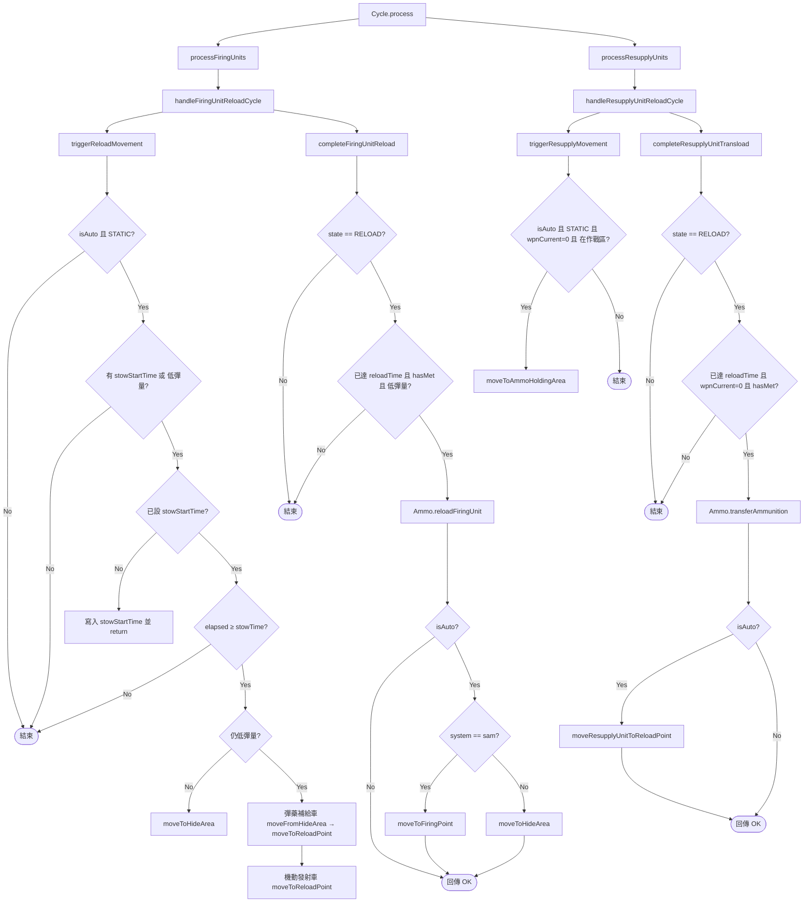

# cycle.lua

補給流程主引擎，負責定時檢查機動發射車與彈藥補給車，驅動 stow → 機動 → 再裝填的狀態轉移。

> Source: `src/modules/missileSystem/cycle.lua`

責任摘要：每次定時檢查中，依「FSP 射擊或低彈量 → stow 等待 → 機動 → 會合 → 完成再裝填」順序推進機動發射車與彈藥補給車的補給節奏。

---

## 概觀

`Cycle.process` 是模組對外唯一進入點，內部分別跑 `processFiringUnits` 與 `processResupplyUnits`，逐一處理該飛彈系統中的所有機動發射車與彈藥補給車。

對機動發射車而言，流程拆成兩段：先用 `triggerReloadMovement` 判定是否要從 STATIC 起跑（受 stow 等待時間管制），再用 `completeFiringUnitReload` 在 RELOAD 狀態下判定是否可以收尾。對彈藥補給車則對應 `triggerResupplyMovement` 與 `completeResupplyUnitTransload`，差別在於它的觸發條件是「彈量歸零且仍在作戰區」，並且不需要 stow 等待。

本模組只負責流程編排與條件判斷，實際動作（移動、武器管制、卸載／裝載、隱蔽）委派給 `Movement`、`Meeting`、`Ammo`、`Concealment`。`isAuto` 控制電腦控制陣營與玩家控制陣營的差異：只有 `isAuto=true` 才會主動驅動 stow 倒數與後續機動，但「完成再裝填」這段在兩種模式下都會執行。

---

## 主要機制

### Stow 等待視窗（新）

`triggerReloadMovement` 在機動發射車目前是 `STATIC` 且 `isAuto=true` 時才會運作，並引入 `firingUnitCtx.stowStartTime` 作為倒數起點：

- 觸發來源有兩個：
  - 低於 `ammoThreshold`（由 `Ammo.isLowAmmo` 判定）
  - FSP 射擊後由 `strikePlanner/fireSupportPlan.lua` 把 `stowStartTime` 設為當前時間
- 第一個偵測到觸發的循環會把 `stowStartTime` 寫入並 return，留到下個循環才推進
- 在 `elapsedTime < systemCtx.stowTime` 期間，車組維持 STATIC 不動，模擬射擊後的收車／撤收時間
- 倒數結束後依當下彈量分流：
  - **彈量充足**：呼叫 `Movement.moveToHideArea` 收回 HA，並清掉 `stowStartTime`（典型 FSP 一波打完後的撤收路徑）
  - **仍然低彈量**：先把對應的彈藥補給車從 HA 拉出（`Concealment.moveFromHideArea`）並送往 RL，再把機動發射車送往 RL，最後清掉 `stowStartTime`

### Reload 完成條件

`completeFiringUnitReload` 只在 `state == RELOAD` 時才執行（狀態由 `Movement.setReloadStartTime` 切換）：

- 進入 RELOAD 後若 `reloadStartTime` 尚未設定，會在這裡補上一個起點
- 透過 `isReadyToReloadFiringUnit` 同時檢查三件事：
  - `ScenEdit_CurrentTime() - reloadStartTime >= reloadTime`
  - `Meeting.hasMetResupplyUnit` 回 `true`（玩家控制流程在 `Meeting` 內部會放寬）
  - `Ammo.isLowAmmo` 仍為 `true`，避免重複裝填
- 條件達成才呼叫 `Ammo.reloadFiringUnit` 實際補彈
- 自動模式下，補完後依系統類別決定下一步：
  - `systemCtx.name == "sam"` → `Movement.moveToFiringPoint`，盡快恢復防空火網
  - 其他 TEL 類 → `Movement.moveToHideArea`，回到 HA 等下一輪
  - 若彈藥補給車仍有存彈且還在作戰區，加碼呼叫 `Concealment.hideUnit` 把它藏回 MASK 建築

### 彈藥補給車的二級補給

`triggerResupplyMovement` 與 `completeResupplyUnitTransload` 與機動發射車對稱，但流程較精簡：

- 觸發條件：自動模式 + `STATIC` + `wpnCurrent == 0` + 仍位於 `operationalArea` 任一陣地內
- 觸發後呼叫 `Movement.moveToAmmoHoldingArea` 前往 AHA 與彈藥儲備點交會
- `isReadyToReloadResupplyUnit` 確認 `reloadTime` 已過、`wpnCurrent` 仍為 0、`Meeting.hasMetAmmoDepot` 回 `true`
- 條件達成呼叫 `Ammo.transferAmmunition`，並在自動模式下由 `Movement.moveResupplyUnitToReloadPoint` 回 RL 待命

### 結果回傳

每個內部 cycle 函式都會回傳 `SBJ__ReloadCycleResult | nil`，由 `Cycle.process` 收成一個陣列回給呼叫端（通常是 `scheduledReloadHideCheck` 系列腳本），供 log 與 UI 使用。回傳結構固定為 `{ tag = "OK", unitName = ..., action = ... }`。

---

## 流程圖

---

## Public API

| 函式 | 參數 | 回傳 | 說明 |
|---|---|---|---|
| `Cycle.process` | `systemCtx: SBJ__MissileSystemContext, isAuto: boolean, sideName: string` | `SBJ__ReloadCycleResult[]` | 對單一飛彈系統執行一次完整補給循環，回傳本次有實際進度的動作清單 |

---

## 關鍵 `config` / `constants` / `saveData` 引用

| 路徑 | 用途 |
|---|---|
| `systemCtx.reloadTime`（對應 `config.*.ground.<system>.reloadTime`） | reload 倒數時長 |
| `systemCtx.stowTime`（對應 `config.*.ground.<system>.stowTime`） | 射擊／低彈量後的 stow 等待時長 |
| `firingUnitCtx.ammoThreshold` | 低彈量觸發門檻，傳給 `Ammo.isLowAmmo` |
| `firingUnitCtx.weaponDBID` | 用來鎖定要回補的武器類別 |
| `firingUnitCtx.stowStartTime` / `reloadStartTime` | 倒數時間錨點，存在 `saveData.*.ground.<system>.firingUnits[*]` |
| `resupplyUnitCtx.wpnCurrent` | 二級補給觸發條件 |
| `constants.MISSILE_SYSTEM_STATE.STATIC` / `RELOAD` | stow 觸發與 reload 完成判斷的狀態守門 |
| `constants.MISSILE_SYSTEM_TYPES.SAM` | 補完後是否回 FP 的分流 |

---

## 相關模組

- [init](init.md)
- [movement](movement.md)
- [meeting](meeting.md)
- [ammo](ammo.md)
- [concealment](concealment.md)
- [triggers](triggers.md)
- [../strikePlanner/fireSupportPlan](../strikePlanner/fireSupportPlan.md)
