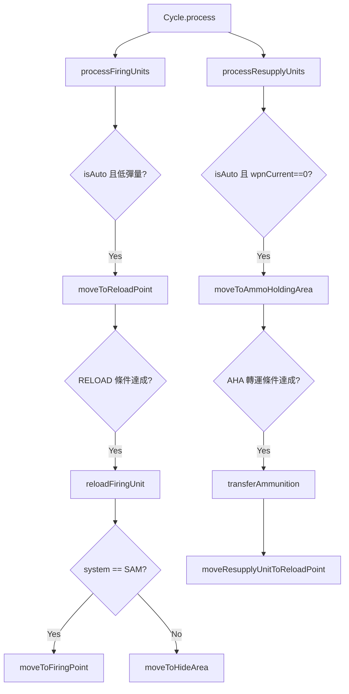

# cycle.lua

補給流程主引擎，負責定時檢查機動發射車與彈藥補給車，驅動補給狀態轉移。

> Source: `src/modules/missileSystem/cycle.lua`

責任摘要：在每次定時檢查中執行「飛彈存彈量低就執行機動、會合等待、完成再裝填」完整流程。

---

## 概觀

`Cycle.process` 會分別跑 `processFiringUnits` 與 `processResupplyUnits`。對機動發射車而言，先判定是否要觸發轉移到 RL，再判定是否達成 reload 條件；對彈藥補給車則是彈量歸零後前往 AHA，完成與彈藥儲備點轉運。

此模組只負責流程編排與條件判斷，實際動作委派給 `Movement`、`Meeting`、`Ammo`、`Concealment`。

電腦控制與玩家控制流程差異由 `isAuto` 控制；`isAuto=true` 才會主動觸發機動流程。

---

## 主要機制

- `isReadyToReloadFiringUnit`: 檢查 `reloadStartTime + reloadTime`、RL 會合與低彈量門檻。
- `isReadyToReloadResupplyUnit`: 檢查彈藥補給車在 AHA 交會後是否可回補。
- `completeFiringUnitReload`: 裝填完成後，SAM 回 FP，其餘類別回 HA。
- `completeResupplyUnitTransload`: 從彈藥儲備點補回彈藥補給車，並回 RL 待命。

---

## Public API

| 函式 | 參數 | 回傳 | 說明 |
|---|---|---|---|
| `process` | `systemCtx, isAuto, sideName` | `SBJ__ReloadCycleResult[]` | 執行一次完整補給流程 |

---

## 相關模組

- [meeting](meeting.md)
- [movement](movement.md)
- [ammo](ammo.md)
- [concealment](concealment.md)
- [init](init.md)
