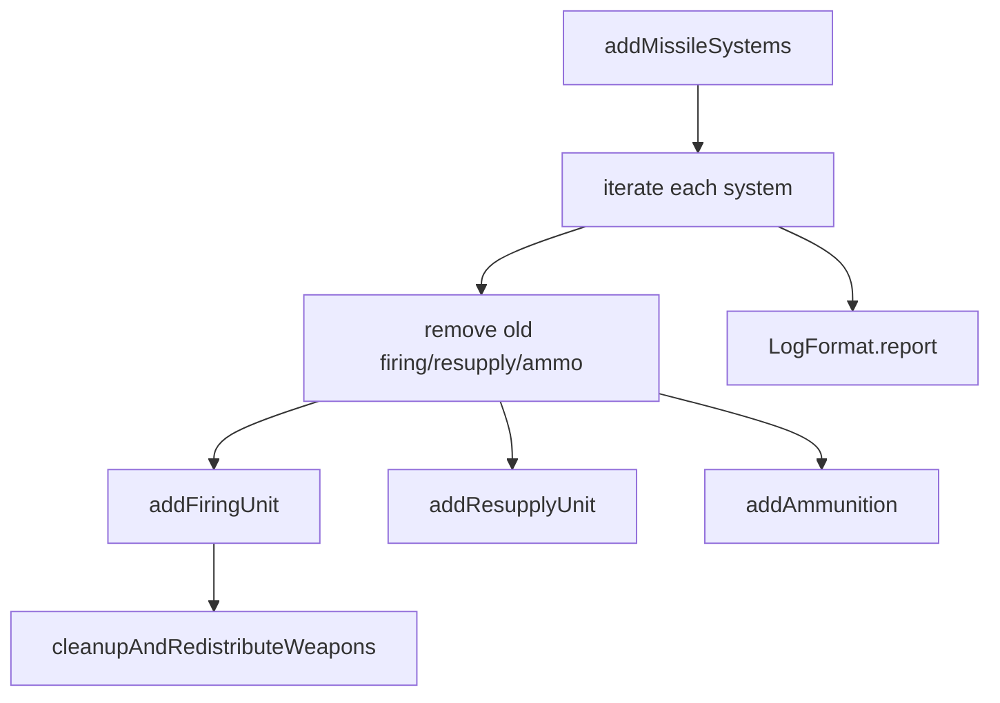

# deployment.lua

飛彈系統單位創建與部署模組。

> Source: `src/modules/missileSystem/deployment.lua`

責任摘要：依 `groundForceCfg` 建立機動發射車/彈藥補給車/彈藥儲備點三類配置並整理武器掛載。

---

## 概觀

`deployment.lua` 主要用在 special action（創建飛彈系統單位）。每個 system 會先刪除既有飛彈系統單位，再按配置創建，最後輸出成功與失敗摘要。

對 firing unit，會依 `isSam` 決定初始生成點（SAM 在 FP、其餘在 HA）。對 resupply/ammo，分別使用 RL 與 AHA 作為初始點。

建立後會執行 `cleanupAndRedistributeWeapons`，去除非目標武器並在單一 weaponDBID 情境下把可轉移彈數補回。

---

## 主要機制

- `removeMissileSystem`: 兼容 group 與單一機動車組刪除。
- `addFiringUnit`: 驗證 HA/FP 路徑、建立分隊、可套用 mountDescriptors。
- `addResupplyUnit`: 依 `unitCount` 建立 Ammo Sec 群組。
- `addAmmunition`: 依對應彈藥補給車的 AHA 配置放置彈藥儲備點。

---

## Public API

| 函式 | 參數 | 回傳 | 說明 |
|---|---|---|---|
| `addMissileSystems` | `groundForceCfg, sideName` | `nil` | 依配置創建所有飛彈系統單位 |

---

## 相關模組

- [shared](shared.md)
- [context](context.md)
- [init](init.md)
