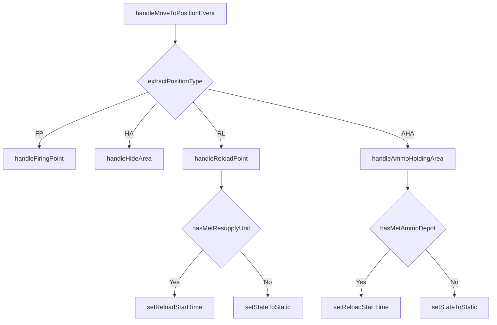

# init.lua

`missileSystem` 入口模組，提供對外 API 並統一處理 `UnitEntersArea` 事件。

> Source: `src/modules/missileSystem/init.lua`

責任摘要：封裝子模組並實作位置觸發分派（FP/HA/RL/AHA）。

---

## 概觀

`init.lua` 是外部腳本唯一需要 `require` 的門面層。定時檢查腳本呼叫 `checkMissileSystemState`，場景事件腳本呼叫 `handleMoveToPositionEvent`，其餘初始化與重建 API 也都由此轉發。

模組內將觸發流程拆成多個局部 handler：`handleFiringPoint`、`handleHideArea`、`handleReloadPoint`、`handleAmmoHoldingArea`，再透過 `forEachEnabledSystem` 套用到啟用中的類別（`mlrs/srbm/...`）。

此外，`resolveBehavior` 允許不同陣營自訂流程，例如電腦控制陣營可在進入 HA 時自動 `hideUnit`，玩家控制陣營則僅做狀態更新。

---

## 主要機制

1. 由 `extractPositionType(event)` 從 trigger description 解析 `FP/AHA/HA/RL`。
2. 非 FP 事件會先 `dropUnitContact`，降低非必要接觸資訊。
3. 依陣地類型分派至對應 handler。
4. RL/AHA 流程會先做 `Meeting` 判斷，成功才進入 `RELOAD` 計時。

---

## Public API

| 函式 | 參數 | 回傳 | 說明 |
|---|---|---|---|
| `moveToFiringPoint` | `firingUnitCtx, firingUnit` | `boolean` | 轉呼叫 `Movement.moveToFiringPoint` |
| `moveFromHideArea` | `unitCtx, unit` | `boolean, string?` | 轉呼叫 `Concealment.moveFromHideArea` |
| `isLowAmmo` | `firingUnit, percentage, weaponDBID` | `boolean` | 轉呼叫 `Ammo.isLowAmmo` |
| `checkMissileSystemState` | `systemCtx, isAuto, sideName` | `nil` | 執行循環並輸出結果日誌 |
| `handleSupplyAssetDestruction` | `unit, systemCtx` | `boolean` | 轉呼叫 `Context.handleSupplyAssetDestruction` |
| `initEventTriggers` | `operationalAreas, operationalAreasToRemove, positionTypes, sideName` | `nil` | 轉呼叫 `Triggers.initEventTriggers` |
| `addMissileSystems` | `groundForceCfg, sideName` | `nil` | 轉呼叫 `Deployment.addMissileSystems` |
| `initMissileSystemContexts` | `groundForceCfg, groundForceCtx` | `nil` | 轉呼叫 `Context.initMissileSystemContexts` |
| `handleMoveToPositionEvent` | `opts` | `nil` | 處理位置事件主流程 |

---

## 相關模組

- [cycle](cycle.md)
- [movement](movement.md)
- [meeting](meeting.md)
- [ammo](ammo.md)
- [concealment](concealment.md)
- [deployment](deployment.md)
- [context](context.md)
- [triggers](triggers.md)
