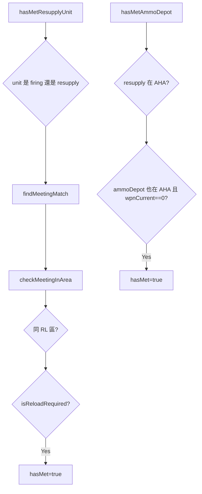

# meeting.lua

RL/AHA 同區域會合與補給必要性判斷模組。

> Source: `src/modules/missileSystem/meeting.lua`

責任摘要：判斷機動發射車、彈藥補給車、彈藥儲備點是否在同一陣地區域且符合補給條件。

---

## 概觀

`meeting.lua` 聚焦在「是否會合成功」與「是否值得補給」兩個問題。它不下任何移動命令，只輸出布林值與匹配到的 context。

在 RL 流程中，會同時檢查雙方狀態與彈量條件，避免在不需要補給時進入 `RELOAD` 計時。

在 AHA 流程中，則要求彈藥補給車彈量為 0，且彈藥補給車與彈藥儲備點都在同一 AHA 區。

---

## 主要機制

- `findUnitArea`：以 RL 區塊判斷目前所在區域。
- `isValidStateForMeeting`：自動模式下限制為 `REPOSITIONING` 或 `RELOAD`。
- `isReloadRequired`：雙向判斷低彈量與庫存餘量。
- `hasMetResupplyUnit` / `hasMetAmmoDepot`：提供外部流程直接呼叫。

---

## Public API

| 函式 | 參數 | 回傳 | 說明 |
|---|---|---|---|
| `findUnitArea` | `unit, operationalArea` | `string[]|nil` | 找到機動車組所在 RL 陣地 |
| `isValidStateForMeeting` | `state, isAuto` | `boolean` | 判斷狀態是否允許會合 |
| `isReloadRequired` | `targetCtx, counterpartCtx, unit, counterpart` | `boolean` | 判斷是否需要補給 |
| `checkMeetingInArea` | `unitCtx, unitName, counterpartList, unit, isAuto` | `boolean, context?` | 單一 context 會合判斷 |
| `findMeetingMatch` | `unitList, unitName, counterpartList, unit, isAuto` | `boolean, context?` | 在清單中找匹配會合 |
| `hasMetResupplyUnit` | `systemCtx, unit, isAuto` | `boolean, context?` | 機動發射車/彈藥補給車於 RL 交會 |
| `hasMetAmmoDepot` | `systemCtx, unit, isAuto` | `boolean, resupplyCtx?` | 彈藥補給車與彈藥儲備點於 AHA 交會 |

---

## 相關模組

- [ammo](ammo.md)
- [cycle](cycle.md)
- [init](init.md)
