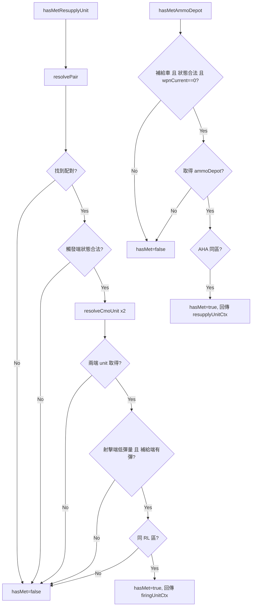

# meeting.lua

RL/AHA 同區域會合與補給必要性判斷模組。

> Source: `src/modules/missileSystem/meeting.lua`

責任摘要：判斷機動發射車、彈藥補給車、彈藥儲備點是否在同一陣地區域且符合補給條件。

---

## 概觀

`meeting.lua` 聚焦在「是否會合成功」與「是否值得補給」兩個問題。它不下任何移動命令，只輸出布林值與匹配到的 context。

在 RL 流程中，會先依觸發單位名稱解析出配對的射擊/補給 context，再一次驗證狀態、低彈量與同區域條件，避免在不需要補給時進入 `RELOAD` 計時。無論觸發端是機動發射車還是彈藥補給車，皆固定回傳 **firing unit context**，讓呼叫端能統一把 reload 起始時間掛在射擊單位上。

在 AHA 流程中，則要求彈藥補給車彈量為 0，且彈藥補給車與彈藥儲備點都在同一 AHA 區。

---

## 主要機制

- `findUnitArea`：以 RL 區塊判斷目前所在區域。
- `isValidStateForMeeting`：自動模式下限制為 `REPOSITIONING` 或 `RELOAD`。
- `resolvePair`（module-local）：以觸發單位名稱向 `systemCtx.firingUnits` / `systemCtx.resupplyUnits` 雙向查找，回傳該對射擊/補給 context；支援 `resupplyUnitCtx.firingUnit` 為字串或陣列（取第一筆）。
- `resolveCmoUnit`（module-local）：若 context 名稱與觸發單位相同則直接重用，避免重複的 `ScenEdit_GetUnit` 呼叫。
- `hasMetResupplyUnit`：依序檢查「配對存在 → 觸發端狀態合法 → 兩端 CMO unit 取得 → 射擊端低彈量且補給端有彈 → 同 RL 區」。
- `hasMetAmmoDepot`：以 guard clauses 提前退出（觸發端必須是補給車、狀態合法、彈量為 0、彈藥儲備點存在），最後在 AHA 位置清單找共同區域。

---

## Public API

| 函式 | 參數 | 回傳 | 說明 |
|---|---|---|---|
| `findUnitArea` | `unit, operationalArea` | `string[]|nil` | 找到機動車組所在 RL 陣地 |
| `isValidStateForMeeting` | `state, isAuto` | `boolean` | 判斷狀態是否允許會合 |
| `hasMetResupplyUnit` | `systemCtx, unit, isAuto` | `boolean, firingUnitCtx?` | 機動發射車/彈藥補給車於 RL 交會；固定回傳 firing unit context |
| `hasMetAmmoDepot` | `systemCtx, unit, isAuto` | `boolean, resupplyUnitCtx?` | 彈藥補給車與彈藥儲備點於 AHA 交會 |

> 內部輔助函式 `resolvePair`、`resolveCmoUnit` 為 module-local，不對外暴露。

---

## 相關模組

- [ammo](ammo.md)
- [cycle](cycle.md)
- [init](init.md)
