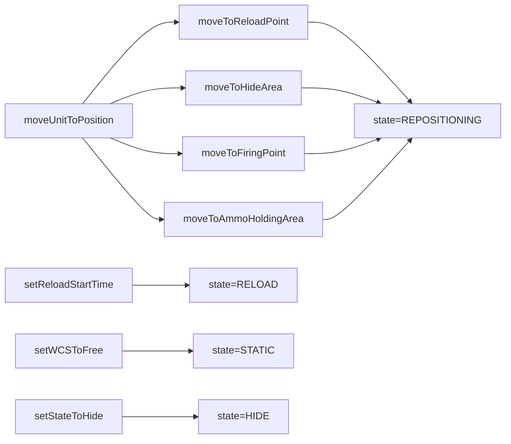

# movement.lua

機動車組機動與狀態轉換模組。

> Source: `src/modules/missileSystem/movement.lua`

責任摘要：統一封裝到 FP/HA/RL/AHA 的移動命令與狀態切換。

---

## 概觀

`movement.lua` 把路徑移動與武器管制設定集中處理，避免各流程重複拼接 `ScenEdit_SetUnit` / Doctrine 參數。所有移動最終都透過 `moveUnitToPosition` 執行。

當狀態改變時，會同步更新 `unitCtx.state` 與 `reloadStartTime`，確保 `cycle.lua` 可用同一套條件運算。

在玩家控制流程下，`isRepositioning` 會直接回傳 true，讓事件流程更寬鬆地接受玩家操作。

---

## 主要機制

- 隨機挑選 `operationalArea` 中某個陣地並賦予 course。
- `setReloadStartTime` 進入 `RELOAD` 並鎖定 `WCS.HOLD`。
- `setWCSToFree` 進入 `STATIC` 並切換 `WCS.FREE`。
- `setStateToHide` 進入 `HIDE`。

---

## Public API

| 函式 | 參數 | 回傳 | 說明 |
|---|---|---|---|
| `moveUnitToPosition` | `opts` | `boolean, string?` | 共用移動執行器 |
| `moveToReloadPoint` | `unitCtx, unit` | `boolean, string?` | 移動至 RL |
| `moveToHideArea` | `firingUnitCtx, firingUnit` | `boolean, string?` | 移動至 HA |
| `moveToAmmoHoldingArea` | `resupplyUnitCtx, resupplyUnit` | `boolean, string?` | 移動至 AHA |
| `moveResupplyUnitToReloadPoint` | `resupplyUnitCtx, resupplyUnit` | `boolean, string?` | 彈藥補給車回 RL |
| `moveToFiringPoint` | `firingUnitCtx, firingUnit` | `boolean, string?` | 移動至 FP |
| `setReloadStartTime` | `firingUnitCtx, firingUnit, isAuto` | `nil` | 設 `RELOAD` 與起始時間 |
| `setWCSToFree` | `firingUnitCtx, firingUnit, isAuto` | `nil` | 設 `STATIC` + `WCS.FREE` |
| `setStateToHide` | `firingUnitCtx, firingUnit, isAuto` | `nil` | 設 `HIDE` + `WCS.HOLD` |
| `setStateToStatic` | `systemCtx, firingUnit, isAuto` | `nil` | 清空 reload timer 並設 `STATIC` |
| `isRepositioning` | `firingUnitCtx, isAuto` | `boolean` | 判斷事件是否可接受 |

---

## 相關模組

- [shared](shared.md)
- [init](init.md)
- [cycle](cycle.md)
