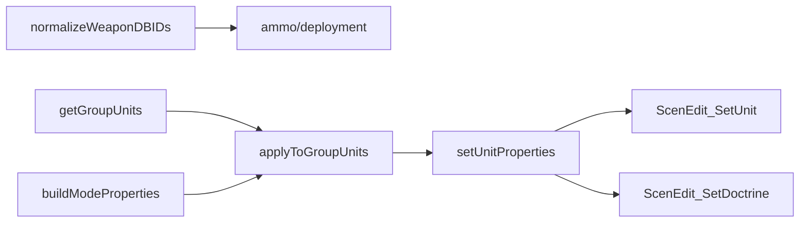

# shared.lua

missileSystem 共用工具函式模組。

> Source: `src/modules/missileSystem/shared.lua`

責任摘要：提供 SAM 判定、group展開、機動車組單位屬性設定與 mode 參數組裝。

---

## 概觀

`shared.lua` 是底層輔助層，避免在 `movement/ammo/concealment` 重複處理group GUID 與 `ScenEdit_SetUnit` 參數組裝。

`SAM_DBIDS` 清單用於決定 Doctrine 設定欄位：SAM 設 `weapon_control_status_air`，其餘設 `weapon_control_status_land`。

`buildModeProperties` 也統一了自動與手動模式的 `holdPosition/throttle/speed` 規則。

---

## 主要機制

---

## Public API

| 函式 | 參數 | 回傳 | 說明 |
|---|---|---|---|
| `normalizeWeaponDBIDs` | `weaponDBID` | `number[]` | weaponDBID 單值/陣列一致化 |
| `isSAM` | `dbid` | `boolean` | 判斷平台是否屬於 SAM |
| `getGroupUnits` | `unit` | `string[]` | 取得group內所有 GUID |
| `setUnitProperties` | `params` | `nil` | 設定單位速度、移動路徑、Doctrine |
| `applyToGroupUnits` | `firingUnit, propsBuilder` | `nil` | 對group每個單位套用屬性 |
| `buildModeProperties` | `unit, isAuto, wcs` | `SBJ__SetUnitPropertiesParams` | 建立 mode 專用屬性 |

---

## 相關模組

- [movement](movement.md)
- [ammo](ammo.md)
- [concealment](concealment.md)
- [deployment](deployment.md)
