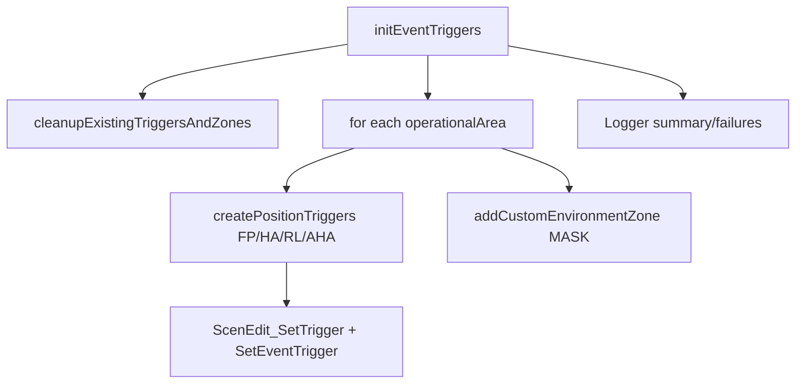

# triggers.lua

陣地tirgger 與 zone 管理模組。

> Source: `src/modules/missileSystem/triggers.lua`

責任摘要：建立/清理 FP、HA、RL、AHA 與 MASK 對應的事件觸發器與 zone。

---

## 概觀

`triggers.lua` 提供一個完整生命週期：先清理舊 trigger/zone，再為新 `operationalAreas` 建立對應觸發器與顏色標示 zone。

清理時會透過 `isSameRPArray` 比對區域幾何，避免只用名稱造成誤刪。建立時 trigger 名稱採固定模板 `(<side>) Arrive in <type> - <idx> - <oparea>`。

此外會補建 `MASK` 區並回填 `operationalArea.mask.area`，供 concealment 後續查建築使用。

---

## 主要機制

- `cleanupExistingTriggersAndZones`：移除舊事件觸發與標準 zone。
- `createPositionTriggers`：逐位置類型與索引建立 `UnitEntersArea` 觸發。
- `addCustomEnvironmentZone`（實作上使用 STANDARD zone）: 建立 mask 區域並寫入 `operationalArea.mask`。

---

## Public API

| 函式 | 參數 | 回傳 | 說明 |
|---|---|---|---|
| `initEventTriggers` | `operationalAreas, operationalAreasToRemove, positionTypes, sideName` | `nil` | trigger/zone 清理與創建 |

---

## 相關模組

- [init](init.md)
- [concealment](concealment.md)
