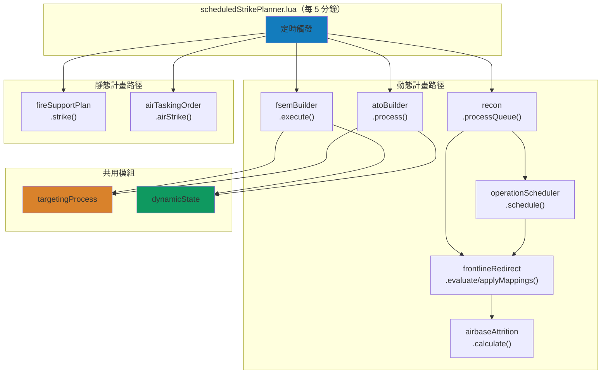
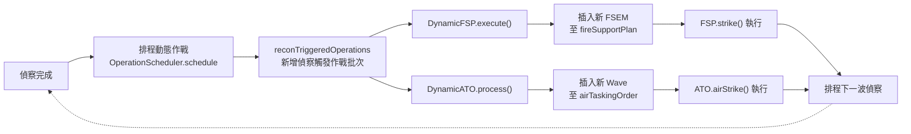
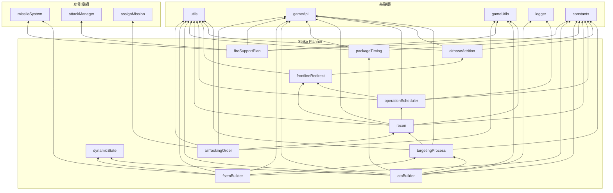

# Strike Planner 系統架構

本文件說明 `src/modules/strikePlanner/` 的整體設計架構、模組間協作關係及資料流。各模組的詳細說明請參閱對應文件。

---

## 概述

Strike Planner 是 China side 的聯合打擊規劃系統，模擬從偵察到打擊的完整 Kill Chain。系統分為兩大執行路徑：

- **靜態計畫**：預先排定的 ATO（空中任務令）與 FSP（火力支援計畫），按時間表依序執行
- **動態計畫**：基於偵察情報與戰損評估（BDA），即時生成新的打擊任務

### 系統能力

- 偵察資產生命週期管理：UAV、衛星、SIGINT 偵察項目可排入 `saveData.c.recon.queue`
- 動態作戰排程：偵察完成後建立 `reconTriggeredOperations`，同時掛載 air/ground operations
- 空中打擊生成：依 `SBJ__WaveTemplate` 評估目標、檢查飛機可用性、產生 ATO Wave
- 空中打擊執行：管理 Package 掛彈、任務建立、目標指派、飛機派遣與打擊後偵察
- 火力支援生成與執行：建立 FSEM，協調 TEL/發射單元移動、射擊與再補給
- 目標掃描與 BDA：維護 `saveData.c.targetlist`，並依任務波次過濾已摧毀或已評估目標

### F2T2EA Kill Chain 對應

| Kill Chain 階段 | 對應模組 | 說明 |
|:-:|---|---|
| **Find** | [recon](recon.md), [targetingProcess](targetingProcess.md) | UAV/衛星偵察、感測器接觸辨識 |
| **Fix** | [targetingProcess](targetingProcess.md) | 目標分類與定位（機場、港口、SAM、C2） |
| **Track** | [recon](recon.md), [targetingProcess](targetingProcess.md) | UAV 持續追蹤、SIGINT 無線電測向 |
| **Target** | [targetingProcess](targetingProcess.md), [fsemBuilder](fsemBuilder.md), [atoBuilder](atoBuilder.md) | 目標篩選、BDA 評估、打擊任務生成 |
| **Engage** | [airTaskingOrder](airTaskingOrder.md), [fireSupportPlan](fireSupportPlan.md) | ATO/FSP 任務執行 |
| **Assess** | [targetingProcess](targetingProcess.md) (BDA), [recon](recon.md) | 戰損評估、下一波偵察排程 |

---

## 模組一覽

### 模組角色對照

| 角色 | 模組 | 說明 |
|---|---|---|
| 目標資料來源 | [targetingProcess](targetingProcess.md) | 建立與查詢目標清單，供空中與地面打擊使用。 |
| 偵察排程者 | [recon](recon.md) / [operationScheduler](operationScheduler.md) | recon 管理偵察生命週期，scheduler 將偵察結果轉為後續 air/ground operations。 |
| 前線重導向 | [frontlineRedirect](frontlineRedirect.md), [airbaseAttrition](airbaseAttrition.md) | 依前線基地駐機戰損啟用 sticky redirect，將符合規則的 strike mapping 改用 AAR 編組。 |
| 動態空中生成者 | [atoBuilder](atoBuilder.md) | 驗證目標與機隊資源後插入 ATO Wave。 |
| 空中時序計算者 | [packageTiming](packageTiming.md) | 為通過驗證的 package 計算各角色時序與加油機受油協調。 |
| 靜態/動態 ATO 執行者 | [airTaskingOrder](airTaskingOrder.md) | 執行所有已啟動 Wave，不區分來源。 |
| 動態地面生成者 | [fsemBuilder](fsemBuilder.md) | 驗證目標與發射單元後插入 FSEM。 |
| 靜態/動態 FSP 執行者 | [fireSupportPlan](fireSupportPlan.md) | 執行所有已啟動 FSEM，不區分來源。 |
| 共用狀態工具 | [dynamicState](dynamicState.md) | 管理 recon-triggered operation 狀態、命名與 generated operation 登記。 |

### 模組摘要

| 模組 | 原始碼 | 職責 |
|---|---|---|
| [targetingProcess](targetingProcess.md) | `targetingProcess.lua` | 目標掃描、分類、動態篩選與 BDA 評估 |
| [recon](recon.md) | `recon.lua` | UAV/衛星偵察生命週期管理，並協調動態作戰排程 |
| [operationScheduler](operationScheduler.md) | `operationScheduler.lua` | 偵察完成後建立 recon-triggered air/ground operations |
| [frontlineRedirect](frontlineRedirect.md) | `frontlineRedirect.lua` | 依前線基地戰損觸發 sticky 重導向與 strike mapping 改寫 |
| [airbaseAttrition](airbaseAttrition.md) | `airbaseAttrition.lua` | 彙整多基地駐機戰損與整體 attrition |
| [airTaskingOrder](airTaskingOrder.md) | `airTaskingOrder.lua` | ATO 執行（掛彈、任務建立、目標指派、單元派遣） |
| [fireSupportPlan](fireSupportPlan.md) | `fireSupportPlan.lua` | FSP 執行（發射單元部署與打擊） |
| [fsemBuilder](fsemBuilder.md) | `fsemBuilder.lua` | 動態 FSEM 生成（偵察驅動） |
| [atoBuilder](atoBuilder.md) | `atoBuilder.lua` | 動態 ATO Wave 生成（目標評估、資源驗證、時序計算） |
| [packageTiming](packageTiming.md) | `packageTiming.lua` | Package 時序計算（飛行時間、加油機受油協調、時程平移） |
| [dynamicState](dynamicState.md) | `dynamicState.lua` | 動態作戰狀態工具（命名、登記、狀態追蹤） |

---

## 系統架構圖

### 整體資料流



### 動態作戰循環



---

## 核心資料結構

### 靜態計畫資料

```
saveData.c
├── air
│   ├── enabled: boolean
│   └── airTaskingOrder: table<string, SBJ__Wave>
│       └── Wave
│           ├── packages: SBJ__Package[]
│           │   ├── striker / escort / wildWeasel / jammer / tanker
│           │   ├── target: SBJ__Target
│           │   └── loadoutStatus: SBJ__LoadoutStatus
│           └── isActivated / hasLaunched
├── ground
│   ├── enabled: boolean
│   └── fireSupportPlan: table<string, SBJ__FireSupportExecutionMatrix>
│       └── FSEM
│           ├── fireSupportTasks: SBJ__FireSupportTask[]
│           │   ├── firingUnits: SBJ__FiringUnit[]
│           │   ├── target: SBJ__Target
│           │   └── startTime / isFinished
│           └── isActivated / isFinished / allFiringUnitsInPosition
└── targetlist: SBJ__TargetEntry[]
```

### 動態作戰資料

```
saveData.c.dynamicOperations
├── enabled: boolean
├── lastEvaluationTime: number
├── generatedOperations: SBJ__GeneratedOperationsTracker
│   ├── air: table<string, boolean>
│   └── ground: table<string, boolean>
└── reconTriggeredOperations: SBJ__ReconTriggeredOperationBatch[]
    └── ReconTriggeredOperationBatch
        ├── time / type / delay / executed
        └── operations: SBJ__Operation[]
            └── Operation
                ├── type: "air" | "ground"
                ├── executed: boolean
                └── template: SBJ__WaveTemplate | SBJ__FireSupportExecutionMatrixTemplate
```

### 偵察資料

```
saveData.c.recon
├── enabled: boolean
├── frontlineRedirected: boolean   -- sticky；前線打擊包改用 AAR 編組後恆為 true
└── queue: SBJ__ReconQueueEntry[]
    ├── UAV Entry
    │   ├── baseGUID / unitDBID / course / unitCount / speed
    │   ├── takeoffTime / endTime
    │   ├── hasLaunched / isFinished / unitGUID
    │   └── isTracking / trackingTargetGUID
    └── Satellite / SIGINT Entry
        ├── reconObjectiveId: string  -- 情蒐目標 ID，對應 strikeMappingsByReconObjective 索引
        ├── endTime
        └── isFinished
```

---

## 模組依賴關係



---

## 設定檔參考

### config.lua（運行期配置）

| 設定路徑 | 用途 |
|---|---|
| `config.c.ground.srbm.reloadTime` | SRBM 再裝填時間；`airTaskingOrder` 用來推算打擊後偵察 UAV 起飛時間 |
| `config.c.recon.strikeMappingsByReconObjective` | 偵察目標到打擊任務的映射表；所有偵察類型皆依 `reconObjectiveId` 索引 |
| `config.c.recon.frontlineRedirect` | 前線基地損耗達門檻時自動改寫打擊 mapping 名稱（搭配 AAR 編組） |
| `config.c.recon.observationWindowSec` | ground operation 的觀測窗長度；由 `fsemBuilder` 消費 scheduler 建立的 ground operations 時使用 |
| `config.c.packageTemplates` | 空中打擊包模板；`operationScheduler` 建立 air operation template，`atoBuilder` 轉為 Wave |
| `config.c.fireSupportTaskTemplates` | 火力支援任務模板；`operationScheduler` 建立 ground operation template，`fsemBuilder` 轉為 FSEM |
| `config.c.air.landBased.deployedACs` | 機場部署描述子；`airbaseAttrition` 以此建立計畫駐機基線 |
| `config.c.sigint.maxRange` | SIGINT 最大偵測距離 |
| `config.c.sigint.maxCount` | SIGINT 偵測次數門檻 |
| `config.targetScanning` | 目標掃描配置（距離門檻、機場/港口清單、模式匹配） |
| `config.readytime` | 所有空中打擊 template 必填的 `timeToReady` 來源，進入 Package 後由 ATO 掛彈流程使用 |

### constants.lua（不可變常數）

| 常數路徑 | 用途 |
|---|---|
| `constants.SIDES.ENEMY` | Strike Planner 對 CMO 任務、reference point、contacts 的 China side 名稱 |
| `constants.UNIT_TYPES.AIRCRAFT` | `airbaseAttrition` 列舉指定 side aircraft 時使用 |
| `constants.TAGS.AIR` | ATO 執行層資訊 log tag |
| `constants.TAGS.DYNAMIC_OPERATIONS` | 動態 ATO/FSP 與偵察排程 log tag |
| `constants.TIME_FORMATS` | ATO 建立任務時附加到 CMO 時間欄位的格式字串 |
| `constants.PLATFORMS.WZ8` | WZ-8 偵察無人機 DBID |
| `constants.PLATFORMS.BZK005` | BZK-005 偵察 UAV DBID |
| `constants.PLATFORMS.GJ11` | GJ-11 偵察/打擊 mapping 的 UAV platform DBID |
| `constants.PLATFORMS.H6N` | H-6N 偵察/打擊 mapping 與 WZ-8 發射載台 DBID |
| `constants.LOADOUTS.WZ8_RECON` | WZ-8 偵察掛載 ID |
| `constants.SENSORS.WZ8_RADAR` | WZ-8 雷達感測器 DBID |
| `constants.SENSORS.*` | 各型 SAM/AEW 雷達感測器 DBID |
| `constants.MISSILE_SYSTEM_STATE` | 飛彈系統狀態列舉 |

---

## 相關檔案

| 檔案 | 說明 |
|---|---|
| `src/scripts/china/scheduledStrikePlanner.lua` | 主排程腳本（每 5 分鐘觸發） |
| `src/modules/attackManager.lua` | 打擊執行（發射武器） |
| `src/modules/assignMission.lua` | 任務指派（飛機分配） |
| `src/modules/missileSystem/init.lua` | TEL 飛彈系統入口模組（發射單元狀態機聚合），詳見 [missileSystem 文件](../missileSystem/README.md) |
| `src/core/schema.lua` | 型別定義 |
| `src/core/config.lua` | 運行期配置 |
| `src/core/constants.lua` | 不可變常數 |
