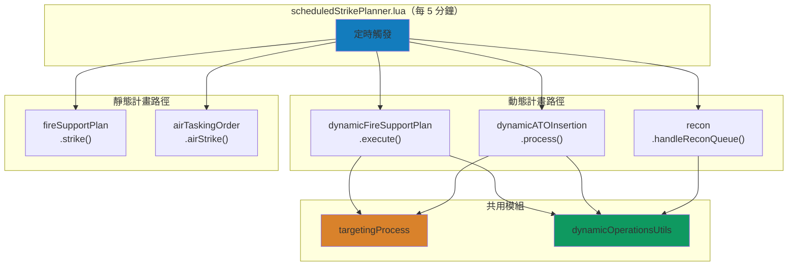
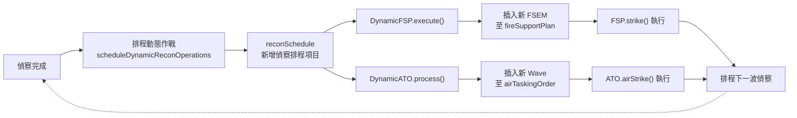
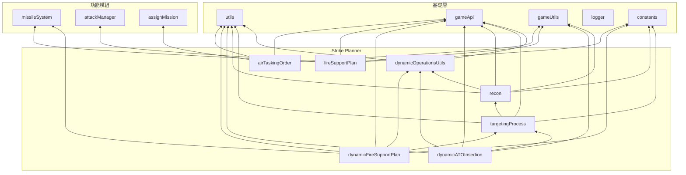

# Strike Planner 系統架構

本文件說明 `src/modules/strikePlanner/` 的整體設計架構、模組間協作關係及資料流。各模組的詳細說明請參閱對應文件。

---

## 概述

Strike Planner 是中國陣營的聯合打擊規劃系統，模擬從偵察到打擊的完整 Kill Chain。系統分為兩大執行路徑：

- **靜態計畫**：預先排定的 ATO（空中任務令）與 FSP（火力支援計畫），按時間表依序執行
- **動態計畫**：基於偵察情報與戰損評估（BDA），即時生成新的打擊任務

### F2T2EA Kill Chain 對應

| Kill Chain 階段 | 對應模組 | 說明 |
|:-:|---|---|
| **Find** | [recon](recon.md), [targetingProcess](targetingProcess.md) | UAV/衛星偵察、感測器接觸辨識 |
| **Fix** | [targetingProcess](targetingProcess.md) | 目標分類與定位（機場、港口、SAM、C2） |
| **Track** | [recon](recon.md), [targetingProcess](targetingProcess.md) | UAV 持續追蹤、SIGINT 無線電測向 |
| **Target** | [targetingProcess](targetingProcess.md), [dynamicFireSupportPlan](dynamicFireSupportPlan.md), [dynamicATOInsertion](dynamicATOInsertion.md) | 目標篩選、BDA 評估、打擊任務生成 |
| **Engage** | [airTaskingOrder](airTaskingOrder.md), [fireSupportPlan](fireSupportPlan.md) | ATO/FSP 任務執行 |
| **Assess** | [targetingProcess](targetingProcess.md) (BDA), [recon](recon.md) | 戰損評估、下一波偵察排程 |

---

## 模組一覽

| 模組 | 原始碼 | 職責 |
|---|---|---|
| [targetingProcess](targetingProcess.md) | `targetingProcess.lua` | 目標掃描、分類、動態篩選與 BDA 評估 |
| [recon](recon.md) | `recon.lua` | UAV/衛星偵察生命週期管理與動態作戰排程 |
| [airTaskingOrder](airTaskingOrder.md) | `airTaskingOrder.lua` | 靜態 ATO 執行（掛彈、任務建立、單元派遣） |
| [fireSupportPlan](fireSupportPlan.md) | `fireSupportPlan.lua` | 靜態 FSP 執行（發射單元部署與打擊） |
| [dynamicFireSupportPlan](dynamicFireSupportPlan.md) | `dynamicFireSupportPlan.lua` | 動態 FSEM 生成（偵察驅動） |
| [dynamicATOInsertion](dynamicATOInsertion.md) | `dynamicATOInsertion.lua` | 動態 ATO Wave 生成（偵察驅動） |
| [dynamicOperationsUtils](dynamicOperationsUtils.md) | `dynamicOperationsUtils.lua` | 動態作戰共用工具（排程、命名、狀態追蹤） |

---

## 系統架構圖

### 整體資料流



### 動態作戰循環



---

## 核心資料結構

### 靜態計畫資料

```
saveData.c
├── air
│   ├── enabled: boolean
│   └── airTaskingOrder: table<string, SBJ__Wave>
│       └── Wave
│           ├── packages: SBJ__Package[]
│           │   ├── striker / escort / wildWeasel / jammer / tanker
│           │   ├── target: SBJ__Target
│           │   └── loadoutStatus: SBJ__LoadoutStatus
│           └── isActivated / hasLaunched
├── ground
│   ├── enabled: boolean
│   └── fireSupportPlan: table<string, SBJ__FireSupportExecutionMatrix>
│       └── FSEM
│           ├── fireSupportTasks: SBJ__FireSupportTask[]
│           │   ├── firingUnits: SBJ__FiringUnit[]
│           │   ├── target: SBJ__Target
│           │   └── startTime / isFinished
│           └── isActivated / isFinished / allFiringUnitsInPosition
└── targetlist: SBJ__TargetEntry[]
```

### 動態作戰資料

```
saveData.c.dynamicOperations
├── enabled: boolean
├── lastEvaluationTime: number
├── generatedOperations: SBJ__GeneratedOperationsTracker
│   ├── air: table<string, boolean>
│   └── ground: table<string, boolean>
└── reconSchedule: SBJ__ReconScheduleEntry[]
    └── ReconScheduleEntry
        ├── time / type / delay / executed
        └── operations: SBJ__Operation[]
            └── Operation
                ├── type: "air" | "ground"
                ├── executed: boolean
                └── template: SBJ__WaveTemplate | SBJ__FireSupportExecutionMatrixTemplate
```

### 偵察資料

```
saveData.c.recon
├── enabled: boolean
└── queue: SBJ__ReconQueueEntry[]
    ├── UAV Entry
    │   ├── baseGUID / unitDBID / course / unitCount / speed
    │   ├── takeoffTime / endTime
    │   ├── hasLaunched / isFinished / unitGUID
    │   └── isTracking / trackingTargetGUID
    └── Satellite Entry
        ├── endTime
        └── isFinished
```

---

## 模組依賴關係



---

## 設定檔參考

### config.lua（運行期配置）

| 設定路徑 | 用途 |
|---|---|
| `config.c.ground.srbm.reloadTime` | SRBM 再裝填時間（影響偵察 UAV 排程） |
| `config.c.recon.reconStrikeMatrix` | 偵察-打擊映射表（平台 → 作戰模板） |
| `config.c.packageTemplates` | 空中打擊包模板（依名稱索引） |
| `config.c.fireSupportTaskTemplates` | 火力支援任務模板（依名稱索引） |
| `config.c.sigint.maxRange` | SIGINT 最大偵測距離 |
| `config.c.sigint.maxCount` | SIGINT 偵測次數門檻 |
| `config.targetScanning` | 目標掃描配置（距離門檻、機場/港口清單、模式匹配） |

### constants.lua（不可變常數）

| 常數路徑 | 用途 |
|---|---|
| `constants.PLATFORMS.WZ8` | WZ-8 偵察無人機 DBID |
| `constants.PLATFORMS.BZK005` | BZK-005 偵察 UAV DBID |
| `constants.LOADOUTS.WZ8_RECON` | WZ-8 偵察掛載 ID |
| `constants.SENSORS.WZ8_RADAR` | WZ-8 雷達感測器 DBID |
| `constants.SENSORS.*` | 各型 SAM/AEW 雷達感測器 DBID |
| `constants.MISSILE_SYSTEM_STATE` | 飛彈系統狀態列舉 |

---

## 相關檔案

| 檔案 | 說明 |
|---|---|
| `src/scripts/china/scheduledStrikePlanner.lua` | 主排程腳本（每 5 分鐘觸發） |
| `src/modules/attackManager.lua` | 打擊執行（發射武器） |
| `src/modules/assignMission.lua` | 任務指派（飛機分配） |
| `src/modules/missileSystem.lua` | TEL 飛彈系統（發射單元狀態機），詳見 [missileSystem 文件](../missileSystem.md) |
| `src/core/schema.lua` | 型別定義 |
| `src/core/config.lua` | 運行期配置 |
| `src/core/constants.lua` | 不可變常數 |
