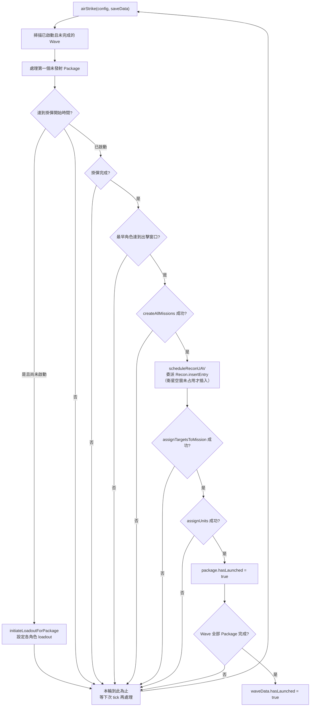

# airTaskingOrder — 空中任務令執行

> 原始碼：`src/modules/strikePlanner/airTaskingOrder.lua`

**職責**：執行已啟動的 ATO Wave，負責打擊包掛彈、CMO 任務建立、目標指派、單元派遣與打擊後偵察排程。

---

## 概述

`airTaskingOrder` 是 Strike Planner 的空中打擊執行層，處理 `saveData.c.air.airTaskingOrder` 內所有 `isActivated == true` 且尚未完成的 Wave。模組不負責產生 Wave；靜態資料可由初始化流程寫入，動態資料則由 [dynamicATOInsertion](dynamicATOInsertion.md) 插入。

每次呼叫 `airStrike()` 時，模組會依序檢查各 Package 的生命週期狀態。若時間到達掛彈窗口，先對基地內符合 `unitDBID` 的飛機設定 `loadoutID`；掛彈完成且最早出發角色達到出擊窗口後，才建立任務、排程偵察 UAV、指派目標與派遣飛機。

為避免單次 tick 大量改動 CMO 狀態，`processWave()` 每次最多成功發射一個 Package。Wave 內所有 Package 都標記 `hasLaunched` 後，Wave 才會標記為完成。

---

## 主要機制

### Package 生命週期



### 掛彈時序

`LOADOUT_ROLES` 固定為 `striker`、`escort`、`wildWeasel`、`jammer`、`tanker`。掛彈開始時間由所有角色中最早的 `startTime` 減去 `packageData.timeToReady` 得出；若未指定 `timeToReady`，執行層預設使用 9 分鐘。

`isTimeToStartLoadout()` 會以 `ADVANCE_SECONDS = 300` 秒作為提前檢查量。到點後 `setLoadoutForRole()` 會讀取角色基地 `baseGUID` 的 `embarkedUnits.Aircraft`，挑選 DBID 符合 `unitDBID` 的飛機，呼叫 `GameApi.ScenEdit_SetLoadout()` 設定 `LoadoutID` 與 `TimeToReady_Minutes`。

### 任務建立與派遣

`createMission()` 以 `constants.SIDES.ENEMY` 建立任務，並使用角色的 `missionCreationParams` 和 `emcon`。若任務含 `endTime`，模組會設定 `OnDeactivateDelete`、`OnDeactivateRTB`、`TakeOffTime`、`endtime`，必要時設定 `TimeOnTargetStation`；strike 任務會額外關閉 `automatic_evasion`。

任務建立成功後，`assignTargetsToMission()` 會確認目標數達到 `target.minTargetCount`，再將 `target.list` 指派給 striker 任務。`assignUnits()` 依 `LOADOUT_ROLES` 派遣各角色，透過 `AssignMission.assignEmbarkedUnitToStrikeMission()` 從基地派出指定數量飛機；非 `striker`、非 `tanker` 的支援任務會建立空 flight plan。

### 偵察 UAV 排程

若 Package 帶有 `reconUAV`，任務建立後 `scheduleReconUAV()` 會安排一架打擊後偵察 UAV。當 `reconUAV.takeoffTime` 尚未預先設定時，模組以 striker 任務結束時間、`config.c.ground.srbm.reloadTime` 與 UAV 航程飛行時間推算起飛時間：

```text
takeoffTime = striker.endTime + config.c.ground.srbm.reloadTime - flightTime
```

接著把這個起飛時間當作 `startTime`，委派給 [`Recon.insertEntry(saveData.c.recon, reconUAV, takeoffTime)`](recon.md)。實際的空窗檢查、deep copy、欄位重設（`hasLaunched = false`、`isFinished = false`、`trackingTargetGUID = nil`）、`endTime = takeoffTime + flightTime` 計算與寫入佇列，全部由 `insertEntry` 完成；`scheduleReconUAV()` 只負責推算起飛時間並回傳 `insertEntry` 給出的 entry（或 `nil`）。

偵察排程是**有條件且不阻塞**打擊流程的：

- 偵察佇列中沒有可錨定的衛星空窗，或同 `templateId` 的 UAV 已覆蓋該空窗時，`Recon.insertEntry` 回傳 `nil`，Package 仍照常發射，只是不排這架偵察。
- `reconUAV.takeoffTime` 若已預先設定，`scheduleReconUAV()` 直接回傳 `nil`，不重算也不重複插入。
- 唯有實際插入成功時，發射摘要才會附帶 `recon UAV at <takeoffTime>` 字樣。

---

## saveData 結構

```text
saveData.c
├── air
│   └── airTaskingOrder: table<string, SBJ__Wave>
│       └── Wave
│           ├── name
│           ├── isActivated
│           ├── hasLaunched
│           └── packages: SBJ__Package[]
│               ├── hasLaunched
│               ├── timeToReady
│               ├── loadoutStatus
│               │   ├── isLoadoutInitiated
│               │   ├── loadoutInitiatedTime
│               │   ├── expectedReadyTime
│               │   └── loadoutStartTime
│               ├── striker / escort / wildWeasel / jammer / tanker
│               ├── reconUAV?
│               └── target
│                   ├── list: string[]
│                   └── minTargetCount
└── recon
    └── queue: SBJ__ReconQueueEntry[]
```

---

## Public API

| 函數 | 參數 | 回傳 | 說明 |
|---|---|---|---|
| `AirTaskingOrder.airStrike(config, saveData)` | `SBJ__Config`, `SBJ__SaveData` | 無 | 掃描已啟動 ATO Wave，推進 Package 掛彈、任務建立、目標指派與單元派遣流程。 |

---

## 相依模組

| 模組 | 用途 |
|---|---|
| `src.utils.utils` | 時間字串轉 timestamp、deep copy。 |
| `src.utils.gameApi` | 包裝 CMO API：讀取單元、建立/查詢任務、設定掛載、指派目標、設定 doctrine。 |
| `src.utils.gameUtils` | 時間判斷、任務建立、路徑距離與飛行時間計算。 |
| `src.utils.logger` | 批次輸出 ATO 執行資訊與錯誤。 |
| `src.modules.assignMission` | 從基地派遣 embarked aircraft 至任務。 |
| `src.modules.strikePlanner.recon` | 透過 `Recon.insertEntry` 將打擊後偵察 UAV 排入偵察佇列（受衛星空窗與同模板重複檢查 gate）。 |
| `src.core.constants` | 使用 `SIDES.ENEMY`、`TAGS.AIR`、`TIME_FORMATS`。 |

---

## 設定與常數參考

| 類型 | 路徑 | 用途 |
|---|---|---|
| `config` | `config.c.ground.srbm.reloadTime` | 推算打擊後偵察 UAV 起飛時間。 |
| `constants` | `constants.SIDES.ENEMY` | 建立與查詢 China side 任務。 |
| `constants` | `constants.TAGS.AIR` | ATO 成功/待處理資訊的 log tag。 |
| `constants` | `constants.TIME_FORMATS` | CMO 任務時間欄位附加格式。 |

---

## 相關模組

- [dynamicATOInsertion](dynamicATOInsertion.md) — 產生並插入動態 ATO Wave。
- [dynamicOperationsUtils](dynamicOperationsUtils.md) — 動態作戰命名與登記，由插入層使用。
- [targetingProcess](targetingProcess.md) — 由插入層先產生 `target.list`，本模組只負責指派。
- [recon](recon.md) — 本模組呼叫 `Recon.insertEntry` 排入打擊後偵察 UAV；偵察佇列中的任務則由 recon 執行。
- [系統架構](README.md)
