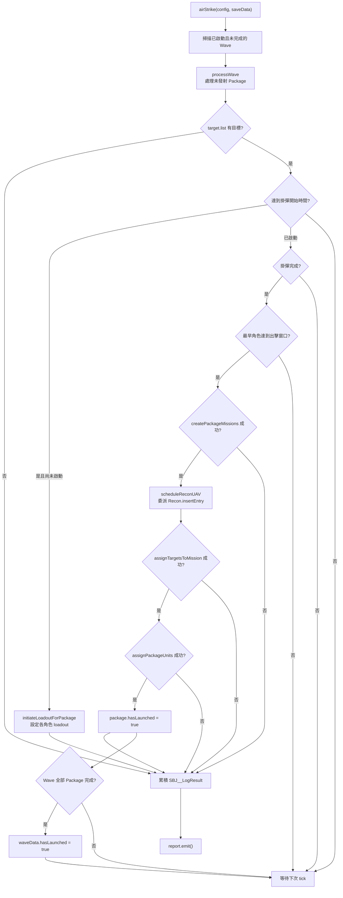

# airTaskingOrder — 空中任務令執行

> 原始碼：`src/modules/strikePlanner/airTaskingOrder.lua`

**職責**：執行已啟動的 ATO Wave，負責打擊包掛彈、CMO 任務建立、目標指派、單元派遣、打擊後偵察排程與集中式執行摘要 log。

---

## 概述

`airTaskingOrder` 是 Strike Planner 的空中打擊執行層，處理 `saveData.c.air.airTaskingOrder` 內所有 `isActivated == true` 且尚未完成的 Wave。模組不負責產生 Wave；靜態資料可由初始化流程寫入，動態資料則由 [atoBuilder](atoBuilder.md) 插入。

每次呼叫 `airStrike()` 時，模組會依序推進各 Package 的生命週期。若時間到達掛彈窗口，先對基地內符合 `unitDBID` 的飛機設定 `loadoutID`；掛彈完成且最早出發角色達到出擊窗口後，才建立任務、排程偵察 UAV、指派目標與派遣飛機。

為避免單次 tick 大量改動 CMO 狀態，`processWave()` 每次最多成功發射一個 Package。Package 處理結果直接回傳為 `SBJ__LogResult`（`tag` + `fields`），最後由單一 `LogFormat.report` 輸出；流程 helper 本身不直接呼叫 `Logger`。

---

## 主要機制

### Local 常數與結果型別

| 名稱 | 類型 | 用途 |
|---|---|---|
| `config.c.air.timing.assignmentSafetyMargin` | `number` | 掛彈與 assign 必須早於預估起飛時間的安全秒數。 |
| `PACKAGE_ROLE_ORDER` | `string[]` | ATO Package 會依序處理 `tanker`、`striker`、`escort`、`wildWeasel`、`jammer`。 |
| `LOG_SCOPE`／`LOG_ACTION` | string | report 的 scope `airTaskingOrder` 與 action `Execute packages`。 |

各 helper 直接回傳 `SBJ__LogResult`，`fields` 使用的欄位：

| 欄位 | 說明 |
|---|---|
| `wave` | `processWave()` 補上的 Wave 名稱。 |
| `mission` | striker 任務名稱，Package 的 log identity。 |
| `action` | 成功動作，例如 `initiate_loadout` 或 `launch`。 |
| `reason` | skip/fail 原因，例如 `invalid_package_targets` 或 `target_assignment_failed`。 |
| `readyTime` | 掛彈預計完成 UTC 時間。 |
| `reconUavTakeoff` | 偵察 UAV 成功排程後的 UTC 起飛時間。 |
| `targets`／`required` | 可用或已指派目標數，以及所需的最低目標數。 |

### Package 生命週期



### 掛彈時序

掛彈開始時間由所有角色中最早的 `startTime` 減去 `packageData.timeToReady` 得出；標準 package 必須提供 `timeToReady`，執行層僅為舊存檔或非標準資料保留 9 分鐘 fallback。`ensureLoadoutStartTime()` 會將計算結果快取到 `packageData.loadoutStatus.loadoutStartTime`。

`isTimeToStartLoadout()` 會以 `config.c.air.timing.assignmentSafetyMargin` 作為提前檢查量；舊 save/config 結構缺少此欄位時 fallback 為 300 秒。到點後 `setLoadoutForRole()` 會讀取角色基地 `baseGUID` 的 `embarkedUnits.Aircraft`，挑選 DBID 符合 `unitDBID` 的飛機，呼叫 `GameApi.ScenEdit_SetLoadout()` 設定 `LoadoutID` 與 `TimeToReady_Minutes`。

`initiateLoadoutForPackage()` 會更新 `loadoutStatus.isLoadoutInitiated`、`loadoutInitiatedTime` 與 `expectedReadyTime`。後續 tick 由 `isLoadoutReady()` 判斷 `expectedReadyTime` 是否已到。

### 任務建立與派遣

`createPackageMission()` 以 `constants.SIDES.ENEMY` 建立尚未排程的任務，並使用角色的 `missionCreationParams` 與 `emcon`；strike 任務會額外透過 `GameApi.ScenEdit_SetDoctrine()` 關閉 `automatic_evasion`。完成目標與單元指派後，`applyPackageMissionSchedules()` 才設定 `OnDeactivateDelete`、`OnDeactivateRTB`、`endtime` 與排程欄位，避免 CMO 在掛載或 assign 完成前依 TOS/TOT 自動產生起飛時間。

排程欄位互斥：角色有 `timeOnStation` 時只設定 `TimeOnTargetStation`；否則才以 `startTime` 設定 `TakeOffTime`。`startTime` 在 TOS 模式下只作為內部掛載與 assign 的保守預估起飛時間，不會寫入 CMO。

一般角色的 `missionCreationParams` 維持單一物件；只有 tanker 可設定為單一物件或陣列。tanker 使用陣列時，執行層會逐一建立所有 support mission，並對每個任務套用角色共用的 `endTime`、`timeOnStation` 與 `emcon`。既有單一 tanker mission 設定不需修改。

`processPackage()` 在生命週期一開始會檢查 `target.list` 是否存在且非空；空目標會標記為 `skip`，原因為 `invalid_package_targets`，並附上 `targets=0` 與 `required=<minTargetCount>`。

任務建立成功後，`assignTargetsToMission()` 只負責把已存在的 `target.list` 指派給 striker 任務。若 CMO API 回傳 `nil`，處理結果會標記為 `fail`，原因為 `target_assignment_failed`，並附上目前目標數與 `target.minTargetCount` 供 log 判讀。

`assignPackageUnits()` 依 `PACKAGE_ROLE_ORDER` 派遣各角色，透過 `AssignMission.assignEmbarkedUnitToStrikeMission()` 從基地派出指定數量飛機。非 `striker`、非 `tanker` 的支援任務會呼叫 `GameApi.ScenEdit_CreateMissionFlightPlan()` 建立空 flight plan；只有 striker 成功分配至少一架飛機時，Package 才會標記 `hasLaunched = true`。

多任務 tanker 會先驗證 `unitCount` 可被任務數整除，再將相同數量依設定順序分派至各任務。例如 `unitCount = 8` 且有兩個任務時，每個任務分派 4 架。掛載仍依角色總 `unitCount` 執行一次，不會按任務重複設定。

使用這些加油任務的 receiver mission 必須在 `opts.TankerMissionList` 列出所有 tanker mission name；執行層不會自動改寫 receiver 的任務設定。

### 偵察 UAV 排程

若 Package 帶有 `reconUAV`，任務建立後 `scheduleReconUAV()` 會安排一架打擊後偵察 UAV。當 `reconUAV.takeoffTime` 尚未預先設定時，模組以 striker 任務結束時間、`config.c.ground.srbm.reloadTime` 與 UAV 航程飛行時間推算起飛時間：

```text
takeoffTime = striker.endTime + config.c.ground.srbm.reloadTime - flightTime
```

接著把這個起飛時間當作 `startTime`，委派給 [`Recon.insertEntry(saveData.c.recon, reconUAV, takeoffTime)`](recon.md)。實際的空窗檢查、deep copy、欄位重設（`hasLaunched = false`、`isFinished = false`、`trackingTargetGUID = nil`）、`endTime = takeoffTime + flightTime` 計算與寫入佇列，全部由 `insertEntry` 完成；`scheduleReconUAV()` 只負責推算起飛時間並回傳 `insertEntry` 給出的 entry（或 `nil`）。

偵察排程是有條件且不阻塞打擊流程：

- 偵察佇列中沒有可錨定的衛星空窗，或同 `templateId` 的 UAV 已覆蓋該空窗時，`Recon.insertEntry()` 回傳 `nil`，Package 仍照常發射。
- `reconUAV.takeoffTime` 若已預先設定，`scheduleReconUAV()` 直接回傳 `nil`，不重算也不重複插入。
- 唯有實際插入成功時，`launch` 結果才會帶上 `reconUavTakeoff="<takeoffTime>"` 欄位。

### 日誌輸出

每個 helper 在自己的分支決定 `tag`，不經過 outcome → tag 對照表。`processWave()` 只補上 `fields.wave`，`airStrike()` 以 `report.addAll()` 收集後 `emit()`；格式化、info／error 分流與空輸出抑制全部由 report 負責。詳見 [logFormat](../logFormat.md)。

```text
[AIR] airTaskingOrder: Execute packages | total=3 ok=2 skip=1
  [OK]   wave=DYNAMIC/SATELLITE/STRIKE/AB/1/1 mission=PKG-AB-1 action=initiate_loadout readyTime="2026-02-14 03:20:00"
  [OK]   wave=DYNAMIC/SATELLITE/STRIKE/AB/1/1 mission=PKG-AB-2 action=launch reconUavTakeoff="2026-02-14 03:05:00" targets=6
  [SKIP] wave=DYNAMIC/UAV/ANTISHIP/1/1 mission=PKG-AS-1 required=2 targets=0 reason=invalid_package_targets
[ERROR] airTaskingOrder: Execute packages | total=1 fail=1
  [FAIL] wave=DYNAMIC/UAV/ANTISHIP/1/1 mission=PKG-AS-2 required=2 targets=1 reason=target_assignment_failed
```

| tag | Logger | 說明 |
|---|---|---|
| `[OK]` | `Logger.log(constants.TAGS.AIR, ...)` | 掛彈啟動或 Package 發射成功。 |
| `[SKIP]` | `Logger.log(constants.TAGS.AIR, ...)` | 可略過但非錯誤的狀態，目前由空 `target.list` 產生 `invalid_package_targets`。 |
| `[FAIL]` | `Logger.error(...)` | Package 執行失敗，例如任務建立、目標指派或 striker 分配失敗。 |

---

## saveData 結構

```text
saveData.c
├── air
│   ├── enabled: boolean
│   └── airTaskingOrder: table<string, SBJ__Wave>
│       └── Wave
│           ├── name
│           ├── isActivated
│           ├── hasLaunched
│           ├── isFirstWave
│           ├── strikeInterval
│           └── packages: SBJ__Package[]
│               ├── hasLaunched
│               ├── timeToReady
│               ├── loadoutStatus
│               │   ├── isLoadoutInitiated
│               │   ├── loadoutInitiatedTime
│               │   ├── expectedReadyTime
│               │   └── loadoutStartTime
│               ├── striker / escort / wildWeasel / jammer / tanker
│               │   ├── baseGUID
│               │   ├── missionCreationParams  # tanker 可為單一物件或陣列
│               │   ├── unitCount / unitDBID / weaponDBID
│               │   ├── loadoutID
│               │   ├── startTime / endTime / timeOnStation
│               │   └── emcon
│               ├── reconUAV?
│               └── target
│                   ├── list: string[]
│                   └── minTargetCount  # 上游建立 Wave 時使用；本模組只作 log required 欄位
└── recon
    ├── enabled: boolean
    └── queue: SBJ__ReconQueueEntry[]
```

### 狀態讀寫

| 路徑 | 操作 | 說明 |
|---|---|---|
| `saveData.c.air.airTaskingOrder` | read | `airStrike()` 掃描所有已啟動且未完成的 Wave。 |
| `package.loadoutStatus.loadoutStartTime` | write | `ensureLoadoutStartTime()` 快取掛彈開始時間。 |
| `package.loadoutStatus.isLoadoutInitiated` | write | `initiateLoadoutForPackage()` 標記掛彈流程已啟動。 |
| `package.loadoutStatus.loadoutInitiatedTime` | write | 記錄實際啟動掛彈的 scenario timestamp。 |
| `package.loadoutStatus.expectedReadyTime` | write | 記錄預期掛彈完成 timestamp。 |
| `package.hasLaunched` | write | `processWave()` 在 package 成功 launch 後標記。 |
| `wave.hasLaunched` | write | `airStrike()` 在所有 packages 都已 launch 後標記。 |
| `saveData.c.recon.queue` | write | `scheduleReconUAV()` 透過 `Recon.insertEntry()` 間接新增打擊後偵察 entry。 |

---

## Public API 與觸發方式

| 函數 | 參數 | 回傳 | 呼叫者 | 說明 |
|---|---|---|---|---|
| `AirTaskingOrder.airStrike(config, saveData)` | `SBJ__Config`, `SBJ__SaveData` | 無 | `StrikePlanner.processActiveATOWaves()` → `src/scripts/china/scheduledStrikePlanner.lua` | 掃描已啟動 ATO Wave，推進 Package 掛彈、任務建立、目標指派、單元派遣與 report 輸出。 |

`scheduledStrikePlanner.lua` 會在 `saveData.c.air.enabled == true` 時呼叫 `StrikePlanner.processActiveATOWaves(config, saveData)`。同一個排程 tick 也會先處理 dynamic ATO insertion，因此動態插入且已啟動的 Wave 可在後續 ATO 執行階段被推進。

---

## 相依模組

| 模組 | 用途 |
|---|---|
| `src.utils.utils` | 時間字串轉 timestamp。 |
| `src.utils.gameApi` | 包裝 CMO API：讀取單元、設定掛載、指派目標、建立 flight plan、設定 doctrine。 |
| `src.utils.gameUtils` | 時間判斷、任務建立、路徑距離與飛行時間計算。 |
| `src.utils.logFormat` | 透過 `LogFormat.report` 收集並輸出 `[OK]` / `[SKIP]` / `[FAIL]` 行。 |
| `src.modules.assignMission` | 從基地派遣 embarked aircraft 至任務。 |
| `src.modules.strikePlanner.recon` | 透過 `Recon.insertEntry()` 將打擊後偵察 UAV 排入偵察佇列。 |
| `src.core.constants` | 使用 `SIDES.ENEMY`、`TAGS.AIR`、`TIME_FORMATS`。 |

---

## 設定與常數參考

| 類型 | 路徑 | 用途 |
|---|---|---|
| `config` | `config.c.ground.srbm.reloadTime` | 推算打擊後偵察 UAV 起飛時間。 |
| `config` | `config.readytime` | Package template 會用它填入必填的 `timeToReady`；本模組執行時讀取的是 `packageData.timeToReady`。 |
| `config` | `config.c.packageTemplates.*.target.minTargetCount` | 上游 `atoBuilder` 建立 Wave 前用來過濾目標數不足的 Package；本模組僅把 executable package 內的值輸出為 log `required`。 |
| `config` | `config.c.packageTemplates.*.reconUAV` | 進入 executable package 後由 `scheduleReconUAV()` 用於打擊後偵察排程。 |
| `constants` | `constants.SIDES.ENEMY` | 建立 China side 任務、設定 doctrine、建立 flight plan。 |
| `constants` | `constants.TAGS.AIR` | ATO report 的模組 tag。 |
| `constants` | `constants.TIME_FORMATS` | CMO 任務時間欄位附加格式。 |

---

## 相關模組

- [atoBuilder](atoBuilder.md) — 產生並插入動態 ATO Wave。
- [dynamicState](dynamicState.md) — 動態作戰命名與登記，由插入層使用。
- [targetingProcess](targetingProcess.md) — 由插入層先產生 `target.list`，本模組只負責指派。
- [recon](recon.md) — 本模組呼叫 `Recon.insertEntry()` 排入打擊後偵察 UAV；偵察佇列中的任務則由 recon 執行。
- [系統架構](README.md)
