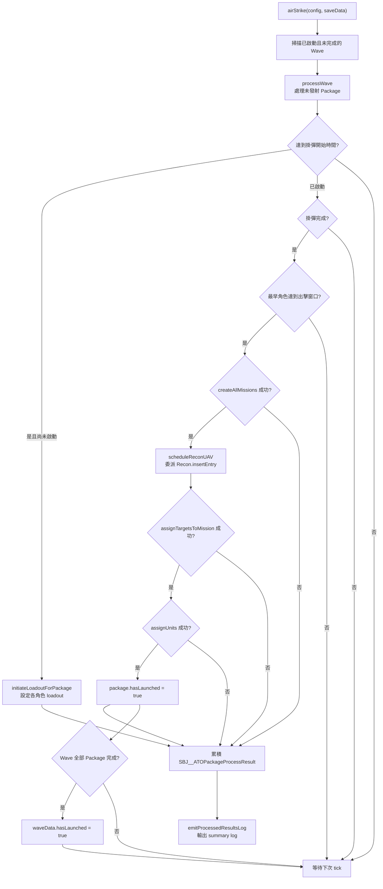
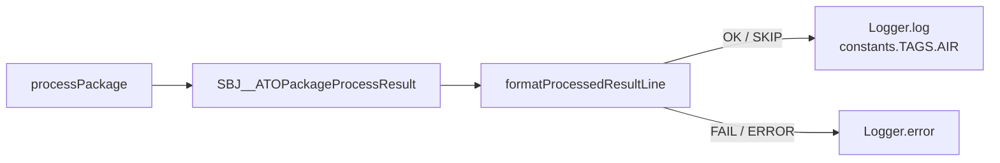

# airTaskingOrder — 空中任務令執行

> 原始碼：`src/modules/strikePlanner/airTaskingOrder.lua`

**職責**：執行已啟動的 ATO Wave，負責打擊包掛彈、CMO 任務建立、目標指派、單元派遣、打擊後偵察排程與集中式執行摘要 log。

---

## 概述

`airTaskingOrder` 是 Strike Planner 的空中打擊執行層，處理 `saveData.c.air.airTaskingOrder` 內所有 `isActivated == true` 且尚未完成的 Wave。模組不負責產生 Wave；靜態資料可由初始化流程寫入，動態資料則由 [dynamicATOInsertion](dynamicATOInsertion.md) 插入。

每次呼叫 `airStrike()` 時，模組會依序推進各 Package 的生命週期。若時間到達掛彈窗口，先對基地內符合 `unitDBID` 的飛機設定 `loadoutID`；掛彈完成且最早出發角色達到出擊窗口後，才建立任務、排程偵察 UAV、指派目標與派遣飛機。

為避免單次 tick 大量改動 CMO 狀態，`processWave()` 每次最多成功發射一個 Package。Package 處理結果會先回傳為 `SBJ__ATOPackageProcessResult`，最後由 `emitProcessedResultsLog()` 統一輸出 summary log；流程 helper 本身不直接呼叫 `Logger`。

---

## 主要機制

### Local 常數與結果型別

| 名稱 | 類型 | 用途 |
|---|---|---|
| `ADVANCE_SECONDS` | `number` | 掛彈與出擊檢查的提前秒數，目前為 `300`。 |
| `LOADOUT_ROLES` | `string[]` | ATO Package 會依序檢查 `striker`、`escort`、`wildWeasel`、`jammer`、`tanker`。 |
| `ATO_OUTCOME` | table enum | Package 處理結果分類：`ok`、`skip`、`fail`、`error`。 |
| `SBJ__ATOPackageProcessResult` | LuaLS class | `processPackage()` 回傳給 log formatter 的結構化結果。 |

`SBJ__ATOPackageProcessResult` 欄位：

| 欄位 | 型別 | 說明 |
|---|---|---|
| `outcome` | `SBJ__ATOPackageProcessOutcome` | 用來轉換成 `[OK]`、`[SKIP]`、`[FAIL]` 或 `[ERROR]`。 |
| `missionName` | `string` | striker 任務名稱，也是 Package log identity。 |
| `waveName` | `string?` | `processWave()` 補上的 Wave 名稱。 |
| `action` | `string?` | 成功動作，例如 `initiate_loadout` 或 `launch`。 |
| `reason` | `string?` | skip/fail/error 原因，例如 `insufficient_targets`。 |
| `readyTime` | `string?` | 掛彈預計完成 UTC 時間。 |
| `reconUavTakeoff` | `string?` | 偵察 UAV 成功排程後的 UTC 起飛時間。 |
| `targets` | `integer?` | 可用或已指派目標數。 |
| `required` | `integer?` | Package 需要的最低目標數。 |

### Package 生命週期



### 掛彈時序

掛彈開始時間由所有角色中最早的 `startTime` 減去 `packageData.timeToReady` 得出；若未指定 `timeToReady`，執行層預設使用 9 分鐘。`ensureLoadoutStartTime()` 會將計算結果快取到 `packageData.loadoutStatus.loadoutStartTime`。

`isTimeToStartLoadout()` 會以 `ADVANCE_SECONDS = 300` 秒作為提前檢查量。到點後 `setLoadoutForRole()` 會讀取角色基地 `baseGUID` 的 `embarkedUnits.Aircraft`，挑選 DBID 符合 `unitDBID` 的飛機，呼叫 `GameApi.ScenEdit_SetLoadout()` 設定 `LoadoutID` 與 `TimeToReady_Minutes`。

`initiateLoadoutForPackage()` 會更新 `loadoutStatus.isLoadoutInitiated`、`loadoutInitiatedTime` 與 `expectedReadyTime`。後續 tick 由 `isLoadoutReady()` 判斷 `expectedReadyTime` 是否已到。

### 任務建立與派遣

`createMission()` 以 `constants.SIDES.ENEMY` 建立任務，並使用角色的 `missionCreationParams` 與 `emcon`。若任務含 `endTime`，模組會設定 `OnDeactivateDelete`、`OnDeactivateRTB`、`TakeOffTime`、`endtime`，必要時設定 `TimeOnTargetStation`；strike 任務會額外透過 `GameApi.ScenEdit_SetDoctrine()` 關閉 `automatic_evasion`。

任務建立成功後，`assignTargetsToMission()` 會確認 `target.list` 數量達到 `target.minTargetCount`，再將目標指派給 striker 任務。若目標不足，處理結果會標記為 `skip`，原因為 `insufficient_targets`；若目標數足夠但 CMO API 回傳 `nil`，處理結果會標記為 `fail`，原因為 `target_assignment_failed`。

`assignUnits()` 依 `LOADOUT_ROLES` 派遣各角色，透過 `AssignMission.assignEmbarkedUnitToStrikeMission()` 從基地派出指定數量飛機。非 `striker`、非 `tanker` 的支援任務會呼叫 `GameApi.ScenEdit_CreateMissionFlightPlan()` 建立空 flight plan；只有 striker 成功分配至少一架飛機時，Package 才會標記 `hasLaunched = true`。

### 偵察 UAV 排程

若 Package 帶有 `reconUAV`，任務建立後 `scheduleReconUAV()` 會安排一架打擊後偵察 UAV。當 `reconUAV.takeoffTime` 尚未預先設定時，模組以 striker 任務結束時間、`config.c.ground.srbm.reloadTime` 與 UAV 航程飛行時間推算起飛時間：

```text
takeoffTime = striker.endTime + config.c.ground.srbm.reloadTime - flightTime
```

接著把這個起飛時間當作 `startTime`，委派給 [`Recon.insertEntry(saveData.c.recon, reconUAV, takeoffTime)`](recon.md)。實際的空窗檢查、deep copy、欄位重設（`hasLaunched = false`、`isFinished = false`、`trackingTargetGUID = nil`）、`endTime = takeoffTime + flightTime` 計算與寫入佇列，全部由 `insertEntry` 完成；`scheduleReconUAV()` 只負責推算起飛時間並回傳 `insertEntry` 給出的 entry（或 `nil`）。

偵察排程是有條件且不阻塞打擊流程：

- 偵察佇列中沒有可錨定的衛星空窗，或同 `templateId` 的 UAV 已覆蓋該空窗時，`Recon.insertEntry()` 回傳 `nil`，Package 仍照常發射。
- `reconUAV.takeoffTime` 若已預先設定，`scheduleReconUAV()` 直接回傳 `nil`，不重算也不重複插入。
- 唯有實際插入成功時，`launch` 結果才會帶上 `reconUavTakeoff="<takeoffTime>"` 欄位。

### 日誌輸出

`processPackage()` 只回傳 `SBJ__ATOPackageProcessResult`，不直接輸出 log。`airStrike()` 收集每個 Wave 產生的結果後，交給 `emitProcessedResultsLog()` 分成 info 與 error 兩組輸出：



summary 格式固定使用 `LogFormat.summary("scope", "airTaskingOrder", "Execute packages", entries)`。每筆 entry 由 `LogFormat.entry(level, message)` 建立，message 使用可搜尋的 key/value 欄位，例如：

```text
[scope=airTaskingOrder] Execute packages: total=2 ok=1 skip=1 fail=0 error=0 warn=0
  [SKIP] wave=WAVE-1 mission=STRIKE-PKG-1 reason=insufficient_targets targets=0 required=2
  [OK] wave=WAVE-1 mission=STRIKE-PKG-2 action=launch targets=2 reconUavTakeoff="2026-02-14 08:05:00"
```

| Outcome | Log level | Logger | 說明 |
|---|---|---|---|
| `ok` | `[OK]` | `Logger.log(constants.TAGS.AIR, ...)` | 掛彈啟動或 Package 發射成功。 |
| `skip` | `[SKIP]` | `Logger.log(constants.TAGS.AIR, ...)` | 目前可恢復的等待狀態，例如 `insufficient_targets`。 |
| `fail` | `[FAIL]` | `Logger.error(...)` | Package 執行失敗，例如任務建立、目標指派或 striker 分配失敗。 |
| `error` | `[ERROR]` | `Logger.error(...)` | 保留給不可預期或結構性錯誤分類；目前程式沒有產生此 outcome 的分支。 |

---

## saveData 結構

```text
saveData.c
├── air
│   ├── enabled: boolean
│   └── airTaskingOrder: table<string, SBJ__Wave>
│       └── Wave
│           ├── name
│           ├── isActivated
│           ├── hasLaunched
│           ├── isFirstWave
│           ├── strikeInterval
│           └── packages: SBJ__Package[]
│               ├── hasLaunched
│               ├── timeToReady
│               ├── loadoutStatus
│               │   ├── isLoadoutInitiated
│               │   ├── loadoutInitiatedTime
│               │   ├── expectedReadyTime
│               │   └── loadoutStartTime
│               ├── striker / escort / wildWeasel / jammer / tanker
│               │   ├── baseGUID
│               │   ├── missionCreationParams
│               │   ├── unitCount / unitDBID / weaponDBID
│               │   ├── loadoutID
│               │   ├── startTime / endTime / timeOnStation
│               │   └── emcon
│               ├── reconUAV?
│               └── target
│                   ├── list: string[]
│                   └── minTargetCount
└── recon
    ├── enabled: boolean
    └── queue: SBJ__ReconQueueEntry[]
```

`airTaskingOrder` 會寫入 `package.loadoutStatus`、`package.hasLaunched`、`wave.hasLaunched`，並可能透過 `Recon.insertEntry()` 間接新增 `saveData.c.recon.queue` entry。

---

## Public API 與觸發方式

| 函數 | 參數 | 回傳 | 呼叫者 | 說明 |
|---|---|---|---|---|
| `AirTaskingOrder.airStrike(config, saveData)` | `SBJ__Config`, `SBJ__SaveData` | 無 | `StrikePlanner.executeAirStrike()` → `src/scripts/china/scheduledStrikePlanner.lua` | 掃描已啟動 ATO Wave，推進 Package 掛彈、任務建立、目標指派、單元派遣與 summary log 輸出。 |

`scheduledStrikePlanner.lua` 會在 `saveData.c.air.enabled == true` 時呼叫 `StrikePlanner.executeAirStrike(config, saveData)`。同一個排程 tick 也會先處理 dynamic ATO insertion，因此動態插入且已啟動的 Wave 可在後續 ATO 執行階段被推進。

---

## 相依模組

| 模組 | 用途 |
|---|---|
| `src.utils.utils` | 時間字串轉 timestamp。 |
| `src.utils.gameApi` | 包裝 CMO API：讀取單元、設定掛載、指派目標、建立 flight plan、設定 doctrine。 |
| `src.utils.gameUtils` | 時間判斷、任務建立、路徑距離與飛行時間計算。 |
| `src.utils.logger` | 輸出 ATO summary info/error log。 |
| `src.utils.logFormat` | 建立 `[OK]` / `[SKIP]` / `[FAIL]` entry 與 summary log。 |
| `src.modules.assignMission` | 從基地派遣 embarked aircraft 至任務。 |
| `src.modules.strikePlanner.recon` | 透過 `Recon.insertEntry()` 將打擊後偵察 UAV 排入偵察佇列。 |
| `src.core.constants` | 使用 `SIDES.ENEMY`、`TAGS.AIR`、`TIME_FORMATS`。 |

---

## 設定與常數參考

| 類型 | 路徑 | 用途 |
|---|---|---|
| `config` | `config.c.ground.srbm.reloadTime` | 推算打擊後偵察 UAV 起飛時間。 |
| `constants` | `constants.SIDES.ENEMY` | 建立 China side 任務、設定 doctrine、建立 flight plan。 |
| `constants` | `constants.TAGS.AIR` | ATO 成功、略過與失敗 summary log 的 tag。 |
| `constants` | `constants.TIME_FORMATS` | CMO 任務時間欄位附加格式。 |

---

## 相關模組

- [dynamicATOInsertion](dynamicATOInsertion.md) — 產生並插入動態 ATO Wave。
- [dynamicOperationsUtils](dynamicOperationsUtils.md) — 動態作戰命名與登記，由插入層使用。
- [targetingProcess](targetingProcess.md) — 由插入層先產生 `target.list`，本模組只負責指派。
- [recon](recon.md) — 本模組呼叫 `Recon.insertEntry()` 排入打擊後偵察 UAV；偵察佇列中的任務則由 recon 執行。
- [系統架構](README.md)
