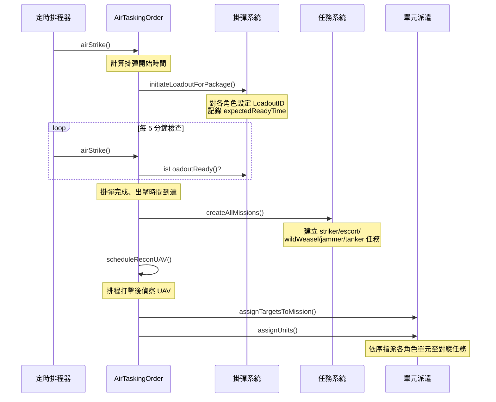

# airTaskingOrder — 空中任務令執行

> 原始碼：`src/modules/strikePlanner/airTaskingOrder.lua`

**職責**：執行預排的 ATO，管理打擊包（Package）的掛彈、任務建立、目標指派與單元派遣

---

## 概述

airTaskingOrder 負責 Kill Chain 的 Engage 階段。遍歷 `saveData.c.air.airTaskingOrder` 中所有已啟動的 Wave，依序處理各 Package 的掛彈準備、任務建立、目標指派與單元派遣。每個 tick 最多發射一個 Package（避免系統過載）。

---

## ATO 資料層級

```
ATO (airTaskingOrder)
└── Wave（波次）
    ├── isActivated: 是否啟動
    ├── hasLaunched: 是否已完成
    └── Package[]（打擊包）
        ├── loadoutStatus: 掛彈狀態
        ├── hasLaunched: 是否已發射
        ├── target: 目標清單
        ├── striker: 打擊機
        ├── escort: 護航機
        ├── wildWeasel: 防空壓制機（SEAD）
        ├── jammer: 電戰機
        └── tanker: 空中加油機
```

---

## Package 生命週期



---

## 任務角色

| 角色 | 任務類型 | 說明 |
|---|---|---|
| `striker` | strike | 主攻打擊機，攜帶對地/對海武器 |
| `escort` | patrol | 護航戰鬥機，提供空優掩護 |
| `wildWeasel` | strike | 防空壓制（SEAD），摧毀敵方防空系統 |
| `jammer` | patrol | 電戰機，提供電磁干擾 |
| `tanker` | support | 空中加油機，延伸作戰半徑 |

角色處理順序：
- **掛彈**：`striker → escort → wildWeasel → jammer`
- **任務建立**：`tanker → striker → escort → wildWeasel → jammer`
- **單元指派**：`striker → escort → wildWeasel → jammer → tanker`

---

## 掛彈時序

掛彈開始時間的計算邏輯：

1. 找出所有角色中最早的 `startTime`
2. 減去 `timeToReady`（預設 9 分鐘）得到掛彈開始時間
3. 提前 `ADVANCE_SECONDS`（5 分鐘）開始檢查是否該啟動掛彈

```
掛彈開始時間 = min(各角色 startTime) - timeToReady
檢查提前量 = ADVANCE_SECONDS (300秒)
```

---

## 偵察 UAV 排程

若 Package 配置了 `reconUAV`，在任務建立後會自動計算偵察 UAV 的起飛時間：

```
起飛時間 = striker.endTime + SRBM 再裝填時間 - 飛行時間
```

計算完成後將 UAV 項目插入 `saveData.c.recon.queue`。

---

## 公開 API

| 函數 | 說明 |
|---|---|
| `airStrike(config, saveData)` | 主入口：遍歷所有 ATO 波次，依序處理各打擊包 |

---

## 相關模組

- [dynamicATOInsertion](dynamicATOInsertion.md) — 動態生成新的 ATO Wave 插入 `airTaskingOrder`
- [recon](recon.md) — 管理排程後的偵察 UAV
- `assignMission` — 單元指派至任務
- [系統架構](README.md)
