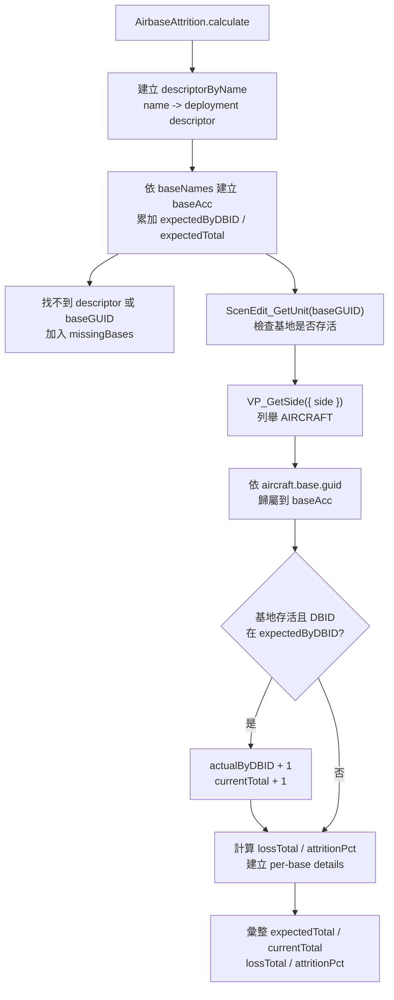

# airbaseAttrition — 機場駐機戰損統計

> 原始碼：`src/modules/strikePlanner/airbaseAttrition.lua`

**職責**：依部署描述子與指定基地清單，彙整計畫駐機、現存可作戰飛機與整體 attrition

---

## 概述

`airbaseAttrition` 是 Strike Planner 的機場戰損統計模組。呼叫端傳入 `config.c.air.landBased.deployedACs` 與要查詢的基地名稱清單，模組會回傳每個基地以及整體的 `SBJ__AirbaseAttritionSummary`。

此模組的核心語意是「可作戰戰力 = 飛機本身存活 + 母基地存活」。飛機即使已經起飛，只要其 `aircraft.base.guid` 仍指向存活基地，仍會被計入 `currentTotal`；若母基地已不存在，該基地聯隊會被視為整體失能。

統計結果目前由 [frontlineRedirect](frontlineRedirect.md) 使用，用來判斷是否把前線空中打擊 mapping 改寫為 AAR 編組。模組本身不寫入 saveData，也不輸出 log。

---

## 主要機制

### 計畫駐機基線

`deployments` 是 `SBJ__AirbaseDeploymentDescriptor[]`，通常來自 `config.c.air.landBased.deployedACs`。模組會先以 `descriptor.name` 建立查詢表，再依 `baseNames` 的順序建立 `baseAcc`，因此回傳的 `summary.bases` 順序與查詢輸入一致。

每個基地的 `expectedTotal` 來自：

```
descriptor.embarkedUnits[].loadouts[].num
```

同一個 `dbid` 可能由多個 loadout 累加，最後彙整到 `expectedByDBID`。

### 現存戰力歸屬

模組會先用 `GameApi.ScenEdit_GetUnit(baseGUID)` 檢查基地是否存在。若基地單元不存在，`isDestroyed = true`，該基地後續不計入任何 aircraft。

接著以 `GameApi.VP_GetSide({ side = side })` 取得指定 side，並透過 `sideObj:unitsBy(constants.UNIT_TYPES.AIRCRAFT)` 列舉全側飛機。每架飛機再用 `GameApi.ScenEdit_GetUnit(entry.guid)` 取實際單元，符合以下條件才計入：

- aircraft 存在
- aircraft 有 `dbid`
- aircraft 有 `base.guid`
- `aircraft.base.guid` 是查詢中的基地
- 該基地未摧毀
- aircraft `dbid` 在該基地的計畫駐機 `expectedByDBID` 中

DBID 不在計畫內的飛機會被忽略，以維持「計畫 vs 實況」語意。

---

## 統計流程



---

## 回傳結構

```
SBJ__AirbaseAttritionSummary
├── queriedBaseNames: string[]
├── expectedTotal: number
├── currentTotal: number
├── lossTotal: number
├── attritionPct: number
├── bases: SBJ__AirbaseAttritionBaseSummary[]
│   └── BaseSummary
│       ├── baseName: string
│       ├── baseGUID: string
│       ├── expectedTotal: number
│       ├── currentTotal: number
│       ├── lossTotal: number
│       ├── attritionPct: number
│       ├── isDestroyed: boolean
│       └── details: SBJ__AirbaseAttritionDetail[]
│           └── { dbid, expected, current, loss }
└── missingBases: string[]
```

---

## 判定語意

| 情境 | 是否計入 `currentTotal` | 原因 |
|---|---|---|
| 飛機存活且母基地存活 | 是 | 仍具備作戰能力 |
| 飛機在空中且母基地存活 | 是 | 依 `aircraft.base.guid` 歸屬，空中狀態不等於損失 |
| 飛機存活但母基地不存在 | 否 | 地勤、跑道、加油與再整補能力失能 |
| 飛機 DBID 不在該基地計畫內 | 否 | 避免非計畫增援或其他機種污染基線 |
| `baseNames` 查無部署描述子 | 不納入分母 | 加入 `missingBases`，呼叫端需自行判讀 |

---

## config / constants / Game API 參考

| 類型 | 路徑 / API | 用途 |
|---|---|---|
| `config` | `config.c.air.landBased.deployedACs` | 常見的 `deployments` 來源，提供基地 GUID 與計畫駐機數 |
| `constants` | `constants.SIDES.ENEMY` | `side` 參數省略時的預設 side |
| `constants` | `constants.UNIT_TYPES.AIRCRAFT` | 列舉指定 side 的 aircraft |
| `GameAPI` | `GameApi.ScenEdit_GetUnit(baseGUID)` | 判斷基地是否存在 |
| `GameAPI` | `GameApi.VP_GetSide({ side = side })` | 取得 side 物件 |
| `GameAPI` | `GameApi.ScenEdit_GetUnit(entry.guid)` | 取得 aircraft 實際單元資料 |

---

## Public API

| 函數 | 參數 | 回傳 | 說明 |
|---|---|---|---|
| `calculate(deployments, baseNames, side?)` | `SBJ__AirbaseDeploymentDescriptor[]`, `string[]`, `string|nil` | `SBJ__AirbaseAttritionSummary` | 彙整指定基地的計畫駐機、現存可作戰飛機、損失數與 attrition 百分比；`side` 預設為 `constants.SIDES.ENEMY` |

---

## 相關模組

- [frontlineRedirect](frontlineRedirect.md) — 使用整體 `attritionPct` 判斷是否啟用前線打擊包重導向
- [recon](recon.md) — 每 tick 協調前線重導向評估
- [系統架構](README.md)
