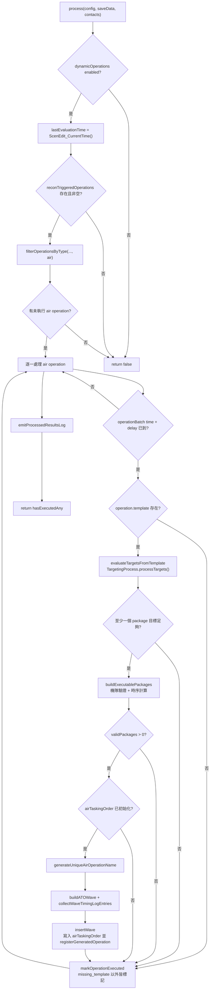

# atoBuilder — 動態 ATO Wave 生成

> 原始碼：`src/modules/strikePlanner/atoBuilder.lua`

**職責**：消費偵察觸發的 `air` operation，評估目標與機隊資源，產生可由 `airTaskingOrder` 執行的動態 ATO Wave。

---

## 概述

`atoBuilder` 是 Strike Planner 的動態空中打擊生成層。它不直接建立 CMO mission，也不直接派遣飛機，而是從 `saveData.c.dynamicOperations.reconTriggeredOperations` 找出尚未執行且已到觸發時間的 `air` operation，將其中的 `SBJ__WaveTemplate` 轉成執行態 `SBJ__Wave`，再寫入 `saveData.c.air.airTaskingOrder`。

模組的主要流程分成三段：先透過 [targetingProcess](targetingProcess.md) 依每個 package 的 target template 取得可打擊目標；再檢查各角色基地是否有足夠且未被任務占用的指定 DBID 飛機，並支援 `baseGUIDCandidates` 跨基地 fallback；最後依支援角色飛行時間、striker 武器射程與 `strikeInterval` 產生所有角色的 `startTime` / `endTime`。

插入 Wave 後，模組會透過 [dynamicState](dynamicState.md) 登記 generated operation，避免後續 tick 產生同名任務。若沒有有效 package，operation 會被標記為已處理但不插入 Wave；若 operation 缺少 template，則保留未執行狀態並輸出錯誤，讓後續仍可追蹤問題。

---

## 主要機制

### 動態 ATO 生成流程



### 目標評估與 package 篩選

`evaluateTargetsFromTemplate()` 會依 `waveTemplate.packages` 順序處理每個 package，呼叫 `TargetingProcess.processTargets(config, saveData, contacts, packageData.target, waveTemplate.isFirstWave)` 取得候選目標。若目標數達到 `packageData.target.minTargetCount`，該 package index 會被記錄在 `targetsByPackageIndex`；若沒有設定 `minTargetCount`，預設需求為 1 個目標。

`buildExecutablePackages()` 只會處理已通過目標門檻的 package。它會從 `operation.template` 的 deep copy 建立執行態 package，將 `package.target.list` 改成實際目標清單，並在機隊驗證成功後呼叫 `createPackageWithTiming()` 補齊 timing 與 `loadoutStatus`。時序串接使用「前一個有效 package」作為基準，因此即使原始第 1 個 package 被跳過，第 1 個成功建立的 package 仍會被視為第一個有效 package。

驗證摘要會以 `packagesValid`、`packagesTotal`、`targets`、`packagesSkipped` 形式寫入 log，方便在 CMO console 或測試輸出追蹤哪些 operation 只是無有效 package，而不是插入流程失敗。

### 機隊資源驗證

機隊驗證依 `PACKAGE_ROLES` 固定順序檢查：

```text
striker -> escort -> wildWeasel -> jammer -> tanker
```

`validateAircraftRole()` 會把 `roleData.baseGUID` 與 `roleData.baseGUIDCandidates` 串成候選基地清單，依序尋找可用飛機。可用飛機由 `getBaseAircraftCapacity()` 計算，條件是基地 `embarkedUnits.Aircraft` 中的 aircraft `dbid` 符合 `roleData.unitDBID`，且 `aircraft.mission == ""` 或 `nil`。

```text
可用餘額 free = getBaseAircraftCapacity(baseGUID, unitDBID) - assignedAircraft[baseGUID]

接受條件： free >= roleData.unitCount / 2
預訂量：   free >= roleData.unitCount -> 預訂 roleData.unitCount
           free <  roleData.unitCount -> 預訂 free
```

當某候選基地通過半戰力門檻，模組會把 `roleData.baseGUID` 改寫為實際選定基地，並把預訂量累加到 `assignedAircraft`，讓同一輪後續 package 不會重複分配同批飛機。`roleData.unitCount` 不會因半戰力通過而改寫；實際派遣數仍由下游 [airTaskingOrder](airTaskingOrder.md) 依可用飛機處理。

`collectAssignedAircraft()` 也會掃描既有 `saveData.c.air.airTaskingOrder`，統計所有 `isActivated == true`、`hasLaunched ~= true` 且 package 尚未 launched 的 role `unitCount`，避免動態插入時和既有 active Wave 重複占用機隊。

若 tanker 的 `missionCreationParams` 使用陣列，建立 Wave 前會額外驗證陣列非空、任務名稱有效且不重複，以及 `unitCount` 可被任務數整除。機隊容量與預訂量仍使用 tanker 的總 `unitCount`，不會因任務拆分而重複計算。

### 飛行時間與任務時序

支援角色包含 `escort`、`wildWeasel`、`jammer`、`tanker`。任務區會先讀取 `missionCreationParams.opts.patrolZone`，若不存在則使用 `opts.zone`，再以 `constants.SIDES.ENEMY` 從 CMO reference point 取得第一個任務區座標。多任務 tanker 會計算所有可解析 zone 的航程並採用最長飛行時間；若所有任務區、reference point 或距離資料都缺失，角色前置時間會 fallback 到 `ESCORT_ADVANCE_TIME`。

| 條件 | 速度 |
|---|---:|
| `role == "tanker"` | 250 kt |
| 非 tanker 且距離 `< 450 nm` | 470 kt |
| 非 tanker 且距離 `>= 450 nm` | 430 kt |

striker 飛行時間會用 striker 基地到第一個 target 的距離扣除 `weaponDBID` 對地最大射程，估算飛到武器釋放點所需時間。`ScenEdit_QueryDB("weapon", weaponDBID)`、`ranges.land.max` 或 `Tool_Range()` 任一資料缺失或不可轉為 number 時，會 fallback 到 `MISSION_DURATION`，避免 CMO DB 查詢缺欄位造成 runtime error。


時序公式如下：

```text
第一個有效 package strikerStart =
  currentTime + supportAdvanceTime - 遠距修正 + (package.timeToReady or 5 分鐘)

後續有效 package strikerStart =
  previousValidPackage.striker.startTime + strikeInterval

strikerEnd =
  strikerStart + (package 有 tanker ? TANKER_DURATION : MISSION_DURATION)

supportStart =
  strikerStart - (tanker 用 maxSupportAdvanceTime；其他角色用各自 roleAdvanceTime)
              + 遠距修正 + (package.timeToReady or 5 分鐘)

supportEnd =
  supportStart + maxSupportAdvanceTime + strikerFlightTime + 10 分鐘
              (tanker 再扣 ELAPSED_TIME 30 分鐘)
```

### 結果分類與 log

`processAirOperation()` 可能回傳下列內部原因：

| reason | 條件 | 後續處理 |
|---|---|---|
| `missing_template` | operation 缺少 `template` | 不標記 executed，輸出 `ERROR` |
| `no_valid_packages` | 目標不足或機隊驗證後沒有有效 package | 標記 executed，輸出 `SKIP` |
| `insertion_failed` | `airTaskingOrder` 未初始化或插入失敗 | 標記 executed，輸出 `FAIL` |
| `nil` | Wave 成功插入 | 標記 executed，輸出 `OK` 與 timing log |

log 由 `emitProcessedResultsLog()` 集中輸出，分成 `dynamicAirOperations` 與 `dynamicAirTiming` 兩個 scope，tag 使用 `constants.TAGS.DYNAMIC_OPERATIONS`。

---

## saveData 結構

```text
saveData.c
├── dynamicOperations
│   ├── enabled: boolean
│   ├── lastEvaluationTime?: number
│   ├── generatedOperations
│   │   ├── air: table<string, boolean>
│   │   └── ground: table<string, boolean>
│   └── reconTriggeredOperations: SBJ__ReconTriggeredOperationBatch[]
│       └── ReconTriggeredOperationBatch
│           ├── time: string
│           ├── type: string
│           ├── delay: number
│           ├── executed: boolean
│           └── operations: SBJ__Operation[]
│               ├── type: "air"
│               ├── executed: boolean
│               ├── executionResult?: boolean
│               └── template: SBJ__WaveTemplate
└── air
    └── airTaskingOrder: table<string, SBJ__Wave>
        └── generated Wave
            ├── name: string
            ├── isActivated = true
            ├── isFirstWave: boolean
            ├── hasLaunched = false
            ├── strikeInterval: number
            └── packages: SBJ__Package[]
                ├── timeToReady: number
                ├── loadoutStatus: SBJ__LoadoutStatus
                ├── hasLaunched = false
                ├── striker / escort / wildWeasel / jammer / tanker
                └── target.list: string[]
```

### 寫入與副作用

| 路徑或 API | 行為 |
|---|---|
| `saveData.c.dynamicOperations.lastEvaluationTime` | 每次 `process()` 通過 enabled 檢查後寫入目前 CMO 時間。 |
| `saveData.c.air.airTaskingOrder[wave.name]` | 成功建立 Wave 時寫入新的 `SBJ__Wave`。 |
| `saveData.c.dynamicOperations.generatedOperations.air[wave.name]` | 透過 `DynamicState.registerGeneratedOperation("air", wave.name, saveData)` 登記。 |
| `operation.executed` / `operation.executionResult` | 透過 `markOperationExecuted()` 標記，`missing_template` 例外。 |
| `operationBatch.executed` | 當 batch 內所有 operation 都完成時由 `DynamicState.checkOperationBatchCompleted()` 更新。 |

---

## local constants

| 名稱 | 內容 | 用途 |
|---|---|---|
| `TIME_CONSTANTS` | `ESCORT_ADVANCE_TIME`、`MISSION_DURATION`、`TANKER_DURATION`、`ELAPSED_TIME`、速度與距離門檻 | 任務時序與飛行時間估算。`TANKER_ADVANCE_TIME` 目前宣告但未被使用。 |
| `PACKAGE_ROLES` | `striker`、`escort`、`wildWeasel`、`jammer`、`tanker` | 機隊驗證與既有任務占用量統計。 |
| `SUPPORT_ROLES` | `escort`、`wildWeasel`、`jammer`、`tanker` | 支援角色時序計算。 |
| `ALL_ROLES` | `PACKAGE_ROLES` 加上 `reconUAV` | timing log 收集。 |
| `PROCESS_REASON` | `missing_template`、`no_valid_packages`、`insertion_failed` | operation 處理失敗或略過原因。 |
| `OPERATION_OUTCOME` | `ok`、`skip`、`missing_template`、`fail` | log 分類。 |

---

## config 與 constants 參考

| 類型 | 路徑 | 使用方式 |
|---|---|---|
| `config` | `config` 參數 | 本模組不直接索引特定 `config.*` 欄位；會原樣傳入 `TargetingProcess.processTargets()`。 |
| `config` | `config.c.packageTemplates` | 上游 [operationScheduler](operationScheduler.md) 的 air operation template 來源，動態 operation 最終會攜帶 `SBJ__WaveTemplate` 進入本模組。 |
| `config` | `config.readytime` | 多數 package template 的 `timeToReady` 來源，runtime 以秒為單位；本模組 fallback 為 `5 * 60`。 |
| `constants` | `constants.SIDES.ENEMY` | 讀取支援角色任務區 reference point。 |
| `constants` | `constants.TAGS.DYNAMIC_OPERATIONS` | 輸出 dynamic ATO 處理結果與 timing log。 |

---

## 相依模組

| 模組 | 用途 |
|---|---|
| `src.modules.strikePlanner.targetingProcess` | 依 target template、contacts 與 BDA 條件產生可打擊目標清單。 |
| `src.modules.strikePlanner.dynamicState` | 篩選 air operations、產生唯一 Wave 名稱、登記 generated operation、標記 operation 執行狀態。 |
| `src.utils.gameApi` | 取得目前時間、基地/飛機/reference point、weapon DB 查詢與距離計算。 |
| `src.utils.gameUtils` | 判斷 recon-triggered operation 是否已到觸發時間。 |
| `src.utils.utils` | deep copy 與 UTC datetime 字串轉 timestamp。 |
| `src.utils.logger` | 輸出動態空中作戰結果與錯誤。 |
| `src.utils.logFormat` | 產生一致的 key/value log entry 與 summary。 |
| `src.core.constants` | 提供 side name 與 log tag。 |

---

## Public API

| 函數 | 參數 | 回傳 | 說明 |
|---|---|---|---|
| `AtoBuilder.process(config, saveData, contacts)` | `SBJ__Config`, `SBJ__SaveData`, `CMO__Contact[]` | `boolean` | 處理所有已到觸發時間的未執行 air operations；若至少成功插入一個 ATO Wave，回傳 `true`。 |

### 呼叫者與觸發方式

| 呼叫者 | 觸發 |
|---|---|
| `StrikePlanner.processDynamicATO(config, saveData, contacts)` | Strike Planner facade，轉呼叫本模組 public API。 |
| `src/scripts/china/scheduledStrikePlanner.lua` | 定時腳本在 `saveData.c.dynamicOperations.enabled` 為 true 時呼叫 `StrikePlanner.processDynamicATO()`。 |
| [airTaskingOrder](airTaskingOrder.md) | 不呼叫本模組；它在後續 tick 執行本模組插入的 active Wave。 |

---

## 相關模組

- [airTaskingOrder](airTaskingOrder.md) — 執行本模組插入的 ATO Wave。
- [targetingProcess](targetingProcess.md) — 動態目標評估與 BDA 過濾。
- [dynamicState](dynamicState.md) — recon-triggered operation 狀態、命名與 generated operation 追蹤。
- [operationScheduler](operationScheduler.md) — 偵察完成後建立 air operation template。
- [fsemBuilder](fsemBuilder.md) — 對應的動態地面 FSEM 生成流程。
- [系統架構](README.md)
