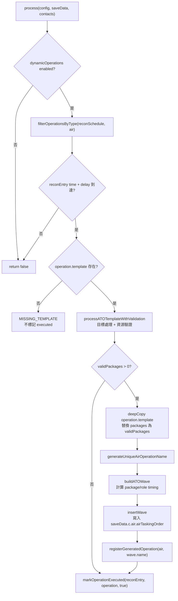

# dynamicATOInsertion — 動態空中任務令插入

> 原始碼：`src/modules/strikePlanner/dynamicATOInsertion.lua`

**職責**：依據偵察排程與即時接觸資料，篩選有效空中打擊包、計算任務時序，並插入可由 `airTaskingOrder` 執行的 ATO Wave。

---

## 概述

`dynamicATOInsertion` 是 Strike Planner 的動態空中打擊生成層。它不直接建立 CMO 任務或派遣飛機，而是從 `saveData.c.dynamicOperations.reconSchedule` 取出尚未執行的 `air` operation，評估目標與機隊資源後，產生 `SBJ__Wave` 寫入 `saveData.c.air.airTaskingOrder`。

模組的核心工作分為三段：第一段用 [targetingProcess](targetingProcess.md) 依 template 取得可打擊目標；第二段檢查各角色基地是否還有未派任務且 DBID 符合的飛機，並支援 `baseGUIDCandidates` fallback；第三段依飛行距離、支援角色到位時間與 `strikeInterval` 產生每個 Package 的 `startTime`、`endTime` 與 `loadoutStatus`。

成功插入 Wave 後，模組會透過 [dynamicOperationsUtils](dynamicOperationsUtils.md) 登記 generated operation，避免後續 tick 產生同名 Wave。無有效 Package 時會將 operation 標記為已處理但不插入 Wave；缺少 template 則保留未執行狀態並輸出錯誤。

---

## 主要機制

### 動態 ATO 生成流程



### 目標與機隊驗證

`processATOTemplateWithValidation()` 會 deep copy Wave template 的 packages，避免直接修改 config 或 recon schedule 中的原始 template。每個 Package 先呼叫 `TargetingProcess.processTargets()` 產生 `target.list`，再以 `validateIndividualPackage()` 驗證目標數與各角色飛機數。

機隊驗證涵蓋 `striker`、`escort`、`wildWeasel`、`jammer`、`tanker`。`validateAircraftRole()` 會依序嘗試 `roleData.baseGUID` 與 `roleData.baseGUIDCandidates`；一旦某基地可用數量足夠，就把 `roleData.baseGUID` 改寫為實際選定基地，並更新 `assignedAircraft`，讓同一輪 validation 中後續 Package 扣除已保留的飛機。

```text
可用餘額 = getBaseAircraftCapacity(baseGUID, unitDBID) - assignedAircraft[baseGUID]

getBaseAircraftCapacity:
  base.embarkedUnits.Aircraft
  └── aircraft.dbid == requiredUnitDBID
      └── aircraft.mission == "" or nil
```

`collectAssignedAircraft()` 另會掃描既有 `saveData.c.air.airTaskingOrder`，統計已啟動、未發射 Wave 中各 Package 已佔用的 role `unitCount`，避免動態插入重複分配同一批飛機。

### 飛行時間與任務時序

支援角色的前置時間來自基地到任務區的距離。`getPatrolZonePoint()` 會優先讀取 `missionCreationParams.opts.patrolZone`，若沒有則 fallback 至 `opts.zone`，再用第一個 reference point 作為任務區座標。`computeRoleFlightTime()` 以 `GameApi.Tool_Range()` 取距離，`calculateFlightTimeFromDistance()` 依角色與距離決定速度。

| 條件 | 速度 |
|---|---:|
| `role == "tanker"` | 250 kt |
| 非 tanker 且距離 `< 450 nm` | 470 kt |
| 非 tanker 且距離 `>= 450 nm` | 430 kt |

第一個 Package 若未指定 striker `startTime`，會以目前時間、`timeToReady`、支援角色最長飛行時間計算。後續 Package 則用前一包 striker `startTime + strikeInterval`。若支援角色最長飛行時間達 `MAX_FLIGHT_TIME`，會套用 `ELAPSED_TIME` 修正。

```text
第一包 strikerStart =
  currentTime + (package.timeToReady or 5) + supportAdvanceTime - 遠距修正

後續包 strikerStart =
  previousPackage.striker.startTime + strikeInterval

supportStart =
  strikerStart - roleAdvanceTime + 61 + (package.timeToReady or 5) + 遠距修正

supportEnd =
  supportStart + maxSupportAdvanceTime + strikerFlightTime + 10 分鐘
```

`calculateStrikerFlightTime()` 會用 striker 基地到第一個 target 的距離扣除 `weaponDBID` 對地最大射程，估算飛到武器釋放點的時間；若資料不足或距離無效，使用 `MISSION_DURATION` 作為 fallback。

---

## saveData 結構

```text
saveData.c
├── dynamicOperations
│   ├── enabled
│   ├── lastEvaluationTime
│   ├── generatedOperations
│   │   └── air: table<string, boolean>
│   └── reconSchedule: SBJ__ReconScheduleEntry[]
│       └── ReconScheduleEntry
│           ├── time
│           ├── type
│           ├── delay
│           ├── executed
│           └── operations: SBJ__Operation[]
│               ├── type: "air"
│               ├── executed
│               ├── executionResult?
│               └── template: SBJ__WaveTemplate
└── air
    └── airTaskingOrder: table<string, SBJ__Wave>
        └── generated Wave
            ├── name
            ├── isActivated = true
            ├── isFirstWave
            ├── hasLaunched = false
            ├── strikeInterval
            └── packages: SBJ__Package[]
```

---

## Public API

| 函數 | 參數 | 回傳 | 說明 |
|---|---|---|---|
| `DynamicATOInsertion.process(config, saveData, contacts)` | `SBJ__Config`, `SBJ__SaveData`, `CMO__Contact[]` | `boolean` | 處理到時的 air operations；若至少成功插入一個 ATO Wave，回傳 `true`。 |

---

## 相依模組

| 模組 | 用途 |
|---|---|
| `src.modules.strikePlanner.targetingProcess` | 依 target template 與 contacts 產生可打擊目標清單。 |
| `src.modules.strikePlanner.dynamicOperationsUtils` | 篩選 air operations、產生唯一 Wave 名稱、登記生成結果、標記執行狀態。 |
| `src.utils.gameApi` | 讀取基地/飛機/reference point、查詢武器資料庫、計算距離、取得目前時間。 |
| `src.utils.gameUtils` | 判斷排程時間是否到達。 |
| `src.utils.utils` | deep copy、時間字串轉 timestamp。 |
| `src.utils.logger` | 輸出動態空中作戰結果與錯誤。 |
| `src.core.constants` | 使用 `SIDES.ENEMY`、`TAGS.DYNAMIC_OPERATIONS`。 |

---

## 設定與常數參考

| 類型 | 路徑 | 用途 |
|---|---|---|
| `config` | `config.c.packageTemplates` | 由 recon 模組建立 operation template；本模組接收其中的 `SBJ__WaveTemplate`。 |
| `saveData` | `saveData.c.dynamicOperations.reconSchedule` | 動態空中作戰的觸發來源。 |
| `saveData` | `saveData.c.air.airTaskingOrder` | 動態 Wave 插入位置，也是既有任務佔用量掃描來源。 |
| `constants` | `constants.SIDES.ENEMY` | 讀取 China side reference point。 |
| `constants` | `constants.TAGS.DYNAMIC_OPERATIONS` | 動態 ATO timing 與處理結果 log tag。 |

---

## 相關模組

- [airTaskingOrder](airTaskingOrder.md) — 執行本模組插入的 ATO Wave。
- [targetingProcess](targetingProcess.md) — 動態目標評估與 BDA 過濾。
- [dynamicOperationsUtils](dynamicOperationsUtils.md) — recon schedule 狀態、命名與 generated operation 追蹤。
- [recon](recon.md) — 依偵察結果建立 air operation template。
- [系統架構](README.md)
