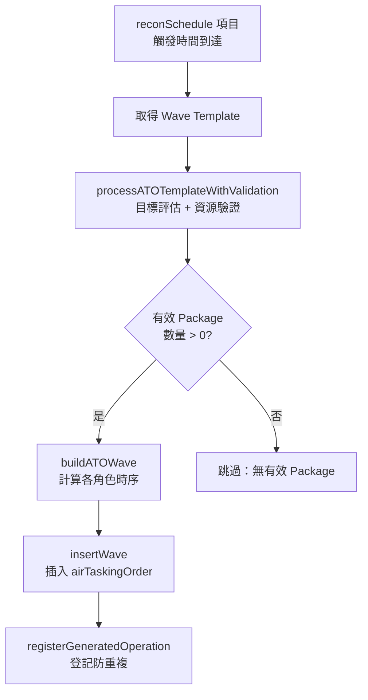

# dynamicATOInsertion — 動態空中任務令插入

> 原始碼：`src/modules/strikePlanner/dynamicATOInsertion.lua`

**職責**：基於偵察排程，動態評估目標與機隊可用性，自動生成新的 ATO Wave 並插入

---

## 概述

dynamicATOInsertion 負責 Kill Chain 的 Target → Engage 階段（動態空中打擊）。監聽 `reconSchedule` 中的 air 類型作戰，當觸發時間到達時：評估目標、驗證機隊可用性、計算飛行時序、組裝 ATO Wave、插入 `airTaskingOrder` 供 [airTaskingOrder](airTaskingOrder.md) 執行。

---

## 動態 ATO 生成流程



---

## Package 驗證

`processATOTemplateWithValidation` 對每個 Package 執行兩階段驗證：

### 1. 目標充足性

呼叫 [targetingProcess.processTargets](targetingProcess.md) 評估目標，確認數量 >= `minTargetCount`。

### 2. 機隊可用性

對 striker、escort、wildWeasel 各角色驗證基地飛機充足：

```
可用飛機 = getBaseAircraftCapacity(baseGUID, unitDBID) - assignedAircraft[baseGUID]
```

- `getBaseAircraftCapacity`：遍歷基地 `embarkedUnits.Aircraft`，計算 DBID 匹配且無任務的飛機數
- `collectAssignedAircraft`：掃描所有啟動中 ATO Wave 中未發射的 Package，統計已指派飛機數

---

## 飛行時間計算

系統自動計算各角色的出擊時序：

### 打擊機（striker）起飛時間

```
第一包：currentTime + readyTime + supportAdvanceTime - (遠距修正)
後續包：前一包 strikerStartTime + strikeInterval
```

### 護航/電戰/SEAD 起飛時間

```
startTime = strikerStartTime - roleAdvanceTime + 61 + readyTime + (遠距修正)
```

- `roleAdvanceTime`：該角色基地至巡邏區的飛行時間
- `supportAdvanceTime`：所有支援角色中最遠基地的飛行時間

### 飛行時間計算規則

| 距離 | 速度 |
|---|---|
| < 450nm | 470kts |
| >= 450nm | 430kts |

### 任務持續時間

| 條件 | 持續時間 |
|---|---|
| 有加油機 | 120 分鐘 |
| 無加油機 | 40 分鐘 |

### 結束時間

```
striker: startTime + missionDuration
support: startTime + maxSupportAdvanceTime + strikerFlightTime + 10分鐘
tanker: 同 support 但扣除 ELAPSED_TIME
```

---

## Wave 組裝

`buildATOWave` 依序處理每個驗證通過的 Package：

1. 呼叫 `calculatePackageTiming` 計算 striker 時序
2. 呼叫 `calculateRoleTiming` 計算各支援角色時序
3. 建立 `SBJ__Package` 結構（含 `loadoutStatus` 初始化）
4. 組裝 `SBJ__Wave` 並透過 `insertWave` 插入

Wave 名稱由 `generateUniqueAirOperationName` 生成（格式：`DYNAMIC/{RECON_TYPE}/{OP_TYPE}/{SEQ}`）。

---

## 公開 API

| 函數 | 說明 |
|---|---|
| `process(config, saveData, contacts)` | 主入口：處理偵察排程中的空中作戰，動態生成 ATO Wave |

---

## 相關模組

- [targetingProcess](targetingProcess.md) — 目標評估
- [dynamicOperationsUtils](dynamicOperationsUtils.md) — 作戰名稱生成、作戰篩選、狀態管理
- [airTaskingOrder](airTaskingOrder.md) — 執行生成的 ATO Wave
- [系統架構](README.md)
