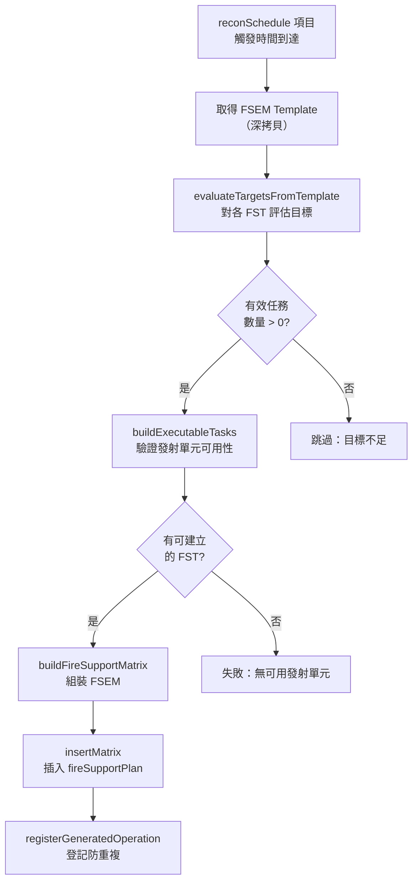

# dynamicFireSupportPlan — 動態火力支援計畫

> 原始碼：`src/modules/strikePlanner/dynamicFireSupportPlan.lua`

**職責**：基於偵察排程，動態評估目標、驗證發射單元可用性，自動生成新的 FSEM 並插入 FSP

---

## 概述

dynamicFireSupportPlan 負責 Kill Chain 的 Target → Engage 階段（動態地面打擊）。監聽 `reconSchedule` 中的 ground 類型作戰，當觸發時間到達時：評估目標、驗證發射單元、組裝 FSEM、插入 `fireSupportPlan` 供 [fireSupportPlan](fireSupportPlan.md) 執行。

---

## 動態 FSEM 生成流程

---

## 目標評估

`evaluateTargetsFromTemplate` 對模板中的每個 FST 呼叫 [targetingProcess.processTargets](targetingProcess.md)：

- 使用 FST 模板的 `target` 配置（filterNames、areas、contactAge、minTargetCount）
- 回傳目標 GUID 陣列
- 僅當目標數 >= `minTargetCount` 時視為有效任務

---

## 發射單元可用性驗證

每個發射單元（Battery）需通過逐項驗證：

| 狀態碼 | 檢查項目 | 說明 |
|---|---|---|
| `available` | 全部通過 | 可指派 |
| `missing_name` | 名稱欄位缺失 | 模板配置錯誤 |
| `assigned` | 已指派至其他 FST | 防止重複配置（掃描所有啟動中的 FSEM） |
| `unit_not_found` | 單元不存在 | 可能已被摧毀 |
| `context_not_found` | 無 context 資料 | saveData 中找不到對應的 `ground[missileSystem].firingUnits` |
| `bad_state` | 非 HIDE 狀態 | 正在移動或射擊中 |
| `low_ammo` | 彈量不足 | `MissileSystem.isLowAmmo` 回傳 true |

### 重複配置防護

`collectAssignedFiringUnits` 掃描所有啟動中且未完成的 FSEM，收集已指派的發射單元名稱。新建 FST 時不會使用已指派的單元。同一次建構週期中，`markFiringUnitsAssigned` 也會即時更新已指派清單。

---

## FSEM 組裝

`buildFireSupportMatrix` 組裝最終的 FSEM 結構：

- `name`：由 `generateUniqueGroundOperationName` 生成（格式：`DYNAMIC/{RECON_TYPE}/{OP_TYPE}/{SEQ}`）
- `isActivated = true`：立即啟動
- `strikeInterval = 0`：Ground 動態 FSP 使用 TOT 導向執行，生成後不需間隔
- 各 FST 的 `startTime` 由 `buildTaskStartTime` 依序遞增

---

## 公開 API

| 函數 | 說明 |
|---|---|
| `execute(config, saveData, contacts)` | 主入口：處理偵察排程中的地面作戰，動態生成 FSEM |

---

## 相關模組

- [targetingProcess](targetingProcess.md) — 目標評估
- [dynamicOperationsUtils](dynamicOperationsUtils.md) — 作戰名稱生成、作戰篩選、狀態管理
- [fireSupportPlan](fireSupportPlan.md) — 執行生成的 FSEM
- [missileSystem](../missileSystem.md) — `isLowAmmo` 彈量檢查
- [系統架構](README.md)
