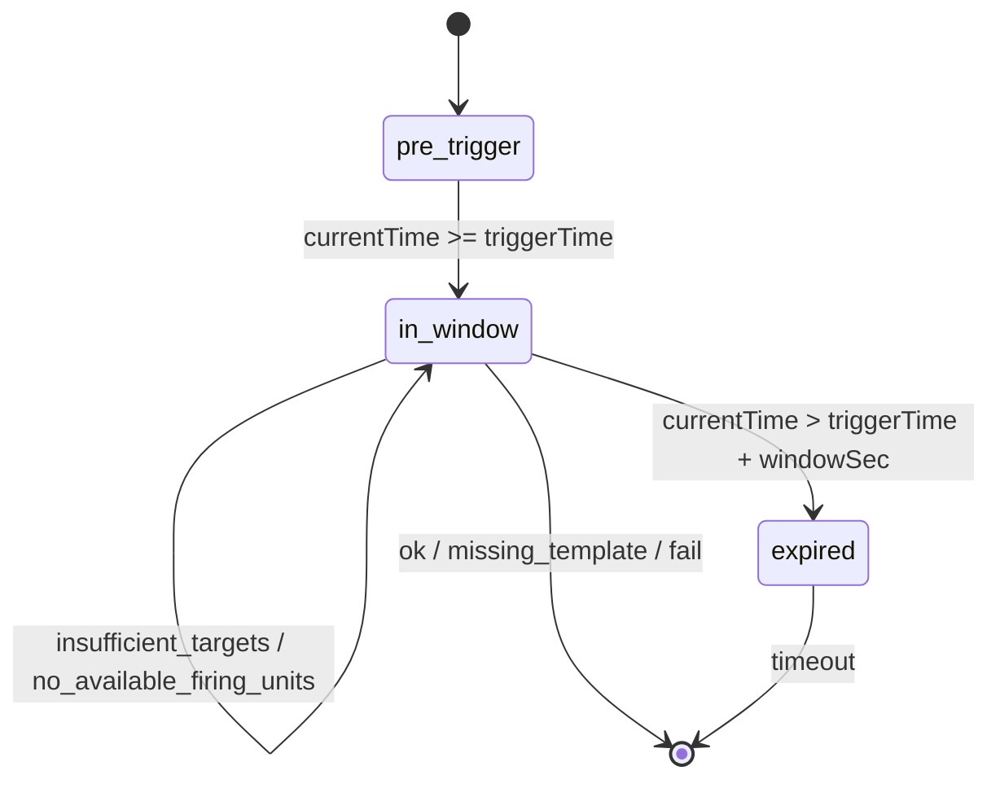
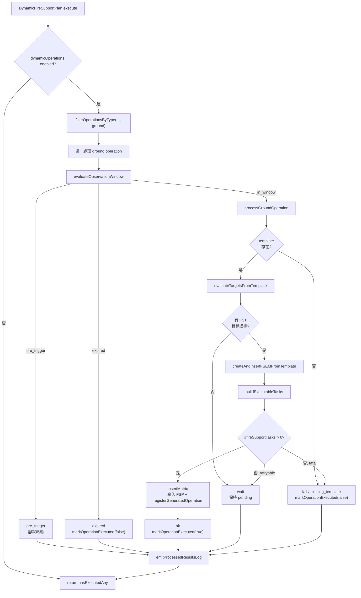

# dynamicFireSupportPlan — 動態火力支援計畫

> 原始碼：`src/modules/strikePlanner/dynamicFireSupportPlan.lua`

**職責**：在偵察觸發後的觀察窗內評估 ground operations，當目標與發射單元可用時產生 FSEM 並插入 `saveData.c.ground.fireSupportPlan`。

---

## 概述

`dynamicFireSupportPlan` 是 Strike Planner 的動態地面打擊生成層。它不直接發射武器，而是消費 `saveData.c.dynamicOperations.reconTriggeredOperations` 中尚未執行的 `ground` operation，依即時 contacts 與 FSEM template 建立新的 `SBJ__FireSupportExecutionMatrix`。

模組以 observation window 控制重試行為。當情境時間進入 `operationBatch.time + operationBatch.delay` 到 `config.c.recon.observationWindowSec` 的區間後，operation 會每個 tick 重新評估目標與 firing units；若只是目標不足或發射單元暫不可用，operation 會保持 pending。

成功建立 FSEM 時，模組會寫入 `saveData.c.ground.fireSupportPlan`，並透過 [dynamicOperationsUtils](dynamicOperationsUtils.md) 登記 generated ground operation 名稱。缺少 template、觀察窗逾時或未知失敗會標記 operation executed，避免無限重試。

---

## 相依與角色

| 相依 | 用途 |
|---|---|
| `src.modules.strikePlanner.targetingProcess` | 依 FST target template 與 contacts 產生可打擊目標 GUID 清單。 |
| `src.modules.strikePlanner.dynamicOperationsUtils` | 篩選 ground operations、產生唯一 FSEM 名稱、登記 generated operation、標記 operation 結果。 |
| `src.modules.missileSystem.init` | 透過 `isLowAmmo()` 檢查發射單元彈量是否低於門檻。 |
| `src.utils.gameApi` | 取得目前情境時間、查詢實際 CMO unit。 |
| `src.utils.utils` | `deepCopy()` template、解析偵察時間字串。 |
| `src.utils.logger` / `src.utils.logFormat` | 輸出動態地面作戰處理摘要。 |
| `src.core.constants` | 使用 `MISSILE_SYSTEM_STATE.HIDE` 與 `TAGS.DYNAMIC_OPERATIONS`。 |

---

## Local Constants

| 名稱 | 類型 | 說明 |
|---|---|---|
| `FIRING_UNIT_STATUS` | enum table | firing unit 驗證狀態，value 採 lower snake case。 |
| `FIRING_UNIT_STATUS_LOG_FIELD` | map table | 將 firing unit 狀態映射成 log 欄位。 |
| `PROCESS_REASON` | enum table | 流程失敗原因：`missing_template`、`insufficient_targets`、`no_available_firing_units`、`no_valid_tasks`。 |
| `OPERATION_OUTCOME` | enum table | 單筆 operation 處理結果：`ok`、`wait`、`timeout`、`missing_template`、`fail`。 |
| `OBSERVATION_STATE` | enum table | 觀察窗狀態：`pre_trigger`、`in_window`、`expired`。 |
| `SBJ__FiringUnitStatusCounter` | alias | `table<string, number>`，統計 firing unit 驗證結果。 |

---

## 主要機制

### 觀察窗處理

`evaluateObservationWindow(currentTime, operationBatch, windowSec)` 以 `operationBatch.time + operationBatch.delay` 計算觸發時間。`pre_trigger` 靜默略過；`in_window` 會嘗試建立 FSEM；`expired` 會呼叫 `markOperationExecuted(operationBatch, operation, false)` 並輸出 `[WARN]`。



### 目標評估

`evaluateTargetsFromTemplate()` 逐一處理 `matrixTemplate.fireSupportTasks`，每個 FST 呼叫 `TargetingProcess.processTargets(config, saveData, contacts, taskTemplate.target, matrixTemplate.isFirstWave)`。只有目標數量達到 `taskTemplate.target.minTargetCount` 的 FST 會進入 `targetsByTaskName`。

若沒有任何 FST 達標，`processGroundOperation()` 回傳 `PROCESS_REASON.INSUFFICIENT_TARGETS`。這是可重試原因，`execute()` 不會標記 operation executed，而是讓它留在觀察窗內等待下一個 tick。

### Firing Unit 驗證

`selectAvailableFiringUnits()` 直接接收完整 `taskTemplate`，使用 `taskTemplate.missileSystem` 與 `taskTemplate.firingUnits` 解析 runtime context。lookup 由 `getFiringUnitContext()` 處理，驗證則由 `validateFiringUnitStatus()` 專注檢查 assigned、CMO unit、state 與 ammo。

| 狀態碼 | 觸發條件 | Log 欄位 |
|---|---|---|
| `available` | CMO unit 存在、context 存在、狀態為 `HIDE`、彈量足夠 | `firingAvailable` |
| `missing_name` | template firing unit 沒有 `name` | `firingMissingName` |
| `assigned` | 名稱已存在於 active FSEM 或本輪已分配清單 | `firingAssigned` |
| `unit_not_found` | `GameApi.ScenEdit_GetUnit(firingUnitName)` 回傳 nil | `firingUnitNotFound` |
| `context_not_found` | `saveData.c.ground[string.lower(missileSystem)].firingUnits[firingUnitName]` 不存在 | `firingContextNotFound` |
| `bad_state` | firing unit context 的 `state ~= constants.MISSILE_SYSTEM_STATE.HIDE` | `firingBadState` |
| `low_ammo` | `MissileSystem.isLowAmmo(actualUnit, ammoThreshold, weaponDBID)` 回傳 true | `firingLowAmmo` |

### FSEM 組裝

`buildExecutableTasks()` 是 FST 建構的 orchestration 層。它先收集已分配 firing unit 名稱，再依通過目標評估的 FST 選出可用 firing units，最後以 `Utils.deepCopy(taskTemplate)` 複製 template 並補上 runtime 欄位：`firingUnits`、`startTime`、`isFinished = false`、`target.list = targets`。

FSEM 名稱由 `DynamicOperationsUtils.generateUniqueGroundOperationName()` 生成，會同時檢查 `generatedOperations.ground` 與既有 `fireSupportPlan`。成功後 `insertMatrix()` 將 matrix 寫入 FSP，並呼叫 `registerGeneratedOperation("ground", newMatrix.name, saveData)`。

### 日誌輸出

`execute()` 累積 `processedResults`，最後交給 `emitProcessedResultsLog()`。`formatProcessedResultLine()` 依 outcome 轉換成 `[OK]`、`[SKIP]`、`[WARN]`、`[ERROR]` 或 `[FAIL]` log entry，再以 `LogFormat.summary("scope", "dynamicGroundOperations", "Process operations", entries)` 輸出。

| Outcome | Log level | Logger | 是否標記 operation executed | 說明 |
|---|---|---|:-:|---|
| `ok` | `[OK]` | `Logger.log(constants.TAGS.DYNAMIC_OPERATIONS, ...)` | 是，`true` | FSEM 已插入 FSP。 |
| `wait` | `[SKIP]` | `Logger.log(constants.TAGS.DYNAMIC_OPERATIONS, ...)` | 否 | `insufficient_targets` 或 `no_available_firing_units`，保留在觀察窗內重試。 |
| `timeout` | `[WARN]` | `Logger.log(constants.TAGS.DYNAMIC_OPERATIONS, ...)` | 是，`false` | 觀察窗逾時。 |
| `missing_template` | `[ERROR]` | `Logger.error(...)` | 是，`false` | operation 缺少 FSEM template 或 `fireSupportTasks`。 |
| `fail` | `[FAIL]` | `Logger.error(...)` | 是，`false` | `no_valid_tasks` 或其他未知失敗原因。 |

---

## 流程圖



---

## saveData 結構

```text
saveData.c
├── dynamicOperations
│   ├── enabled: boolean
│   ├── generatedOperations
│   │   └── ground: table<string, boolean>
│   └── reconTriggeredOperations: SBJ__ReconTriggeredOperationBatch[]
│       └── ReconTriggeredOperationBatch
│           ├── time: string
│           ├── type: string
│           ├── delay: number
│           ├── executed: boolean
│           └── operations: SBJ__Operation[]
│               └── Operation
│                   ├── type: "ground"
│                   ├── executed: boolean
│                   ├── executionResult?: boolean
│                   └── template: SBJ__FireSupportExecutionMatrixTemplate
└── ground
    ├── fireSupportPlan: table<string, SBJ__FireSupportExecutionMatrix>
    │   └── generated FSEM
    │       ├── name
    │       ├── isActivated = true
    │       ├── isFinished = false
    │       ├── isFirstWave
    │       ├── allFiringUnitsInPosition = false
    │       ├── strikeInterval = 0
    │       └── fireSupportTasks: SBJ__FireSupportTask[]
    │           ├── firingUnits
    │           ├── startTime
    │           ├── isFinished = false
    │           └── target.list
    └── <missileSystemLower>
        └── firingUnits
            └── [firingUnitName]: SBJ__FiringUnitContext
                ├── name
                ├── state
                ├── ammoThreshold
                └── weaponDBID
```

### 讀寫與副作用

| 類型 | 路徑 / API | 行為 |
|---|---|---|
| 讀取 | `saveData.c.dynamicOperations.enabled` | 判斷模組是否啟用。 |
| 讀取 | `saveData.c.dynamicOperations.reconTriggeredOperations` | ground operation 來源。 |
| 讀取 | `saveData.c.ground.fireSupportPlan` | 掃描 active FSEM，避免 firing unit 重複分配。 |
| 讀取 | `saveData.c.ground[missileSystemLower].firingUnits[firingUnitName]` | 取得 firing unit runtime context。 |
| 寫入 | `saveData.c.ground.fireSupportPlan[newMatrix.name]` | 插入新 FSEM。 |
| 寫入 | `saveData.c.dynamicOperations.generatedOperations.ground[newMatrix.name]` | 登記 generated operation 名稱。 |
| 寫入 | `operation.executed` / `operation.executionResult` | 記錄 operation 是否已完成與結果。 |
| Game API | `GameApi.ScenEdit_CurrentTime()` | 取得觀察窗與 FSEM start time 基準。 |
| Game API | `GameApi.ScenEdit_GetUnit(firingUnitName)` | 驗證 firing unit 實體是否仍存在。 |

---

## Public API

| 函數 | 參數 | 回傳 | 呼叫者 | 說明 |
|---|---|---|---|---|
| `DynamicFireSupportPlan.execute(config, saveData, contacts)` | `SBJ__Config`, `SBJ__SaveData`, `CMO__Contact[]` | `boolean` | `StrikePlanner.executeDynamicFireSupportPlan()` → `src/scripts/china/scheduledStrikePlanner.lua` | 處理尚未執行的 ground operations；若至少插入一個 FSEM，回傳 `true`。 |

---

## config / constants 參考

| 類型 | 路徑 | 用途 |
|---|---|---|
| `config` | `config.c.recon.observationWindowSec` | ground operation 觀察窗長度；目前配置為 `30 * 60` 秒。 |
| `config` | `config.c.fireSupportTaskTemplates` | ground operation template 的上游來源，由 scheduler 掛入 `operation.template`。 |
| `constants` | `constants.MISSILE_SYSTEM_STATE.HIDE` | firing unit 必須處於 HIDE 狀態才可被選用。 |
| `constants` | `constants.TAGS.DYNAMIC_OPERATIONS` | 動態地面作戰 summary log 的 tag。 |

---

## 相關模組

- [targetingProcess](targetingProcess.md) — 依 target template 與 contacts 解析可打擊目標。
- [dynamicOperationsUtils](dynamicOperationsUtils.md) — 管理 recon-triggered operation 狀態、命名與 generated operation 登記。
- [fireSupportPlan](fireSupportPlan.md) — 執行本模組插入的 FSEM。
- [reconOperationScheduler](reconOperationScheduler.md) — 依偵察結果建立 ground operation template。
- [missileSystem](../missileSystem/README.md) — 提供 firing unit 狀態與彈量檢查相關功能。
- [Strike Planner 系統架構](README.md)
