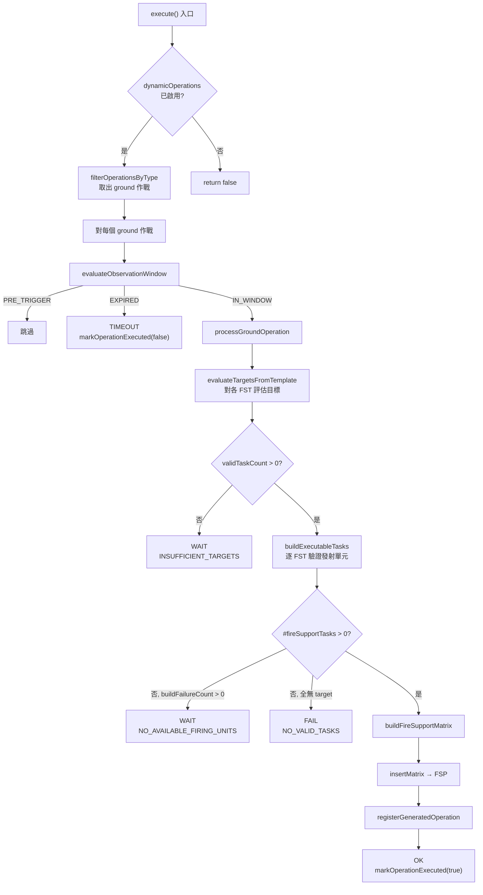
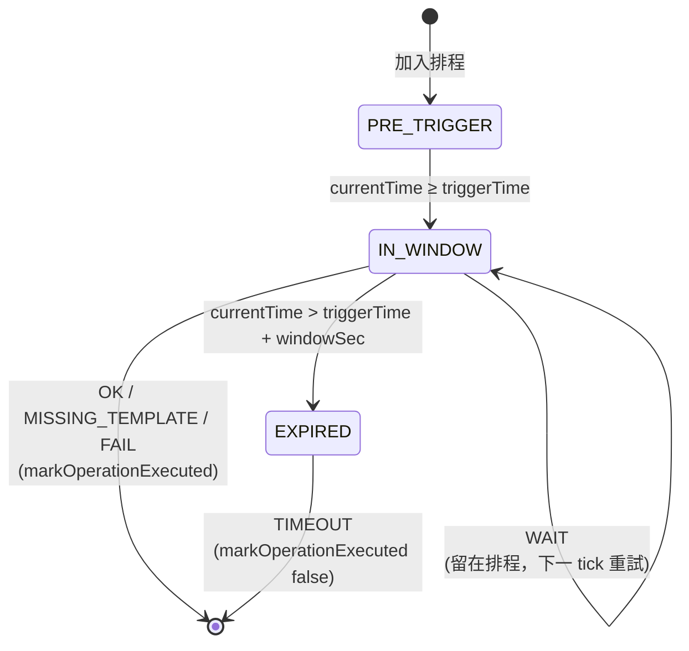

# dynamicFireSupportPlan — 動態火力支援計畫

> 原始碼：`src/modules/strikePlanner/dynamicFireSupportPlan.lua`

**職責**：基於偵察排程，於觀察窗內動態評估目標、驗證發射單元可用性，自動生成新的 FSEM 並插入 FSP

---

## 概述

dynamicFireSupportPlan 負責 Kill Chain 的 Target → Engage 階段（動態地面打擊）。模組監聽 `saveData.c.dynamicOperations.reconTriggeredOperations` 中的 ground 類型作戰，每次由 `scheduledStrikePlanner.lua` 觸發時逐項評估其觀察窗狀態，並依結果決定是否生成 FSEM、是否標記作戰已執行、或是讓作戰留在批次內等待下一個 tick。

模組的核心設計是 **觀察窗（Observation Window）機制**：偵察觸發時間到達後，作戰並不立即被消耗；它會在 `config.c.recon.observationWindowSec` 期間內持續嘗試達成生成條件（足夠的有效目標、可用的發射單元）。這讓偵察累積接觸與發射單元釋放的時間差能被吸收，避免因瞬時資源短缺造成整波打擊浪費。

成功生成的 FSEM 透過 `insertMatrix` 寫入 `saveData.c.ground.fireSupportPlan`，後續由 [fireSupportPlan](fireSupportPlan.md) 模組執行實際發射。同時，動態作戰名稱會經 [dynamicOperationsUtils](dynamicOperationsUtils.md) 登記，避免跨 tick 重複生成。

---

## 觀察窗機制

每個地面作戰項目於每次 tick 會落入三種狀態之一：

| 狀態 | 條件 | 處置 |
|---|---|---|
| `PRE_TRIGGER` | `currentTime < triggerTime` | 靜默跳過，不寫入結果 |
| `IN_WINDOW` | `triggerTime ≤ currentTime ≤ triggerTime + windowSec` | 嘗試生成 FSEM，依結果分派 outcome |
| `EXPIRED` | `currentTime > triggerTime + windowSec` | 標記為已執行（失敗），輸出 `TIMEOUT` |

其中 `triggerTime = parseDatetimeToTimestamp(reconEntry.time) + reconEntry.delay`，由 `evaluateObservationWindow` 計算。

### IN_WINDOW outcome 分派

`processGroundOperation` 會回傳 `(success, reason, statusSummary)`，主迴圈依此分派：

| Outcome | 條件 | 是否標記執行 | 行為 |
|---|---|:-:|---|
| `OK` | `success == true` | ✓ | 插入 FSEM、設定 `hasExecutedAny = true` |
| `MISSING_TEMPLATE` | `reason == "MISSING_TEMPLATE"` | ✓ | 致命錯誤，避免無限重試 |
| `WAIT` | `reason == "INSUFFICIENT_TARGETS"` 或 `"NO_AVAILABLE_FIRING_UNITS"` | ✗ | 留在排程內，下一個 tick 重試 |
| `FAIL` | 未知 reason | ✓ | 防呆：避免不可預期狀況造成無限重試 |

`WAIT` 是觀察窗機制的關鍵：每次 tick 都會重新輸出 `[WAIT]` 日誌，操作者可即時觀察是 *目標不足* 還是 *發射單元被佔用* 在阻擋作戰生成。

---

## 動態 FSEM 生成流程

### 觀察窗狀態圖

---

## 目標評估

`evaluateTargetsFromTemplate` 對模板中的每個 FST 呼叫 [targetingProcess.processTargets](targetingProcess.md)，並依 `minTargetCount` 篩選有效任務：

- 使用 FST 模板的 `target` 配置（filterNames、areas、contactAge、minTargetCount、ammoPerTarget）
- 傳入 `matrixTemplate.isFirstWave` 作為首波旗標（影響目標篩選邏輯）
- `minTargetCount` 為 schema/config 必填欄位，模組不做 runtime fallback
- 回傳 `(evaluatedTargets, validTaskCount)`：FST 名稱對應目標 GUID 陣列、與通過門檻的任務數

只要 `validTaskCount == 0`，整個作戰回傳 `INSUFFICIENT_TARGETS` 進入 WAIT 狀態。

---

## 發射單元可用性驗證

每個發射單元（Battery）由 `validateFiringUnitStatus` 逐項檢查，回傳七種狀態之一：

| 狀態碼 | 檢查項目 | 說明 |
|---|---|---|
| `available` | 全部通過 | 可指派 |
| `missing_name` | 名稱欄位缺失 | 模板配置錯誤 |
| `assigned` | 已指派至其他 FST | 防止重複配置（掃描所有啟動中的 FSEM） |
| `unit_not_found` | `ScenEdit_GetUnit` 回傳 nil | 可能已被摧毀 |
| `context_not_found` | `saveData.c.ground[missileSystem].firingUnits[name]` 找不到 | context 缺失 |
| `bad_state` | 非 `MISSILE_SYSTEM_STATE.HIDE` | 正在移動或射擊中 |
| `low_ammo` | `MissileSystem.isLowAmmo` 回傳 true | 彈量低於門檻 |

### 重複配置防護

- `collectAssignedFiringUnits` 啟動時掃描所有 `isActivated == true` 且 `isFinished == false` 的 FSEM，收集已指派的發射單元名稱
- 同一次建構週期中，每完成一個 FST 即由 `markFiringUnitsAssigned` 即時更新已指派清單，避免同 tick 內多 FST 搶單元

### 狀態統計

每次 tick 維護一個 `statusCounter`（由 `createStatusCounter` 建立），由 `formatStatusCounter` 格式化成 `available=2, assigned=3, low_ammo=1` 形式的字串，附在 outcome 日誌中供操作者觀察可用度。

---

## FSEM 組裝

`buildFireSupportMatrix` 組裝最終的 FSEM 結構，由 `insertMatrix` 寫入 `saveData.c.ground.fireSupportPlan`：

| 欄位 | 值 | 說明 |
|---|---|---|
| `name` | `buildMatrixName` | `DYNAMIC/{RECON_TYPE}/{OP_TYPE}/{SEQ}`（透過 `generateUniqueGroundOperationName`） |
| `isActivated` | `true` | 立即啟動 |
| `isFinished` | `false` | 等待 FSP 模組執行 |
| `isFirstWave` | 沿用模板 | 影響 BDA 與後續波次邏輯 |
| `allFiringUnitsInPosition` | `false` | FSP 模組會在執行時翻轉 |
| `strikeInterval` | `0` | Ground 動態 FSP 使用 TOT 導向執行；間隔在生成後被刻意停用 |
| `fireSupportTasks` | 由 `buildExecutableTasks` 產生 | 各 FST 的 `startTime` 由 `buildTaskStartTime` 依模板的 `strikeInterval` 順序遞增 |

每個 FST 的 `startTime` 為 UTC 字串：`os.date("!%Y-%m-%d %H:%M:%S", matrixStartTime + taskIndex × strikeInterval)`。

---

## 結構化日誌輸出

每次 tick 結束會將累積的 `processedResults` 拆成 info 與 error 兩組輸出：

| Outcome | Logger | 範例片段 |
|---|---|---|
| `OK` | `Logger.log` | `[OK] OP_NAME (recon_time, recon_type) \| firing units: available=2, assigned=1` |
| `WAIT` | `Logger.log` | `[WAIT] OP_NAME (...) \| INSUFFICIENT_TARGETS \| firing units: ...` |
| `TIMEOUT` | `Logger.log` | `[TIMEOUT] OP_NAME (...) \| observation window expired` |
| `MISSING_TEMPLATE` | `Logger.error` | `[ERROR] OP_NAME (...) \| missing FSEM template` |
| `FAIL` | `Logger.error` | `[FAIL] OP_NAME (...) \| <reason> \| firing units: ...` |

info 與 error 各自合併成單一多行日誌訊息，以 `Ground operations processed: N items` / `Ground operations errors: N items` 起首。標籤為 `constants.TAGS.DYNAMIC_OPERATIONS`。

---

## 公開 API

| 函數 | 說明 |
|---|---|
| `execute(config, saveData, contacts)` | 主入口：對 `reconTriggeredOperations` 中的 ground 作戰逐項評估觀察窗、嘗試生成 FSEM。若任一作戰成功生成回傳 `true`，否則 `false`。模組關閉、無 ground 作戰時短路回傳 `false` |

呼叫者：`src/modules/strikePlanner/init.lua` 的 `executeDynamicFireSupportPlan` → `src/scripts/china/scheduledStrikePlanner.lua`（每 5 分鐘 tick）

---

## config / constants 引用

| 路徑 | 用途 |
|---|---|
| `config.c.recon.observationWindowSec` | 觀察窗長度（預設 30 分鐘） |
| `config.c.fireSupportTaskTemplates` | FST 模板（透過 `evaluateTargetsFromTemplate` 間接引用） |
| `constants.MISSILE_SYSTEM_STATE.HIDE` | 發射單元 `bad_state` 判定基準 |
| `constants.TAGS.DYNAMIC_OPERATIONS` | Logger info 訊息標籤 |

---

## 相關模組

- [targetingProcess](targetingProcess.md) — 目標評估（`processTargets`）
- [dynamicOperationsUtils](dynamicOperationsUtils.md) — 作戰篩選、命名、登記、執行標記
- [fireSupportPlan](fireSupportPlan.md) — 執行生成的 FSEM
- [missileSystem](../missileSystem/README.md) — `isLowAmmo` 彈量檢查
- [系統架構](README.md)
