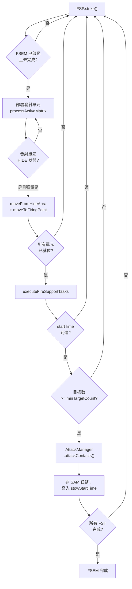

# fireSupportPlan — 火力支援計畫執行

> 原始碼：`src/modules/strikePlanner/fireSupportPlan.lua`

**職責**：執行預排的 FSP，管理發射單元部署至射擊陣地並執行打擊

---

## 概述

fireSupportPlan 負責 Kill Chain 的 Engage 階段（地面打擊）。遍歷 `saveData.c.ground.fireSupportPlan` 中所有已啟動的 FSEM，將發射單元從 HIDE 區部署至射擊陣地（FP），待所有單元就位後依序執行各 FST 的打擊任務。

---

## FSP 資料層級

```
FSP (fireSupportPlan)
└── FSEM（火力支援執行矩陣）
    ├── isActivated: 是否啟動
    ├── isFinished: 是否完成
    ├── allFiringUnitsInPosition: 所有發射單元就位
    └── FST[]（火力支援任務）
        ├── startTime: 開始時間
        ├── isFinished: 是否完成
        ├── missileSystem: 飛彈系統類型
        ├── firingUnits: 發射單元陣列
        └── target: 目標清單
```

---

## FSEM 執行流程



### 部署階段

對 FSEM 內每個未完成的 FST：

1. 檢查 `startTime` 是否到達
2. 對每個 `firingUnit` 透過 `saveData` 取得其 `FiringUnitContext`
3. 確認狀態為 `HIDE` 且彈量充足（`MissileSystem.isLowAmmo`）
4. 呼叫 `MissileSystem.moveFromHideArea` 把單元從 MASK 建築卸載，再呼叫 `MissileSystem.moveToFiringPoint` 驅動移動
5. 確認狀態轉為 `STATIC`（已就位）

### 打擊階段

所有發射單元就位後，對每個 FST：

1. 確認 `startTime` 到達
2. 確認目標數 >= `minTargetCount`
3. 呼叫 `AttackManager.attackContacts` 執行打擊
4. 成功後標記 `task.isFinished = true`
5. 若 `task.missileSystem ~= "SAM"`，把每個發射單元的 `firingUnitContext.stowStartTime` 設為當前時間（若尚未設定），交由 `missileSystem.cycle` 接手 stow 等待視窗與後續撤收

---

## 與 missileSystem 模組的協作

| 呼叫 | 用途 |
|---|---|
| `MissileSystem.isLowAmmo(group, threshold, weaponDBID)` | 確認發射單元彈量是否充足 |
| `MissileSystem.moveFromHideArea(firingUnitCtx, actualUnit)` | 把發射單元從 MASK 建築卸載 |
| `MissileSystem.moveToFiringPoint(firingUnitCtx, actualUnit)` | 驅動發射單元從 HIDE → FP |
| 寫入 `firingUnitContext.stowStartTime`（非 SAM） | 打擊完成後啟動 `missileSystem.cycle` 的 stow 倒數，銜接後續撤收／補給 |

發射單元的狀態轉換（HIDE → REPOSITIONING → STATIC）由 missileSystem 模組的狀態機管理。詳見 [missileSystem 文件](../missileSystem.md)。

---

## 公開 API

| 函數 | 說明 |
|---|---|
| `strike(saveData)` | 主入口：遍歷所有啟動的 FSEM，部署單元並執行打擊 |

---

## 相關模組

- [dynamicFireSupportPlan](dynamicFireSupportPlan.md) — 動態生成新的 FSEM 插入 `fireSupportPlan`
- [missileSystem](../missileSystem.md) — 發射單元狀態機與移動控制
- `attackManager` — 實際發射武器
- [系統架構](README.md)
