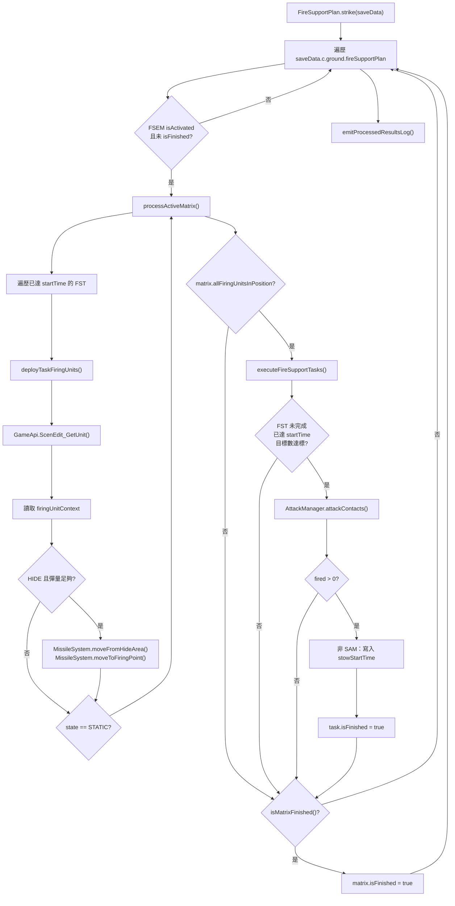

# fireSupportPlan — 火力支援計畫執行

> 原始碼：`src/modules/strikePlanner/fireSupportPlan.lua`

**職責**：執行 `saveData.c.ground.fireSupportPlan` 內已啟動的 FSEM，協調發射單元部署、打擊執行、任務完成狀態與集中式日誌輸出。

---

## 概述

`fireSupportPlan` 是 Strike Planner 的地面 Engage 執行器。它不負責產生目標或建立 FSEM，而是讀取已存在於 `saveData.c.ground.fireSupportPlan` 的火力支援執行矩陣，逐一處理已啟動且未完成的矩陣。

模組的核心流程分成部署與打擊兩段。部署階段會檢查 FST 的 `startTime`、發射單元的實體單位、飛彈系統狀態與彈量；只有所有相關發射單元都進入 `STATIC` 狀態後，才會進入打擊階段。打擊階段會呼叫 `AttackManager.attackContacts()`，成功發射後標記 FST 完成，並在非 SAM 任務上寫入 `stowStartTime`，讓 missileSystem 狀態機接手後續收車與再補給流程。

日誌輸出採集中彙整模式。各階段只回傳結構化結果，最後由 `emitProcessedResultsLog()` 統一格式化為 `LogFormat.summary()`，以 `constants.TAGS.GROUND` 寫入一般地面作戰日誌；未來若出現失敗結果則可分流至 `Logger.error()`。

---

## 相依模組

| require | 角色 |
|---|---|
| `src.modules.attackManager` | 透過 `attackContacts()` 對目標 GUID 清單發射武器。 |
| `src.utils.gameUtils` | 使用 `isAfterStartTime()` 判斷 FST 是否已達啟動時間。 |
| `src.utils.logger` | 輸出集中式 summary 日誌。 |
| `src.utils.gameApi` | 透過 `ScenEdit_GetUnit()` 取得實體單位，透過 `ScenEdit_CurrentTime()` 寫入 stow 起始時間。 |
| `src.utils.logFormat` | 格式化 `[OK]`、`[SKIP]`、`[FAIL]` entry 與 summary。 |
| `src.modules.missileSystem.init` | 檢查彈量並移動發射單元至射擊點。 |
| `src.core.constants` | 使用 `MISSILE_SYSTEM_STATE` 與 `TAGS.GROUND`。 |

---

## 主要機制

### Firing Unit Readiness

`isFiringUnitReady()` 會同時檢查兩個條件：

| 條件 | 來源 | 說明 |
|---|---|---|
| `firingUnitCtx.state == constants.MISSILE_SYSTEM_STATE.HIDE` | `saveData.c.ground.<system>.firingUnits` | 發射單元必須仍在隱蔽狀態，才會被派往射擊點。 |
| `not MissileSystem.isLowAmmo(...)` | CMO unit + firing unit context | 彈量不得低於該 firing unit 的 `ammoThreshold`。 |

`isFiringUnitAtFiringPoint()` 只檢查 `state == STATIC`。在此模組中，`STATIC` 代表該 firing unit 已位於可射擊位置；實際狀態轉換由 missileSystem 模組維護。

### Firing Unit Deployment

`processActiveMatrix()` 會遍歷 FSEM 內尚未完成且已達 `startTime` 的 FST。每個 firing unit 會由 `deploySingleFiringUnit()` 取得實體單位與 runtime context：

1. `GameApi.ScenEdit_GetUnit(firingUnit.name)` 取得 CMO 實體單位。
2. `getFiringUnitContext(saveData, task.missileSystem, firingUnit.name)` 讀取 `saveData.c.ground.<system>.firingUnits[name]`。
3. 若 firing unit 在 `HIDE` 且彈量足夠，依序呼叫 `MissileSystem.moveFromHideArea()` 與 `MissileSystem.moveToFiringPoint()`。
4. 以 `isFiringUnitAtFiringPoint()` 判斷是否已進入射擊位置。

若任一 firing unit 尚未就位，該 FST 會被列入 pending 結果，並在日誌中輸出 `reason=firing_units_not_in_position` 與單位名稱。

### Strike Execution

`executeFireSupportTasks()` 只會在整個 FSEM 的 firing units 都已就位時執行。每個 FST 需同時滿足以下條件：

| 條件 | 說明 |
|---|---|
| `not task.isFinished` | 任務尚未完成。 |
| `GameUtils.isAfterStartTime(task.startTime)` | 已達任務啟動時間。 |
| `#task.target.list >= task.target.minTargetCount` | 目標數量符合最低發射門檻。 |

符合條件後會呼叫：

```lua
AttackManager.attackContacts({
  contacts = task.target.list,
  qty = task.target.ammoPerTarget,
  firingUnits = task.firingUnits,
})
```

當回傳值大於 `0`，代表本次打擊有實際發射。模組會將 `task.isFinished` 設為 `true`，並回傳 `{ taskName = task.name, fired = result }` 供日誌彙整。

### Stow Window Trigger

非 SAM 任務成功發射後，模組會針對該 FST 的每個 firing unit 寫入：

```lua
firingUnitContext.stowStartTime = GameApi.ScenEdit_CurrentTime()
```

如果該 firing unit 已有 `stowStartTime`，則不覆寫。SAM 任務不寫入此欄位，因為 SAM firing unit 在此流程中不啟動同樣的打擊後 stow 倒數。

### Consolidated Logging

`strike()` 會累積 `SBJ__FireSupportPlanProcessedResult[]`，最後交由 `emitProcessedResultsLog()` 統一輸出。

| outcome | log level | 主要欄位 |
|---|---|---|
| `strike` | `[OK]` | `matrix`、`action=strike`、`task`、`fired` |
| `pending` | `[SKIP]` | `matrix`、`task`、`reason=firing_units_not_in_position`、`units` |
| `finished` | `[OK]` | `matrix`、`state=finished` |
| fallback | `[FAIL]` | `matrix`、`reason` |

一般結果會透過：

```lua
Logger.log(constants.TAGS.GROUND, LogFormat.summary(
  "scope",
  "fireSupportPlan",
  "Execute fire support plan",
  infoLines
))
```

`FAIL` 或 `ERROR` entry 會被分流到 `Logger.error()`。

---

## 執行流程



---

## saveData 結構

```text
saveData.c.ground
├── enabled: boolean
├── fireSupportPlan: table<string, SBJ__FireSupportExecutionMatrix>
│   └── <matrixName>
│       ├── name: string
│       ├── isActivated: boolean
│       ├── isFinished: boolean
│       ├── isFirstWave: boolean
│       ├── strikeInterval: number
│       ├── allFiringUnitsInPosition: boolean
│       └── fireSupportTasks: SBJ__FireSupportTask[]
│           └── <task>
│               ├── name: string
│               ├── missileSystem: string
│               ├── startTime: string
│               ├── isFinished: boolean
│               ├── firingUnits: SBJ__FiringUnit[]
│               │   └── name: string
│               └── target
│                   ├── list: string[]
│                   ├── minTargetCount: number
│                   └── ammoPerTarget: number
├── mlrs / glcm / srbm / mrbm / ascm / sam
│   └── firingUnits: table<string, SBJ__FiringUnitContext>
│       └── <firingUnitName>
│           ├── state: constants.MISSILE_SYSTEM_STATE
│           ├── ammoThreshold: number
│           ├── weaponDBID: number|number[]
│           └── stowStartTime?: number
```

### 狀態讀寫

| 路徑 | 操作 | 說明 |
|---|---|---|
| `saveData.c.ground.fireSupportPlan` | read | `strike()` 遍歷所有 FSEM。 |
| `matrix.allFiringUnitsInPosition` | write | `processActiveMatrix()` 寫入部署階段結果。 |
| `task.isFinished` | write | `executeFireSupportTasks()` 在成功發射後標記完成。 |
| `matrix.isFinished` | write | `strike()` 在所有 FST 完成後標記 FSEM 完成。 |
| `saveData.c.ground.<system>.firingUnits.<name>.stowStartTime` | write | 非 SAM 任務成功發射後啟動 stow 倒數。 |

---

## `config` 參考

`fireSupportPlan.lua` 不直接 `require("src.core.config")`，但它讀寫的 `saveData.c.ground.<system>` 由 `src/core/saveData.lua` 依 `config.c.ground.*` 初始化。

| config 路徑 | 間接用途 |
|---|---|
| `config.logging.modules[constants.TAGS.GROUND]` | 控制 `constants.TAGS.GROUND` 日誌是否 verbose。 |
| `config.c.ground.<system>.reloadTime` | 初始化 `saveData.c.ground.<system>.reloadTime`，供 missileSystem 後續流程使用。 |
| `config.c.ground.<system>.stowTime` | 初始化 `saveData.c.ground.<system>.stowTime`，供打擊後 stow 視窗使用。 |
| `config.c.ground.<system>.firingUnits[*].ammoThreshold` | 進入 `SBJ__FiringUnitContext` 後由 `MissileSystem.isLowAmmo()` 使用。 |
| `config.c.ground.<system>.firingUnits[*].weaponDBID` | 進入 `SBJ__FiringUnitContext` 後用於彈量檢查與發射單元武器設定。 |

---

## `constants` 參考

| constants 路徑 | 用途 |
|---|---|
| `constants.MISSILE_SYSTEM_STATE.HIDE` | 判斷 firing unit 是否可從隱蔽位置部署。 |
| `constants.MISSILE_SYSTEM_STATE.STATIC` | 判斷 firing unit 是否已在射擊位置。 |
| `constants.TAGS.GROUND` | 作為 `Logger.log()` 的地面作戰日誌 tag。 |

---

## Public API

| 函式 | 參數 | 回傳 | 副作用 |
|---|---|---|---|
| `FireSupportPlan.strike(saveData)` | `SBJ__SaveData` | 無 | 部署 firing units、呼叫 `AttackManager.attackContacts()`、更新 FST/FSEM 狀態、寫入非 SAM firing unit 的 `stowStartTime`、輸出 fire support plan summary 日誌。 |

### 上游呼叫

| 呼叫者 | 條件 | 說明 |
|---|---|---|
| `StrikePlanner.strikeGroundTargets(saveData)` | 無額外條件 | `src/modules/strikePlanner/init.lua` 對外包裝。 |
| `src/scripts/china/scheduledStrikePlanner.lua` | `saveData.c.ground.enabled == true` | 定時排程中執行 FSP；同一輪腳本結束時會儲存 `SaveData`。 |

---

## Internal Helper 對照

| helper | 責任 | 主要輸入 | 主要輸出 |
|---|---|---|---|
| `isFiringUnitReady()` | 判斷 firing unit 是否可派往射擊點。 | `SBJ__FiringUnitContext`, `CMO__Unit` | `boolean` |
| `isFiringUnitAtFiringPoint()` | 判斷 firing unit 是否已就位。 | `SBJ__FiringUnitContext` | `boolean` |
| `getFiringUnitContext()` | 依 missile system 與 firing unit name 從 saveData 取 context。 | `saveData`, `missileSystem`, `firingUnitName` | `SBJ__FiringUnitContext` |
| `deploySingleFiringUnit()` | 取得實體單位、必要時呼叫 missileSystem 移動，並回報是否就位。 | `saveData`, `task`, `firingUnit` | `boolean` |
| `deployTaskFiringUnits()` | 部署一個 FST 的所有 firing units。 | `saveData`, `task` | `allInPosition`, `notReadyNames` |
| `executeFireSupportTasks()` | 對可執行 FST 發射武器並標記完成。 | `saveData`, `matrix` | `{ taskName, fired }[]` |
| `isMatrixFinished()` | 判斷 FSEM 內所有 FST 是否完成。 | `matrix` | `boolean` |
| `processActiveMatrix()` | 執行 FSEM 部署階段並回傳 pending task。 | `saveData`, `matrix` | `allInPosition`, `pendingTasks` |
| `formatProcessedResultLine()` | 將結構化結果轉為單行日誌 entry 內容。 | `SBJ__FireSupportPlanProcessedResult` | `level`, `message` |
| `emitProcessedResultsLog()` | 分流 info/error 並輸出 summary。 | `SBJ__FireSupportPlanProcessedResult[]` | 無 |

---

## 相關模組

| 文件 | 關係 |
|---|---|
| [fsemBuilder](fsemBuilder.md) | 動態產生 FSEM 並插入 `saveData.c.ground.fireSupportPlan`，由本模組後續執行。 |
| [targetingProcess](targetingProcess.md) | 提供動態 FSEM 生成時的目標評估；本模組只消耗已寫入 FST 的 target list。 |
| [missileSystem](../missileSystem/README.md) | 管理 firing unit 狀態機、移動、stow 與 reload。 |
| [attackManager](../attackManager.md) | 實際執行 `attackContacts()` 發射流程。 |
| [Strike Planner README](README.md) | Strike Planner 整體架構與 FSP 在 Kill Chain 中的位置。 |
