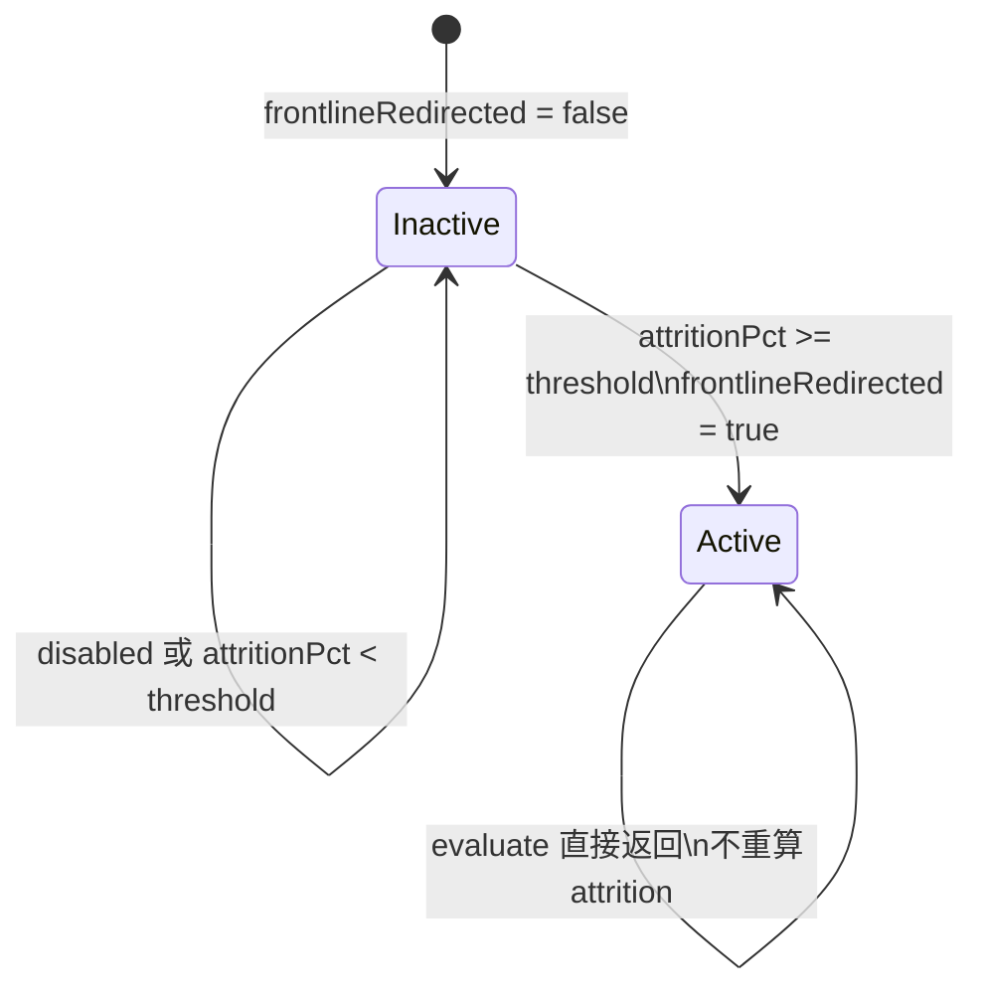
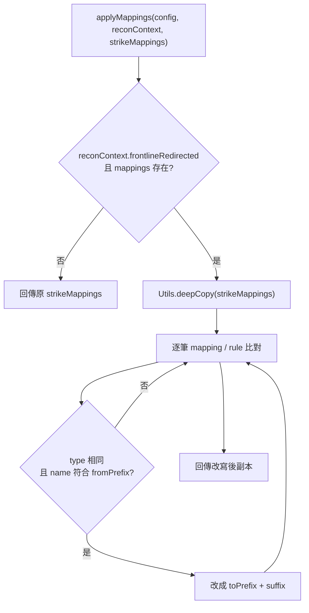

# frontlineRedirect — 前線打擊包重導向

> 原始碼：`src/modules/strikePlanner/frontlineRedirect.lua`

**職責**：依前線基地整體戰損啟用 sticky redirect，並在排程前改寫 strike mapping 名稱

---

## 概述

`frontlineRedirect` 將前線空軍基地的戰損情況轉成動態作戰排程的 mapping rewrite。當 `AirbaseAttrition.calculate` 回報的整體 `attritionPct` 達到 `config.c.recon.frontlineRedirect.attritionThresholdPct`，模組會把 `reconContext.frontlineRedirected` 設為 `true`。

這個旗標是 sticky 狀態，觸發後不會由本模組清回 `false`。後續 tick 若再次呼叫 `evaluate`，會直接回傳 `true, nil`，避免每次都列舉整個 side 的 aircraft。

實際 mapping 改寫由 `applyMappings` 與 `rewriteMappings` 處理。改寫前會先深拷貝輸入 mapping 陣列，避免污染 `config.c.recon.strikeMappingsByReconObjective` 這份全域設定。

---

## 主要機制

### 戰損門檻評估

`evaluate(config, reconContext)` 只在以下條件成立時呼叫 [airbaseAttrition](airbaseAttrition.md)：

- `reconContext.frontlineRedirected ~= true`
- `config.c.recon.frontlineRedirect` 存在
- `config.c.recon.frontlineRedirect.enabled == true`

評估使用：

| 來源 | 用途 |
|---|---|
| `config.c.air.landBased.deployedACs` | 機場與計畫駐機基線 |
| `config.c.recon.frontlineRedirect.frontlineBaseNames` | 要納入統計的前線基地名稱 |
| `config.c.recon.frontlineRedirect.attritionThresholdPct` | 啟用 redirect 的整體戰損門檻 |

達標時會回傳 `true` 以及一段 activation log 內容，實際 log 由 [recon](recon.md) 的 `processQueue` 輸出到 `constants.TAGS.RECON`。

### Mapping rewrite

`rewriteMappings(strikeMappings, rules)` 逐筆比對 mapping：

- `mapping.type == rule.type`
- `mapping.name` 字首符合 `rule.fromPrefix`

符合時將名稱改成：

```
rule.toPrefix .. mapping.name:sub(#rule.fromPrefix + 1)
```

以目前設定為例，`STRIKE/AB/W/1` 會被改寫為 `STRIKE/AB/W/AAR/1`，使 [operationScheduler](operationScheduler.md) 查詢 `config.c.packageTemplates.STRIKE_AB_W_AAR_1`。

---

## 狀態流程



---

## Mapping 改寫流程



---

## saveData 結構

```
saveData.c.recon
├── enabled: boolean
├── frontlineRedirected: boolean
└── queue: SBJ__ReconQueueEntry[]
```

`frontlineRedirect` 只改寫 `reconContext.frontlineRedirected`。在實際情境中，這個 `reconContext` 由 `saveData.c.recon` 傳入，因此 sticky 旗標會隨 saveData 保存。

---

## config / saveData 參考

| 類型 | 路徑 | 用途 |
|---|---|---|
| `config` | `config.c.recon.frontlineRedirect.enabled` | 是否啟用前線重導向 |
| `config` | `config.c.recon.frontlineRedirect.attritionThresholdPct` | 整體戰損達到此百分比即啟用 |
| `config` | `config.c.recon.frontlineRedirect.frontlineBaseNames` | 交給 `AirbaseAttrition.calculate` 的基地名稱清單 |
| `config` | `config.c.recon.frontlineRedirect.mappings` | mapping 改寫規則陣列 |
| `config` | `config.c.air.landBased.deployedACs` | 前線基地計畫駐機基線 |
| `saveData` | `saveData.c.recon.frontlineRedirected` | sticky redirect 狀態 |

---

## Public API

| 函數 | 參數 | 回傳 | 說明 |
|---|---|---|---|
| `evaluate(config, reconContext)` | `SBJ__Config`, `SBJ__ReconContext` | `boolean, string|nil` | 評估前線基地戰損是否達門檻；首次啟用時寫入 sticky 旗標並回傳 activation message |
| `applyMappings(config, reconContext, strikeMappings)` | `SBJ__Config`, `SBJ__ReconContext`, `SBJ__ReconStrikeMapping[]` | `SBJ__ReconStrikeMapping[]` | 當 sticky redirect 已啟用且有規則時，回傳改寫後 mapping 副本 |
| `rewriteMappings(strikeMappings, rules)` | `SBJ__ReconStrikeMapping[]`, `SBJ__StrikeMappingRewriteRule[]` | `SBJ__ReconStrikeMapping[]` | 深拷貝 mappings，依規則改寫符合字首與類型的 mapping 名稱 |

---

## 相關模組

- [airbaseAttrition](airbaseAttrition.md) — 計算前線基地整體戰損率
- [operationScheduler](operationScheduler.md) — 在建立 operation 前套用 mapping 改寫
- [recon](recon.md) — 每 tick 呼叫 `evaluate`，並負責輸出 activation log
- [系統架構](README.md)
