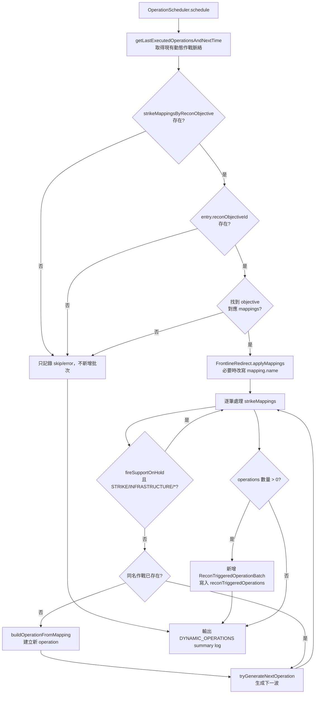

# operationScheduler — 偵察觸發作戰排程

> 原始碼：`src/modules/strikePlanner/operationScheduler.lua`

**職責**：在偵察任務成功完成後，依 `reconObjectiveId` 建立後續 air/ground operations，並寫入 `reconTriggeredOperations`

---

## 概述

`operationScheduler` 是 [recon](recon.md) 從偵察生命週期拆出的動態作戰排程層。它不處理 UAV 發射、航線監控或衛星任務完成判定，只接收 `SBJ__ReconQueueProcessingContext` 與已完成且成功的 `SBJ__ReconQueueEntry`，再把偵察目標轉換成 `SBJ__Operation`。

模組會依 `entry.reconObjectiveId` 查詢 `config.c.recon.strikeMappingsByReconObjective`，逐筆建立空中或地面作戰。空中作戰使用 `config.c.packageTemplates`，地面作戰使用 `config.c.fireSupportTaskTemplates`，兩者都會先把 strike mapping 名稱中的 `/` 轉成 `_` 當模板表鍵名。

排程結果會新增為 `SBJ__ReconTriggeredOperationBatch` 並寫入呼叫端傳入的 `reconTriggeredOperations`。後續由 [atoBuilder](atoBuilder.md) 取出 `air` operation 生成 ATO Wave，並由 [fsemBuilder](fsemBuilder.md) 取出 `ground` operation 生成 FSEM。

---

## 主要機制

### 偵察目標映射

排程從 `config.c.recon.strikeMappingsByReconObjective` 開始。每筆偵察 entry 必須帶有 `reconObjectiveId`，否則模組會輸出 `[SKIP] reason=recon_objective_not_assigned`，不建立任何作戰。

若映射表不存在，模組輸出 `[ERROR] reason=strike_mappings_by_recon_objective_not_found`。若 entry 的 `reconObjectiveId` 查無映射，模組輸出 `[SKIP] reason=strike_mapping_not_found`。

### 作戰建立與特殊 gate

`buildOperationFromMapping` 依 mapping 類型建立 operation：

| `strikeMapping.type` | 模板來源 | 寫入欄位 | `strikeInterval` |
|---|---|---|---|
| `air` | `config.c.packageTemplates[key]` | `operation.template.packages` | `30 * 60` |
| `ground` | `config.c.fireSupportTaskTemplates[key]` | `operation.template.fireSupportTasks` | `0` |

特殊規則：

- `STRIKE/AB/E/1` 只有在 `LACMContext.enabled == true` 時建立，否則輸出 `[SKIP] reason=lacm_not_active`。
- `fireSupportOnHold == true` 時，所有 `STRIKE/INFRASTRUCTURE/*` mapping 會輸出 `[HOLD] reason=fire_support_on_hold` 並跳過，避免 SRBM 彈藥被重點基礎設施打擊消耗。
- 若 `reconContext.frontlineRedirected == true`，會先呼叫 [frontlineRedirect](frontlineRedirect.md) 改寫 mapping 名稱，使後續空中打擊改用 AAR 編組模板。

### 下一波與重複排程防護

若同名 operation 已存在於 `reconTriggeredOperations`，scheduler 不再建立同名作戰，但會嘗試以前綴尋找已執行的最新波次，呼叫 `OperationScheduler.generateNextOperation` 生成 `/N+1`。

當 `generateNextOperation` 回傳 `FOUND_NEXT`，模組會再呼叫 `OperationScheduler.hasPendingOperation` 檢查同名下一波是否已排入但尚未執行。若已存在，會輸出 `[SKIP] reason=already_pending`，防止同一個 `/N+1` 被多次偵察完成重複排入。

---

## 排程流程



---

## 資料結構

```
saveData.c.dynamicOperations.reconTriggeredOperations
└── SBJ__ReconTriggeredOperationBatch
    ├── time: string              -- entry.endTime
    ├── type: string              -- entry.type
    ├── delay: number             -- 固定 0
    ├── executed: boolean         -- 初始 false
    └── operations: SBJ__Operation[]
        └── SBJ__Operation
            ├── type: "air" | "ground"
            ├── executed: boolean -- 初始 false
            └── template
                ├── name: string
                ├── isFirstWave: boolean
                ├── packages?: SBJ__PackageTemplate[]
                ├── fireSupportTasks?: SBJ__FireSupportTaskTemplate[]
                └── strikeInterval: number
```

---

## config / constants / saveData 參考

| 類型 | 路徑 | 用途 |
|---|---|---|
| `config` | `config.c.recon.strikeMappingsByReconObjective` | 依 `entry.reconObjectiveId` 取得後續 strike mappings |
| `config` | `config.c.recon.frontlineRedirect` | 交由 `FrontlineRedirect.applyMappings` 判斷是否改寫 mapping 名稱 |
| `config` | `config.c.packageTemplates` | `air` operation 的 template 來源 |
| `config` | `config.c.fireSupportTaskTemplates` | `ground` operation 的 template 來源 |
| `saveData` | `saveData.c.dynamicOperations.reconTriggeredOperations` | 寫入偵察觸發作戰批次；同時作為既有/待執行作戰查詢來源 |
| `saveData` | `saveData.c.recon.frontlineRedirected` | 由 `FrontlineRedirect.applyMappings` 讀取；本模組不直接改寫 |
| `constants` | `constants.TAGS.DYNAMIC_OPERATIONS` | 輸出排程 summary log |

---

## Public API

| 函數 | 參數 | 回傳 | 說明 |
|---|---|---|---|
| `schedule(processingContext, entry)` | `SBJ__ReconQueueProcessingContext`, `SBJ__ReconQueueEntry` | 無 | 依完成偵察 entry 建立後續作戰，必要時新增 `ReconTriggeredOperationBatch` 並輸出 log |

`processingContext` 欄位：

| 欄位 | 用途 |
|---|---|
| `config` | 讀取 recon objective mappings、air package templates 與 ground fire support templates |
| `reconContext` | 讀取 `frontlineRedirected` sticky 旗標並套用 mapping rewrite |
| `reconTriggeredOperations` | 查詢既有/待執行作戰，並在有新作戰時追加 `ReconTriggeredOperationBatch` |
| `LACMContext` | 判斷 `STRIKE/AB/E/1` 等 LACM 依賴 mapping 是否可建立 |
| `fireSupportOnHold` | 暫停 `STRIKE/INFRASTRUCTURE/*` mapping，避免消耗 SRBM 彈藥 |

---

## 相關模組

- [recon](recon.md) — 偵察任務完成後呼叫 scheduler
- [frontlineRedirect](frontlineRedirect.md) — 提供 sticky redirect 後的 mapping 改寫
- [dynamicState](dynamicState.md) — 提供執行端共用的狀態、命名與 generated operation 登記
- [atoBuilder](atoBuilder.md) — 消費 `air` operation，生成 ATO Wave
- [fsemBuilder](fsemBuilder.md) — 消費 `ground` operation，生成 FSEM
- [系統架構](README.md)
