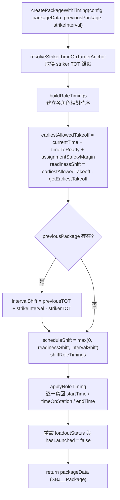
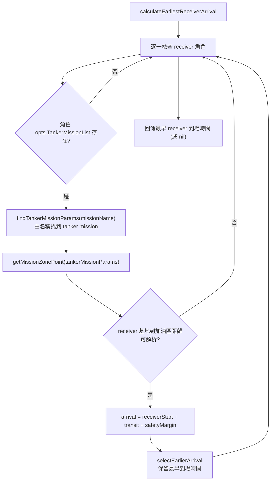

# packageTiming — Package 時序計算

> 原始碼：`src/modules/strikePlanner/packageTiming.lua`

**職責**：將單一 `SBJ__PackageTemplate` 依飛行時間、支援角色戰術提前量與 `strikeInterval`，計算出所有角色的 `startTime` / `timeOnStation` / `endTime`，並補齊 `loadoutStatus` 與 `hasLaunched`，就地轉為可執行的 `SBJ__Package`。

---

## 概述

`packageTiming` 是 [atoBuilder](atoBuilder.md) 動態 ATO 生成流程中的時序計算層。它從 `atoBuilder` 的機隊驗證流程被抽離出來，讓 `atoBuilder` 專注於目標評估、機隊資源驗證與 Wave 組裝，而把「飛行時間估算」與「任務時序排定」這段認知負荷最高的邏輯獨立成單一模組。

模組只暴露一個 public API：`createPackageWithTiming()`。它不讀寫 `saveData`，也不建立 CMO mission，僅就地改寫傳入的 `packageData`。所有時間資料都以 `constants.DATE_FORMAT`（UTC）字串寫回各角色 descriptor；`timeOnStation` 是寫入 CMO 的權威到站時間，`startTime` 則是內部保守預估的起飛時間。

計算分成三個階段：先以 striker 的 Time-on-Target（TOT）為錨點建立所有角色的相對時序；再以掛載就緒時間與前一個有效 package 的間隔約束整組向後平移；最後把計算出的時間戳格式化寫回 descriptor。空中加油機（tanker）的到站時間會反推自其受油機（receiver）抵達加油區的最早時間，因此支援跨角色的多任務加油協調。

---

## 主要機制

### 整體流程



---

### striker TOT 錨點解析

所有角色時序都以 striker 的 Time-on-Target 為基準。`resolveStrikerTimeOnTargetAnchor()` 依 striker descriptor 的排程模式決定錨點：

| 模式 | 條件 | TOT 錨點 |
|---|---|---|
| TOS 模式 | `striker.timeOnStation` 存在 | `parse(striker.timeOnStation)` |
| TakeOffTime 模式 | 僅 `striker.startTime` 存在 | `parse(striker.startTime) + resolveRoleFlightTime(striker)` |
| 未排程 | 兩者皆無 | `ScenEdit_CurrentTime()` |

---

### 飛行時間估算

`resolveRoleFlightTime()` 依角色分派估算方式，並在資料缺失時 fallback 到設定值，最後一律加上 `flightTimeSafetyMargin`：

```text
conservativeFlightTime = (estimated or fallback) + flightTimeSafetyMargin
```

| 角色 | 估算函式 | 估算方式 | fallback |
|---|---|---|---|
| `striker` | `estimateStrikerFlightTime` | striker 基地到第一個 target 的距離扣除 `weaponDBID` 對地最大射程 | `unresolvedFlightTime.striker` |
| 其他角色 | `estimateSupportRoleFlightTime` | 角色基地到任務區的最長航程 | `unresolvedFlightTime.support` |

任務區座標由 `getMissionZonePoint()` 取得：先讀 `missionCreationParams.opts.PatrolZone`，不存在則用 `opts.Zone`，再以 `constants.SIDES.ENEMY` 從 CMO reference point 取第一個 zone 座標。多任務 tanker 會計算所有可解析 zone 的航程並採用**最長**飛行時間。距離換算時間時，`tanker` 使用 `cruiseSpeed.tanker`，其餘角色使用 `cruiseSpeed.combatAircraft`：

```text
flightTimeSeconds = ceil((distanceNm / speed) * 3600)
```

striker 估算若 `ScenEdit_QueryDB("weapon", weaponDBID)`、`ranges.land.max` 或 `Tool_Range()` 任一缺失或不可轉為 number，即回傳 `nil` 並套用 fallback。

---

### 角色相對時序

`buildRoleTimings()` 以 striker TOT 為錨點，逐一產生各角色時序。striker 的任務持續時間會依 package 是否含 tanker 切換：

```text
strikerDuration = packageData.tanker and missionDuration.tanker or missionDuration.standard
```

各角色的規劃到站時間（planned TOS）：

```text
striker                         : plannedTOS = strikerTOT
escort / wildWeasel / jammer    : plannedTOS = strikerTOT - supportLeadTime[role]
tanker                          : plannedTOS = earliestReceiverArrival - tankerSetupTime
                                  （無法解析時 fallback = strikerTOT - tankerUnresolvedArrivalLeadTime）
```

`buildRoleTiming()` 依 descriptor 排程模式決定實際時間欄位（`usesTakeoffTime = startTime ~= nil and timeOnStation == nil`）：

| 模式 | startTime | timeOnStation | endTime |
|---|---|---|---|
| TOS 模式 | `plannedTOS - flightTime` | `plannedTOS` | `plannedTOS + duration` |
| TakeOffTime 模式 | `parse(startTime)` | `nil` | `startTime + duration` |

---

### 加油機受油協調

tanker 到站時間反推自受油機抵達加油區的最早時間。`calculateEarliestReceiverArrival()` 掃描 `TANKER_RECEIVER_ROLES`（`striker`、`escort`、`wildWeasel`、`jammer`），對每個有設定 `missionCreationParams.opts.TankerMissionList` 的角色：



受油機到加油區的 transit 時間以該 receiver 角色的巡航速度換算，並加上 `flightTimeSafetyMargin`。若所有 receiver 或加油區皆無法解析，`calculateEarliestReceiverArrival()` 回傳 `nil`，tanker TOS 改用 `strikerTOT - tankerUnresolvedArrivalLeadTime` fallback。

---

### 時程平移約束

各角色的相對時序建立後，整組會依兩個約束向後平移：

```text
readinessShift = (currentTime + timeToReady + assignmentSafetyMargin) - getEarliestTakeoff(roleTimings)
intervalShift  = previousPackage 存在時 : inferStrikerTimeOnTarget(previous) + strikeInterval - strikerTOT
                 previousPackage 不存在時 : 0

scheduleShift = max(0, readinessShift, intervalShift)
```

`shiftRoleTimings()` 只在 `scheduleShift > 0` 時對每個角色的 `startTime`、`endTime` 與（若存在）`timeOnStation` 一致加上位移，確保角色間相對關係不變。`readinessShift` 保證最早起飛不早於掛載就緒與 assign 安全裕度；`intervalShift` 保證本 package 的 striker TOT 至少落在前一個有效 package 之後 `strikeInterval` 秒。前一包若為 TakeOffTime 模式，其 TOT 由起飛時間加航程反推。

---

### 輸出寫回

`applyRoleTiming()` 依 `PACKAGE_ROLES` 逐一把計算出的時間戳格式化寫回 descriptor：

- `startTime` / `endTime`：以 `os.date(constants.DATE_FORMAT, ...)` 寫入 UTC 字串。
- `timeOnStation`：TOS 模式寫入 UTC 字串；TakeOffTime 模式清為 `nil`。

最後重設 `packageData.loadoutStatus`（`isLoadoutInitiated = false`，其餘欄位為 `nil`）與 `packageData.hasLaunched = false`，並回傳同一個（已轉為 `SBJ__Package`）表。

---

## 狀態與副作用

模組不持有狀態，也不讀寫 `saveData`，僅就地改寫傳入的 `packageData`：

| 對象 | 行為 |
|---|---|
| `packageData[role].startTime` / `.timeOnStation` / `.endTime` | 各角色時序以 UTC 字串寫回（`timeOnStation` 可能被清為 `nil`）。 |
| `packageData.loadoutStatus` | 重設為未初始化掛載狀態。 |
| `packageData.hasLaunched` | 設為 `false`。 |
| `GameApi.ScenEdit_CurrentTime` / `Tool_Range` / `ScenEdit_QueryDB` / `ScenEdit_GetReferencePoint` | 唯讀查詢，無 CMO 副作用。 |

---

## local constants

| 名稱 | 內容 | 用途 |
|---|---|---|
| `PACKAGE_ROLES` | `striker`、`escort`、`wildWeasel`、`jammer`、`tanker` | `applyRoleTiming` 寫回時序時的角色列舉順序。 |
| `TANKER_RECEIVER_ROLES` | `striker`、`escort`、`wildWeasel`、`jammer` | 計算受油機到加油區最早到場時間的掃描範圍。 |

---

## config 與 constants 參考

| 類型 | 路徑 | 使用方式 |
|---|---|---|
| `config` | `config.c.air.timing.cruiseSpeed.tanker` / `.combatAircraft` | 距離換算飛行時間的巡航速度。 |
| `config` | `config.c.air.timing.flightTimeSafetyMargin` | 每段估算航程額外加上的安全裕度。 |
| `config` | `config.c.air.timing.unresolvedFlightTime.striker` / `.support` | 無法估算航程時的 fallback 飛行時間。 |
| `config` | `config.c.air.timing.supportLeadTime.{escort,wildWeasel,jammer}` | 支援角色提前抵達作戰區的時間。 |
| `config` | `config.c.air.timing.tankerSetupTime` | tanker 需在受油機到場前就位的提前量。 |
| `config` | `config.c.air.timing.tankerUnresolvedArrivalLeadTime` | 無法解析受油機到場時，tanker 相對 striker TOT 的 fallback 提前量。 |
| `config` | `config.c.air.timing.missionDuration.standard` / `.tanker` | 一般角色與 tanker（含含 tanker 之 striker）的任務持續時間。 |
| `config` | `config.c.air.timing.assignmentSafetyMargin` | 掛載就緒後計算最早允許起飛的安全裕度。 |
| `constants` | `constants.SIDES.ENEMY` | 讀取角色任務區 reference point 的 China side 名稱。 |
| `constants` | `constants.DATE_FORMAT` | 時間戳寫回 descriptor 時的 UTC 格式字串。 |

---

## 相依模組

| 模組 | 用途 |
|---|---|
| `src.utils.gameApi` | 取得目前時間、reference point、weapon DB 查詢與距離計算。 |
| `src.utils.utils` | UTC datetime 字串轉 timestamp。 |
| `src.modules.strikePlanner.tankerMission` | 正規化 tanker `missionCreationParams`，供多任務加油機航程與受油協調使用。 |
| `src.core.constants` | 提供 side name 與 UTC 日期格式。 |

---

## Public API

| 函數 | 參數 | 回傳 | 說明 |
|---|---|---|---|
| `PackageTiming.createPackageWithTiming(config, packageData, previousPackage, strikeInterval)` | `SBJ__Config`, `SBJ__PackageTemplate`, `SBJ__Package \| nil`, `integer` | `SBJ__Package` | 就地計算 package 內所有角色時序、補齊 `loadoutStatus` 與 `hasLaunched`，回傳同一個轉為執行態的 package。 |

### 呼叫者與觸發方式

| 呼叫者 | 觸發 |
|---|---|
| [atoBuilder](atoBuilder.md) 的 `buildExecutablePackages()` | 每個通過目標門檻與機隊驗證的 package，會以前一個有效 package 為時序基準呼叫本 API。 |

---

## 相關模組

- [atoBuilder](atoBuilder.md) — 動態 ATO Wave 生成，機隊驗證後委派本模組計算時序。
- [airTaskingOrder](airTaskingOrder.md) — 執行帶有本模組所排定時序的 ATO Wave。
- [dynamicState](dynamicState.md) — recon-triggered operation 狀態、命名與 generated operation 追蹤。
- [系統架構](README.md)
