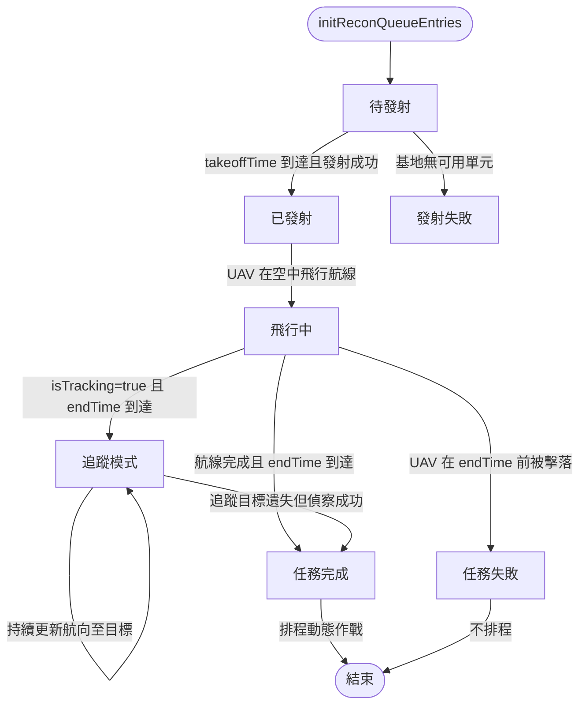
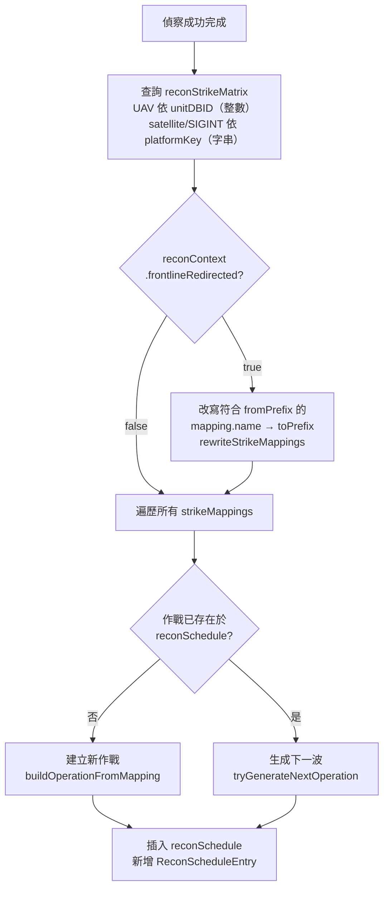
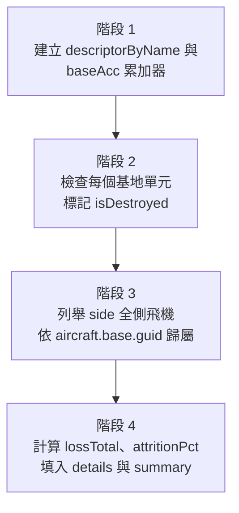
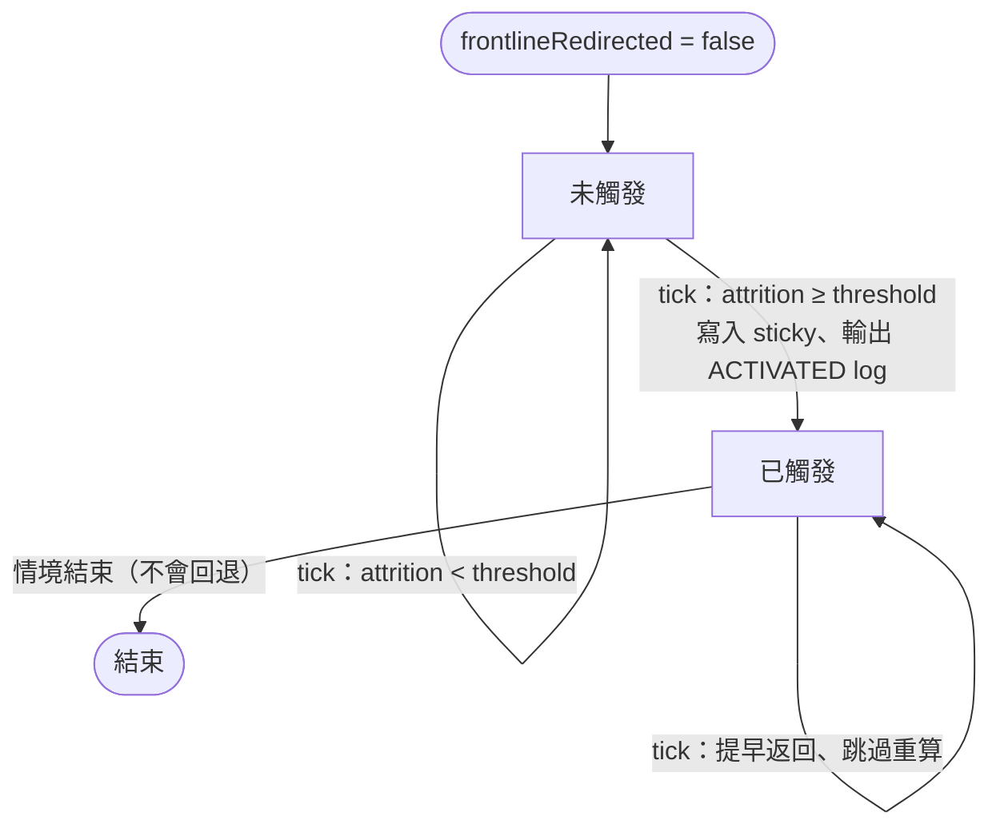
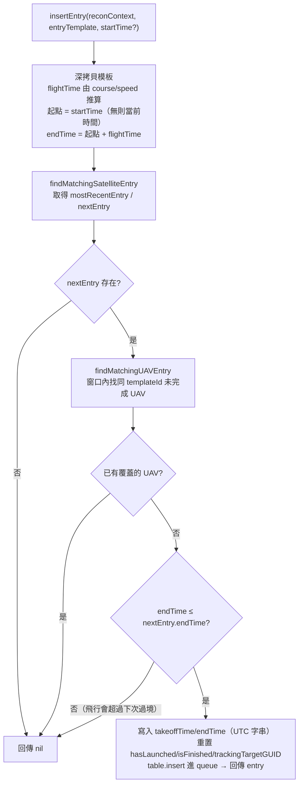

# recon — 偵察任務管理

> 原始碼：`src/modules/strikePlanner/recon.lua`

**職責**：UAV 發射、飛行監控、任務完成判定、動態作戰排程、目標追蹤、衛星間隙 UAV 動態插入、機場戰損總和、前線打擊包重導向

---

## 概述

recon 模組管理偵察佇列中所有 UAV 與衛星任務的完整生命週期。偵察成功完成後，會依照平台類型與 `reconStrikeMatrix` 配置，自動排程後續打擊作戰至 `reconSchedule`。

除了偵察生命週期外，模組也負責兩項與打擊規劃緊密相關的副功能：

- **機場戰損總和**（`Recon.calculateAirbaseAttrition`）：依 `deployedACs` 描述子彙整多個基地的駐機戰損，回報每個基地以及整體的損耗百分比。供本模組以及其他需要參考戰損數據的決策邏輯使用。
- **前線打擊包重導向**：當前線基地整體戰損達到門檻時，自動把 `STRIKE/AB/W/*` 等打擊任務名稱改寫為帶加油機編組的 `STRIKE/AB/W/AAR/*`，使後續排程改用較深內陸基地出擊。屬於 sticky 狀態（觸發後不回退），旗標寫入 `saveData.c.recon.frontlineRedirected`。

---

## 偵察佇列生命週期



---

## 支援的偵察類型

| 類型 | 處理函數 | 完成條件 | reconStrikeMatrix 索引鍵 |
|---|---|---|---|
| UAV | `processUAVEntry` | 航線完成 + endTime 到達（或 endTime 後被擊落） | `entry.unitDBID`（整數平台 DBID） |
| satellite | `processSatelliteEntry` | endTime 到達即完成 | `entry.platformKey`（語意字串，例如 `EOS`） |
| SIGINT | `processSatelliteEntry` | endTime 到達即完成 | `entry.platformKey`（語意字串，例如 `ELINT`） |

### UAV 處理階段

1. **發射階段**：`takeoffTime` 到達後從基地發射指定數量的 UAV
2. **飛行階段**：監控 UAV 航線進度與存活狀態
3. **完成判定**：
   - UAV 被擊落 → 若 endTime 已過視為成功，否則失敗
   - 航線完成且 endTime 到達 → 成功
4. **追蹤模式**：`isTracking=true` 時持續更新航向至 `trackingTargetGUID`

---

## WZ-8 偵察無人機發射

`Recon.launchWZ8` 從 H-6N 轟炸機發射超高速偵察無人機：

- 初始高度 20,574m、航向 180°、速度 3,300kts
- 自動掛載 WZ-8 雷達感測器（`constants.SENSORS.WZ8_RADAR`）
- 設定感測器弧段：PB1、PB2、SB1、SB2、SMF1、PMF2
- 設定 EMCON 為 Radar=Active
- H-6N 發射後自動 RTB

---

## 動態作戰排程

偵察任務成功完成後，`scheduleDynamicReconOperations` 依平台類型生成後續打擊作戰。當 sticky 旗標 `reconContext.frontlineRedirected` 為 true 時，會在進入主迴圈前先依 `frontlineRedirect.mappings` 改寫對應 mapping 的名稱（先深拷貝再改寫，避免動到共用的 config 結構）。



### 特殊規則

- `STRIKE/AB/E/1`（LACM 打擊）：僅在 `LACMContext.enabled` 時生成
- `STRIKE/INFRASTRUCTURE/*`（SRBM 重點打擊）：當 `fireSupportOnHold = true` 時整批跳過並輸出 `[HOLD]` 日誌；該旗標由 [landingOps/coordinator](../landingOps/coordinator.md) 依 SRBM 彈藥水平與各區域到位狀況維護
- 矩陣未命中：`findStrikeMappingsForEntry` 找不到對應映射時輸出 `[SKIP] No strike mappings for <type> key=<key>` 日誌
- 下一波生成：呼叫 `DynamicOperationsUtils.generateNextOperation` 遞增模板編號
- 下一波重複檢查（`tryGenerateNextOperation`）：當回傳狀態為 `FOUND_NEXT` 且 `DynamicOperationsUtils.hasPendingOperation` 顯示同名 `/N+1` 已在 `reconSchedule` 中待執行時，整筆跳過並輸出 `[SKIP] <name> already pending`。否則同一個 `/N+1` 會在稍後另一次偵察完成時被再次排入，導致打擊包翻倍。`REUSED_CURRENT`（無下一波模板、重用已執行的 `/N`）則刻意保留，不套用這道檢查
- 命名互不衝突：`STRIKE/AB/W/N` 與 `STRIKE/AB/W/AAR/N` 在 `findPrefixMatch` 不會互相誤匹配（後者的 `AAR/N` 無法轉成數字），所以重導向前後產生的下一波作戰各走各的序列，不會混到一起

---

## 機場戰損總和（calculateAirbaseAttrition）

`Recon.calculateAirbaseAttrition(deployments, baseNames, side?)` 對指定的基地清單盤點駐機戰損，回傳 `SBJ__AirbaseAttritionSummary`。

### 戰力定義

> 戰力 = 飛機 + 地勤
>
> 飛機被視為可作戰，當且僅當「飛機本身存活」**且**「母基地存活」。因此：

| 情境 | 計入 currentTotal | 說明 |
|---|---|---|
| 飛機在地、母基地存活 | ✅ | 標準狀態 |
| 飛機在空（出任務）、母基地存活 | ✅ | 依 `aircraft.base.guid` 歸屬 |
| 飛機在空、母基地被摧毀 | ❌ | 整聯隊視為失能（`isDestroyed=true`、`currentTotal=0`） |
| DBID 不在計畫內的駐機 | ❌ | 維持「計畫 vs 實況」語意 |

### 處理階段



### 回傳結構

```
SBJ__AirbaseAttritionSummary
├── queriedBaseNames: string[]   -- 查詢輸入（深拷貝）
├── expectedTotal: integer        -- 計畫總機數
├── currentTotal: integer         -- 現存可作戰總機數
├── lossTotal: integer            -- 損失總機數
├── attritionPct: number          -- 0-100，整體損耗百分比
├── bases: SBJ__AirbaseAttritionBaseSummary[]
│   └── { baseName, baseGUID, expectedTotal, currentTotal,
│          lossTotal, attritionPct, isDestroyed, details[] }
└── missingBases: string[]        -- 在 deployments 中找不到的 baseName
```

> ⚠️ `baseNames` 拼錯字會被默默歸入 `missingBases`，不會報錯，但會讓戰損率被低估。建議在啟動初始化階段額外加一道檢查。

---

## 前線打擊包重導向

當前線基地的整體戰損達到門檻時，把 `STRIKE/AB/W/*` 系列改寫為 `STRIKE/AB/W/AAR/*`，使後續打擊改由內陸基地出擊並搭配加油機（`AAR/E`）。



### 觸發時機

- 由 `Recon.handleReconQueue` 在每 tick 開頭呼叫 `shouldRedirectFrontlineStrike(config, reconContext)` 主動評估
- 即使佇列當下沒有 entry 處理，旗標也能即時翻轉，下次偵察完成時直接生效
- 旗標翻轉的當下 tick 會輸出一條 RECON log：`Frontline strike redirect ACTIVATED: attrition=N.N%% (threshold=...)`

### Sticky 行為

- 一旦 `reconContext.frontlineRedirected = true`，`shouldRedirectFrontlineStrike` 走提早返回路徑，**不**重新呼叫 `calculateAirbaseAttrition`，避免每個 tick 都重新枚舉全 side 的單元
- 即使 attrition 後續回升（理論上不太可能），也不會回退到前線——符合「裝備一旦被打掉就不該回頭」的語意

### 改寫規則

`config.c.recon.frontlineRedirect.mappings` 是規則陣列，每條規則：

| 欄位 | 類型 | 說明 |
|---|---|---|
| `fromPrefix` | string | 比對 `mapping.name` 的字首 |
| `toPrefix` | string | 命中時用此字首替換 |
| `type` | `"air" \| "ground"` | 限定 mapping 類型 |

`rewriteStrikeMappings` 會先用 `Utils.deepCopy` 複製一份再改寫，避免動到 `config.c.recon.reconStrikeMatrix` 這份共用設定。

### 設計取捨

- **判定方式**：看整體戰損率（`attritionPct`），不分基地獨立判斷
- **狀態管理**：sticky—觸發後鎖定，整場情境不會再次評估
- **DBID 過濾**：未開啟，所有駐機（含運輸/SIGINT）都計入分母

---

## 目標追蹤

`Recon.trackTarget` 指派空中 UAV 持續追蹤特定目標（用於飛彈中途導引）：

1. 檢查目標是否已被其他 UAV 追蹤（`isTargetAlreadyTracked`）
2. 搜尋最近的可用 UAV（`findClosestUAV`，限距 1,000nm 內）
3. 在偵察佇列中找到對應項目（`findQueueEntryByUnitGUID`）
4. 標記追蹤任務（`assignTrackingMission`）

追蹤模式下，每次 tick 更新 UAV 航線至目標當前位置。

---

## 衛星間隙 UAV 動態插入（insertEntry）

`Recon.insertEntry(reconContext, entryTemplate, startTime?)` 從 UAV 模板動態建立一筆偵察 entry，用來填補兩次衛星過境之間的偵察空窗。只有當該空窗尚未被同模板的 UAV 覆蓋、且 UAV 的整段飛行能在下一次衛星過境前結束時，才會插入並回傳**該筆插入的 entry**；否則回傳 `nil`、不動佇列。

`startTime` 為選填的起算時間字串（datetime）：省略時以 `GameApi.ScenEdit_CurrentTime()` 的當前時間為錨點；提供時改以該時點起算 `takeoffTime` 與 `endTime`，讓呼叫端能把這筆偵察錨定在未來某個時點，而非一律從現在起飛。注意起點往後挪會推遲 `endTime`，原本剛好能塞進空窗的飛行可能因此被拒。

### 空窗界定

空窗以**衛星過境**為錨點（`findMatchingSatelliteEntry` 只看 `type == satellite` 的 entry）：

- `mostRecentEntry`：`endTime` 落在當前時間之前、且最接近現在的衛星 entry（窗口起點，可為 `nil` 代表起點不設限）
- `nextEntry`：`endTime` 落在當前時間之後、且最接近現在的衛星 entry（窗口終點）

> 動態插入的 UAV 與 SIGINT entry **不**參與錨點計算。否則先前插入的 UAV 會把邊界往後推，讓重複的 UAV 通過重複檢查再次插入。

### 重複檢查與時間窗

`findMatchingUAVEntry` 在窗口 `(mostRecentEntry.endTime, nextEntry.endTime]` 內，尋找同 `templateId` 且尚未完成（`isFinished == false`）的 UAV entry；其 `takeoffTime` 與 `endTime` 都必須落在窗口內才算覆蓋。



### 插入後寫入的欄位

插入成功時，會把推算出的時間與旗標寫回 entry，並把這筆 entry 回傳給呼叫端：

- `takeoffTime` = 起點時間、`endTime` = 起點時間 + `flightTime`（起點為 `startTime`，省略時為當前時間；皆以 `os.date("!...")` 轉成 UTC 字串）
- `hasLaunched = false`、`isFinished = false`、`trackingTargetGUID = nil`

> `entryTemplate.templateId` 必須與 `config.c.recon.template.*` 中對應模板一致；`findMatchingUAVEntry` 以 `templateId` 作為判斷是否重複的依據，`templateId == nil` 的模板無法用來比對是否重複。

---

## 公開 API

| 函數 | 說明 |
|---|---|
| `handleReconQueue(config, reconContext, reconSchedule, LACMContext, fireSupportOnHold)` | 處理偵察佇列；每次 tick 同時更新前線重導向 sticky 旗標，並把該 tick 的所有 RECON log 統一從此處輸出；`fireSupportOnHold=true` 時跳過 `STRIKE/INFRASTRUCTURE/*` 映射 |
| `launchWZ8(h6n, course)` | 從 H-6N 發射 WZ-8 偵察無人機 |
| `trackTarget(reconContext, units, UAVDBID, target)` | 指派 UAV 追蹤特定目標 |
| `insertEntry(reconContext, entryTemplate, startTime?)` | 在兩次衛星過境的空窗中動態插入一筆 UAV 偵察 entry，成功時回傳該筆 entry；同模板已覆蓋或飛行會超過下次過境時回傳 `nil` 不插入。`startTime` 省略時以當前時間為起算錨點 |
| `initReconQueueEntries(reconConfig, reconContext)` | 初始化偵察佇列項目（不重置 `frontlineRedirected`） |
| `calculateAirbaseAttrition(deployments, baseNames, side?)` | 彙整多個基地的駐機戰損，回傳每個基地與整體的 `SBJ__AirbaseAttritionSummary`；side 預設 `constants.SIDES.ENEMY` |

---

## config / saveData 參考

| 路徑 | 用途 |
|---|---|
| `config.c.recon.reconStrikeMatrix` | 偵察-打擊映射表（UAV 依平台 DBID、satellite/SIGINT 依 platformKey 索引） |
| `config.c.recon.queue` | 偵察佇列模板（被 `initReconQueueEntries` 深拷貝至 saveData） |
| `config.c.recon.template` | 偵察 entry 模板字典（如 `BZK005_RECON_1`）；每筆含 `templateId`，`insertEntry` 動態插入時用它判斷該模板是否已重複 |
| `config.c.recon.frontlineRedirect.enabled` | 是否啟用前線重導向機制 |
| `config.c.recon.frontlineRedirect.attritionThresholdPct` | 整體戰損達到此百分比即觸發改寫（0–100） |
| `config.c.recon.frontlineRedirect.frontlineBaseNames` | 監測的前線基地名稱清單（須與 `config.c.air.landBased.deployedACs[].name` 完全相符） |
| `config.c.recon.frontlineRedirect.mappings` | 改寫規則陣列（`fromPrefix`、`toPrefix`、`type`） |
| `config.c.air.landBased.deployedACs` | 機場部署描述子，提供 `calculateAirbaseAttrition` 的計畫基線 |
| `saveData.c.recon.enabled` | 偵察系統是否啟用 |
| `saveData.c.recon.queue` | 執行期偵察佇列（含 `hasLaunched` / `isFinished` / `unitGUID` 等狀態） |
| `saveData.c.recon.frontlineRedirected` | sticky 旗標；觸發後恆為 `true`，存檔保留 |
| `constants.PLATFORMS.WZ8` / `constants.LOADOUTS.WZ8_RECON` / `constants.SENSORS.WZ8_RADAR` | 發射 WZ-8 時用到的平台、掛載、感測器 DBID |
| `constants.BASES.LONGTIAN_AAB` | WZ-8 預設歸屬基地 |
| `constants.SIDES.ENEMY` | China side 名稱；`launchWZ8` 建立 WZ-8 時的所屬 side，亦為 `calculateAirbaseAttrition` 預設 side |
| `constants.UNIT_TYPES.AIRCRAFT` | 列舉某 side 飛機時所用的單元類型 |
| `constants.TAGS.RECON` / `constants.TAGS.DYNAMIC_OPERATIONS` | log tag |

---

## 相關模組

- [dynamicOperationsUtils](dynamicOperationsUtils.md) — 作戰搜尋（前綴/精確）、名稱生成、下一波生成
- [dynamicATOInsertion](dynamicATOInsertion.md) — 從 reconSchedule 取出 air operations 並插入 ATO
- [dynamicFireSupportPlan](dynamicFireSupportPlan.md) — 從 reconSchedule 取出 ground operations 並插入 FSEM
- [targetingProcess](targetingProcess.md) — 呼叫 `trackTarget` 進行偵察追蹤觸發
- [系統架構](README.md)
