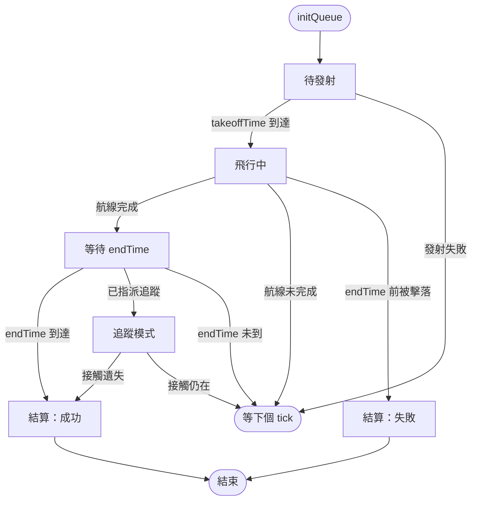
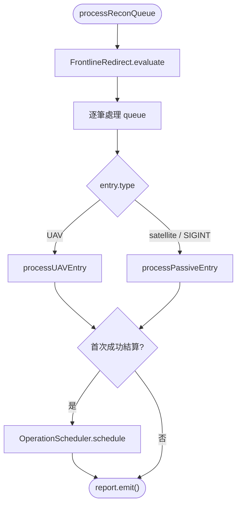
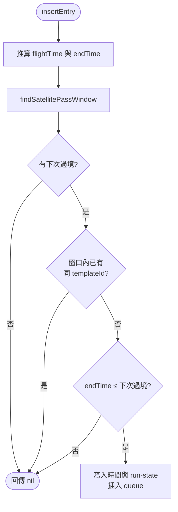

# recon — 偵察任務管理

> 原始碼：`src/modules/strikePlanner/recon.lua`

**職責**：UAV 發射、飛行監控、任務完成判定、目標追蹤、衛星間隙 UAV 動態插入，並協調偵察完成後的動態作戰排程

---

## 概述

recon 模組管理偵察佇列中所有 UAV、衛星與 SIGINT 任務的完整生命週期。偵察成功完成後，會委派 [operationScheduler](operationScheduler.md) 依照 `reconObjectiveId` 建立後續 `air` / `ground` operations。

除了偵察生命週期外，recon 只負責協調兩個拆分模組：

- 每個 tick 開頭呼叫 [frontlineRedirect](frontlineRedirect.md)，更新 `saveData.c.recon.frontlineRedirected` sticky 旗標。
- 偵察成功結算時呼叫 [operationScheduler](operationScheduler.md)，將完成的偵察 entry 轉成 `saveData.c.dynamicOperations.reconTriggeredOperationBatches` 批次。

[airbaseAttrition](airbaseAttrition.md) 是 `frontlineRedirect` 的下游統計工具，recon 不直接呼叫。

偵察 entry 有 template → plan → entry 三層形態，定義在 `src/core/schema.lua`（`SBJ__ReconUAVTemplate` / `SBJ__ReconUAVPlan` / `SBJ__ReconUAVEntry`，被動偵察對應 `SBJ__ReconPassivePlan` / `SBJ__ReconPassiveEntry`）。分界是 `SBJ__ReconRunState` 這個 mixin：`Recon.initQueue` 深拷貝 `config.c.recon.queue` 並補上 run-state 旗標，plan 就成為 entry。

---

## 偵察佇列生命週期

`NEXT` 表示這個 tick 不動作，下個 tick 從該 entry 當前所處階段重新判斷；發射失敗時 `hasLaunched` 仍為 `false`，會一直重試。`endTime` 之後才被擊落算成功（走 `FLYING → OK`，圖上未畫）。

`Recon.trackTarget` 可以把已結算的 entry 清掉 `isFinished` 拉回追蹤模式，那是 processQueue 之外的外部觸發，不在此圖流程內。

UAV 走 `processUAVEntry`（發射 → 飛行監控 → 完成判定 → 追蹤）；satellite 與 SIGINT 走 `processPassiveEntry`，沒有發射階段，`endTime` 到達即完成。三種類型都以 `reconObjectiveId` 索引後續打擊映射。

---

## 為什麼排程只發生一次

`settleReconMission` 用兩個旗標把關，職責不同：

| 旗標 | 語義 | 是否會被清除 |
|---|---|---|
| `isFinished` | 這筆偵察目前是否已結算 | **會**，`assignTrackingMission` 重新指派追蹤時清為 `false` |
| `hasScheduledOperations` | 是否已觸發過後續作戰排程 | 否，設起後恆為 `true` |

`isFinished` 單獨無法把關：`Recon.trackTarget` 會把已結算的 entry 拉回追蹤模式，之後若接觸遺失就再次結算。只看 `isFinished` 的話，**每次接觸遺失都會再排一波打擊、把 `/N` 波次計數往前推**，且可隨目標輪替無限重複。

任務失敗時不設 `hasScheduledOperations`，讓日後重新啟用並成功結算時仍能正常排程。

---

## 為什麼只有衛星能錨定插入空窗

`findSatellitePassWindow` 只掃 `type == "satellite"` 的 entry，動態插入的 UAV 與 SIGINT **不**參與錨點計算。否則先前插入的 UAV 會把窗口邊界往後推，讓重複的 UAV 通過去重檢查再次插入。

---

## 目標追蹤

`Recon.trackTarget` 指派空中 UAV 追蹤特定目標（用於飛彈中途導引）：先確認目標未被追蹤（`isTargetAlreadyTracked`），找出 1,000nm 內最近的空中同型機（`findClosestUAV`），在佇列中找到它的 entry（`findQueueEntryByUnitGUID`），然後指派（`assignTrackingMission`）。

> `isTargetAlreadyTracked` 必須排除 `isFinished == true` 的 entry。已結算的 entry 會被 `processUAVEntry` 直接跳過，若它殘留的 `trackingTargetGUID` 仍算數，該目標會被永久誤判為「已被追蹤」，再也不會指派新的 UAV。

`updateTrackingCourse` 把航線換成**單一航點**（目標最新已知位置）。因為只有一個航點，UAV 抵達後航線才清空，下個 tick 才會再更新 —— 實際行為是尾隨目標的舊位置，而非連續導引。

`trackingSpeed` 用於**發射機種與追蹤機種不同**的情況：`WZ8_RECON_ISLAND` 發射 H-6N（`speed` 供飛時推算），實際追蹤的是它釋放的 WZ-8。未設定時退回 `speed`。

---

## WZ-8 發射

`Recon.launchWZ8(h6n, course)` 從 H-6N 發射超高速偵察無人機：生成後掛載雷達感測器、指定歸屬基地、開啟 EMCON，全部成功才寫入 course 並讓 H-6N `RTB(true)`。

單位建立後的任一步驟失敗，都會呼叫 `abortWZ8Launch` 刪除該架 WZ-8 —— 沒有清理的話，一架沒有航線的無人機會以生成速度直線飛完整場劇本。

> `ScenEdit_SetUnit` 的回傳值**刻意不檢查**：它是 pass-through wrapper，成功時的回傳值不保證為 truthy，拿它當刪除條件可能誤刪一架正常的無人機。

發射後由事件腳本 `src/scripts/china/launchWZ8.lua` 把 entry 的 `unitGUID` 從 H-6N 換成 WZ-8，後續監控對象隨之改變。

---

## 拆分模組協調

`Recon.processQueue` 是偵察 tick 的協調入口，由 `StrikePlanner.processReconQueue` 轉交 `SBJ__ReconQueueProcessingContext`。

| 協調點 | recon 的責任 | 詳細文件 |
|---|---|---|
| 前線重導向 | 每 tick 呼叫 `FrontlineRedirect.evaluate`；若回傳 activation 欄位表，併上 `scope=frontlineRedirect` 後統一用 RECON log 輸出 | [frontlineRedirect](frontlineRedirect.md) |
| 偵察完成排程 | 首次成功結算時呼叫 `OperationScheduler.schedule`；失敗或重複結算時不排程 | [operationScheduler](operationScheduler.md) |
| 機場戰損統計 | 不直接呼叫；由 `frontlineRedirect` 使用 | [airbaseAttrition](airbaseAttrition.md) |

該 tick 所有 entry 的結果由 `LogFormat.report` 收集，每列補上 `entryType` 後統一 `emit()`；FAIL 與 ERROR 自動分流到 error sink。

---

## 衛星間隙 UAV 動態插入

`Recon.insertEntry` 從 UAV 模板動態建立一筆偵察 entry，填補兩次衛星過境之間的空窗。只有當空窗尚未被同 `templateId` 的未完成 UAV 覆蓋、且整段飛行能在下次衛星過境前結束時才插入。

窗口為 `(mostRecentEntry.endTime, nextEntry.endTime]`，候選 UAV 的 `takeoffTime` 與 `endTime` 都必須落在其中才算覆蓋。去重只看 `templateId`，course 內容不參與比對。

`startTime` 省略時以當前遊戲時間為錨點；提供時改以該時點起算，讓呼叫端能把偵察錨定在未來某個時點。注意起點往後挪會推遲 `endTime`，原本剛好能塞進空窗的飛行可能因此被拒。

---

## 公開 API

| 函數 | 說明 |
|---|---|
| `processQueue(processingContext)` | 處理偵察佇列；同時更新前線重導向 sticky 旗標，並把該 tick 的所有 RECON log 統一從此處輸出 |
| `launchWZ8(h6n, course)` | 從 H-6N 發射 WZ-8；建立後的任一步驟失敗會刪除該架無人機並回傳 `nil` |
| `trackTarget(reconContext, sideUnits, uavDBID, target)` | 指派最近的空中 UAV 追蹤目標；目標已被未結算的 entry 追蹤時直接回傳 `true` |
| `insertEntry(reconContext, entryTemplate, startTime?)` | 在衛星過境空窗中動態插入 UAV entry，成功時回傳該筆 entry，否則回傳 `nil` |
| `initQueue(reconConfig, reconContext)` | 把 `config.c.recon.queue` 的 plan 深拷貝並補上 run-state 旗標（不重置 `frontlineRedirected`） |

`processingContext`（`SBJ__ReconQueueProcessingContext`）欄位：

| 欄位 | 型別 | 用途 |
|---|---|---|
| `config` | `SBJ__Config` | 偵察設定、strike mappings 與後續任務模板 |
| `reconContext` | `SBJ__ReconContext` | 偵察 runtime 狀態與 `queue` |
| `reconTriggeredOperationBatches` | `SBJ__ReconTriggeredOperationBatch[]` | 已觸發的動態作戰批次，供 scheduler 去重與追加 |
| `LACMContext` | `SBJ__LACMContext` | 建立後續 LACM 任務時使用的狀態 |
| `fireSupportOnHold` | `boolean` | 為保存彈藥而暫停 SRBM-driven mappings 時設為 `true` |

---

## config / constants 參考

| 路徑 | 用途 |
|---|---|
| `config.c.recon.queue` | 偵察佇列 plan（被 `initQueue` 深拷貝為執行期 entry） |
| `config.c.recon.template` | UAV 模板字典（如 `BZK005_RECON_1`）；每筆的 `templateId` 是 `insertEntry` 去重的唯一依據 |
| `config.c.recon.template.*.trackingSpeed` | 追蹤機種與發射機種不同時的指定速度（如 `WZ8_RECON_ISLAND`） |
| `config.c.recon.strikeMappingsByReconObjective` | 偵察目標到打擊任務的映射表；由 `operationScheduler` 消費 |
| `config.c.recon.frontlineRedirect` | 前線重導向設定；由 `FrontlineRedirect.evaluate` 消費 |
| `constants.PLATFORMS.WZ8` / `constants.LOADOUTS.WZ8_RECON` / `constants.SENSORS.WZ8_RADAR` / `constants.SENSOR_ARCS` | 發射 WZ-8 的平台、掛載、感測器與弧段 |
| `constants.BASES.LONGTIAN_AAB` | WZ-8 預設歸屬基地 |
| `constants.SIDES.ENEMY` | China side 名稱；建立 WZ-8 與查詢接觸時使用 |
| `constants.DATE_FORMAT` | `insertEntry` 寫回時間欄位的 UTC 格式 |
| `constants.TAGS.RECON` | 偵察佇列處理、前線重導向 activation 與 WZ-8 發射失敗的 log tag |

模組層級常數（`MAX_TRACKING_DISTANCE_NM = 1000`、`WZ8_INITIAL_ALTITUDE / HEADING / SPEED`）定義在 `recon.lua` 開頭。

---

## 相關模組

- [operationScheduler](operationScheduler.md) — 偵察完成後建立 recon-triggered operations
- [frontlineRedirect](frontlineRedirect.md) — 前線基地戰損觸發與 strike mapping 改寫
- [airbaseAttrition](airbaseAttrition.md) — 多基地駐機戰損統計
- [atoBuilder](atoBuilder.md) — 從 reconTriggeredOperationBatches 取出 air operations 並插入 ATO
- [fsemBuilder](fsemBuilder.md) — 從 reconTriggeredOperationBatches 取出 ground operations 並插入 FSEM
- [targetingProcess](targetingProcess.md) — 呼叫 `trackTarget` 進行偵察追蹤觸發
- [系統架構](README.md)
