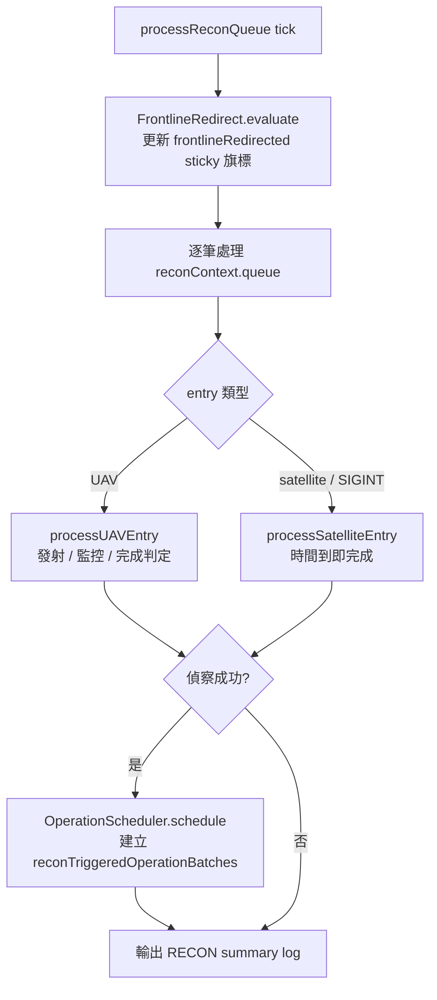
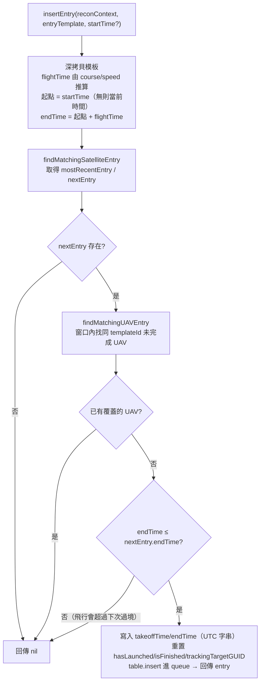

# recon — 偵察任務管理

> 原始碼：`src/modules/strikePlanner/recon.lua`

**職責**：UAV 發射、飛行監控、任務完成判定、目標追蹤、衛星間隙 UAV 動態插入，並協調偵察完成後的動態作戰排程

---

## 概述

recon 模組管理偵察佇列中所有 UAV 與衛星任務的完整生命週期。偵察成功完成後，會委派 [operationScheduler](operationScheduler.md) 依照 `reconObjectiveId` 建立後續 `air` / `ground` operations。

除了偵察生命週期外，recon 只負責協調兩個拆分模組：

- 每個 tick 開頭呼叫 [frontlineRedirect](frontlineRedirect.md)，更新 `saveData.c.recon.frontlineRedirected` sticky 旗標。
- 偵察成功結算時呼叫 [operationScheduler](operationScheduler.md)，將完成的偵察 entry 轉成 `saveData.c.dynamicOperations.reconTriggeredOperationBatches` 批次。

[airbaseAttrition](airbaseAttrition.md) 是 `frontlineRedirect` 的下游統計工具，recon 不直接呼叫。

---

## 偵察佇列生命週期

---

## 支援的偵察類型

| 類型 | 處理函數 | 完成條件 | 打擊映射索引 |
|---|---|---|---|
| UAV | `processUAVEntry` | 航線完成 + endTime 到達（或 endTime 後被擊落） | `entry.reconObjectiveId`；`templateId` 只用於 UAV 模板身分與動態插入去重 |
| satellite | `processSatelliteEntry` | endTime 到達即完成 | `entry.reconObjectiveId` |
| SIGINT | `processSatelliteEntry` | endTime 到達即完成 | `entry.reconObjectiveId` |

### UAV 處理階段

1. **發射階段**：`takeoffTime` 到達後從基地發射指定數量的 UAV
2. **飛行階段**：監控 UAV 航線進度與存活狀態
3. **完成判定**：
   - UAV 被擊落 → 若 endTime 已過視為成功，否則失敗
   - 航線完成且 endTime 到達 → 成功
4. **追蹤模式**：`isTracking=true` 時持續更新航向至 `trackingTargetGUID`

---

## WZ-8 偵察無人機發射

`Recon.launchWZ8` 從 H-6N 轟炸機發射超高速偵察無人機：

- 初始高度 20,574m、航向 180°、速度 3,300kts
- 自動掛載 WZ-8 雷達感測器（`constants.SENSORS.WZ8_RADAR`）
- 設定感測器弧段：PB1、PB2、SB1、SB2、SMF1、PMF2
- 設定 EMCON 為 Radar=Active
- H-6N 發射後自動 RTB

---

## 拆分模組協調

`Recon.processQueue` 是偵察 tick 的協調入口。`StrikePlanner.processReconQueue` 會把事件腳本組好的 `SBJ__ReconQueueProcessingContext` 轉交給它。它先評估前線重導向 sticky 旗標，再逐筆處理偵察佇列；只有偵察成功完成時，才把 entry 交給 scheduler 建立後續動態作戰。

| 協調點 | recon 的責任 | 詳細文件 |
|---|---|---|
| 前線重導向 | 每 tick 呼叫 `FrontlineRedirect.evaluate`；若回傳 activation message，統一用 RECON log 輸出 | [frontlineRedirect](frontlineRedirect.md) |
| 偵察完成排程 | 偵察成功時呼叫 `OperationScheduler.schedule`；失敗時不排程 | [operationScheduler](operationScheduler.md) |
| 機場戰損統計 | 不直接呼叫；由 `frontlineRedirect` 使用 | [airbaseAttrition](airbaseAttrition.md) |

---

## 目標追蹤

`Recon.trackTarget` 指派空中 UAV 持續追蹤特定目標（用於飛彈中途導引）：

1. 檢查目標是否已被其他 UAV 追蹤（`isTargetAlreadyTracked`）
2. 搜尋最近的可用 UAV（`findClosestUAV`，限距 1,000nm 內）
3. 在偵察佇列中找到對應項目（`findQueueEntryByUnitGUID`）
4. 標記追蹤任務（`assignTrackingMission`）

追蹤模式下，每次 tick 更新 UAV 航線至目標當前位置。

---

## 衛星間隙 UAV 動態插入（insertEntry）

`Recon.insertEntry(reconContext, entryTemplate, startTime?)` 從 UAV 模板動態建立一筆偵察 entry，用來填補兩次衛星過境之間的偵察空窗。只有當該空窗尚未被同模板的 UAV 覆蓋、且 UAV 的整段飛行能在下一次衛星過境前結束時，才會插入並回傳**該筆插入的 entry**；否則回傳 `nil`、不動佇列。

`startTime` 為選填的起算時間字串（datetime）：省略時以 `GameApi.ScenEdit_CurrentTime()` 的當前時間為錨點；提供時改以該時點起算 `takeoffTime` 與 `endTime`，讓呼叫端能把這筆偵察錨定在未來某個時點，而非一律從現在起飛。注意起點往後挪會推遲 `endTime`，原本剛好能塞進空窗的飛行可能因此被拒。

### 空窗界定

空窗以**衛星過境**為錨點（`findMatchingSatelliteEntry` 只看 `type == satellite` 的 entry）：

- `mostRecentEntry`：`endTime` 落在當前時間之前、且最接近現在的衛星 entry（窗口起點，可為 `nil` 代表起點不設限）
- `nextEntry`：`endTime` 落在當前時間之後、且最接近現在的衛星 entry（窗口終點）

> 動態插入的 UAV 與 SIGINT entry **不**參與錨點計算。否則先前插入的 UAV 會把邊界往後推，讓重複的 UAV 通過重複檢查再次插入。

### 重複檢查與時間窗

`findMatchingUAVEntry` 在窗口 `(mostRecentEntry.endTime, nextEntry.endTime]` 內，尋找同 `templateId` 且尚未完成（`isFinished == false`）的 UAV entry；其 `takeoffTime` 與 `endTime` 都必須落在窗口內才算覆蓋。

### 插入後寫入的欄位

插入成功時，會把推算出的時間與旗標寫回 entry，並把這筆 entry 回傳給呼叫端：

- `takeoffTime` = 起點時間、`endTime` = 起點時間 + `flightTime`（起點為 `startTime`，省略時為當前時間；皆以 `os.date("!...")` 轉成 UTC 字串）
- `hasLaunched = false`、`isFinished = false`、`trackingTargetGUID = nil`

> `entryTemplate.templateId` 必須與 `config.c.recon.template.*` 中對應模板一致；`findMatchingUAVEntry` 以 `templateId` 作為判斷是否重複的依據，`templateId == nil` 的模板無法用來比對是否重複。

---

## 公開 API

| 函數 | 說明 |
|---|---|
| `processQueue(processingContext)` | 處理偵察佇列；每次 tick 同時更新前線重導向 sticky 旗標，並把該 tick 的所有 RECON log 統一從此處輸出；偵察成功時透過 `processingContext` 把 `LACMContext` 與 `fireSupportOnHold` 轉交 scheduler |
| `launchWZ8(h6n, course)` | 從 H-6N 發射 WZ-8 偵察無人機 |
| `trackTarget(reconContext, units, UAVDBID, target)` | 指派 UAV 追蹤特定目標 |
| `insertEntry(reconContext, entryTemplate, startTime?)` | 在兩次衛星過境的空窗中動態插入一筆 UAV 偵察 entry，成功時回傳該筆 entry；同模板已覆蓋或飛行會超過下次過境時回傳 `nil` 不插入。`startTime` 省略時以當前時間為起算錨點 |
| `initReconQueueEntries(reconConfig, reconContext)` | 初始化偵察佇列項目（不重置 `frontlineRedirected`） |

`processQueue` 的公開參數使用 context table，呼叫端通常透過 `StrikePlanner.processReconQueue(processingContext)` 進入：

| 欄位 | 型別 | 用途 |
|---|---|---|
| `config` | `SBJ__Config` | 讀取偵察設定、strike mappings 與後續任務模板 |
| `reconContext` | `SBJ__ReconContext` | 偵察 runtime 狀態與 `queue` |
| `reconTriggeredOperationBatches` | `SBJ__ReconTriggeredOperationBatch[]` | 已由偵察觸發的動態作戰批次，供 scheduler 去重與追加 |
| `LACMContext` | `SBJ__LACMContext` | 建立後續 LACM 任務時使用的狀態 |
| `fireSupportOnHold` | `boolean` | 為保存彈藥而暫停 SRBM-driven mappings 時設為 `true` |

---

## config / saveData 參考

| 路徑 | 用途 |
|---|---|
| `config.c.recon.queue` | 偵察佇列模板（被 `initReconQueueEntries` 深拷貝至 saveData） |
| `config.c.recon.template` | 偵察 entry 模板字典（如 `BZK005_RECON_1`）；每筆含 `templateId`，`insertEntry` 動態插入時用它判斷該模板是否已重複 |
| `config.c.recon.strikeMappingsByReconObjective` | 偵察目標到打擊任務的映射表；由 `operationScheduler` 消費 |
| `config.c.recon.frontlineRedirect` | 前線重導向設定；由 `FrontlineRedirect.evaluate` 消費 |
| `saveData.c.recon.enabled` | 偵察系統是否啟用 |
| `saveData.c.recon.queue` | 執行期偵察佇列（含 `hasLaunched` / `isFinished` / `unitGUID` 等狀態） |
| `saveData.c.recon.frontlineRedirected` | sticky 旗標；觸發後恆為 `true`，存檔保留 |
| `saveData.c.dynamicOperations.reconTriggeredOperationBatches` | 偵察成功後由 scheduler 寫入的動態作戰批次；recon 只負責傳入 |
| `constants.PLATFORMS.WZ8` / `constants.LOADOUTS.WZ8_RECON` / `constants.SENSORS.WZ8_RADAR` | 發射 WZ-8 時用到的平台、掛載、感測器 DBID |
| `constants.BASES.LONGTIAN_AAB` | WZ-8 預設歸屬基地 |
| `constants.SIDES.ENEMY` | China side 名稱；`launchWZ8` 建立 WZ-8 時使用 |
| `constants.TAGS.RECON` | 偵察佇列處理與前線重導向 activation log tag |

---

## 相關模組

- [operationScheduler](operationScheduler.md) — 偵察完成後建立 recon-triggered operations
- [frontlineRedirect](frontlineRedirect.md) — 前線基地戰損觸發與 strike mapping 改寫
- [airbaseAttrition](airbaseAttrition.md) — 多基地駐機戰損統計
- [atoBuilder](atoBuilder.md) — 從 reconTriggeredOperationBatches 取出 air operations 並插入 ATO
- [fsemBuilder](fsemBuilder.md) — 從 reconTriggeredOperationBatches 取出 ground operations 並插入 FSEM
- [targetingProcess](targetingProcess.md) — 呼叫 `trackTarget` 進行偵察追蹤觸發
- [系統架構](README.md)
