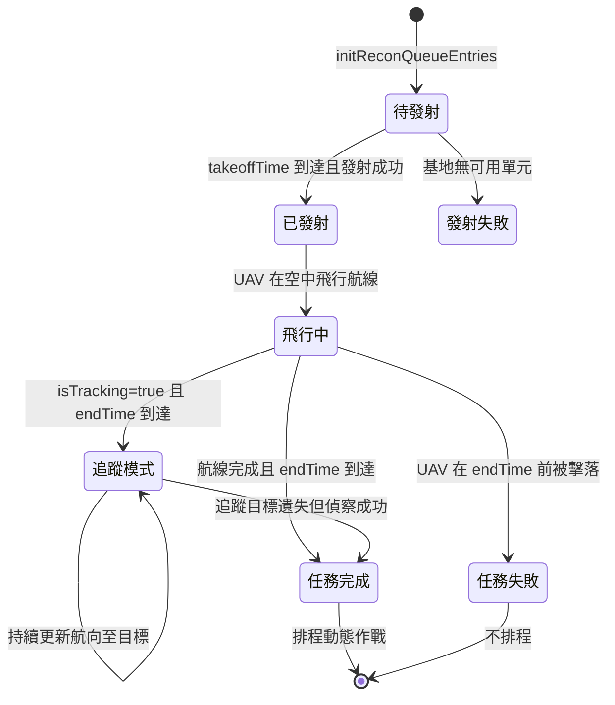
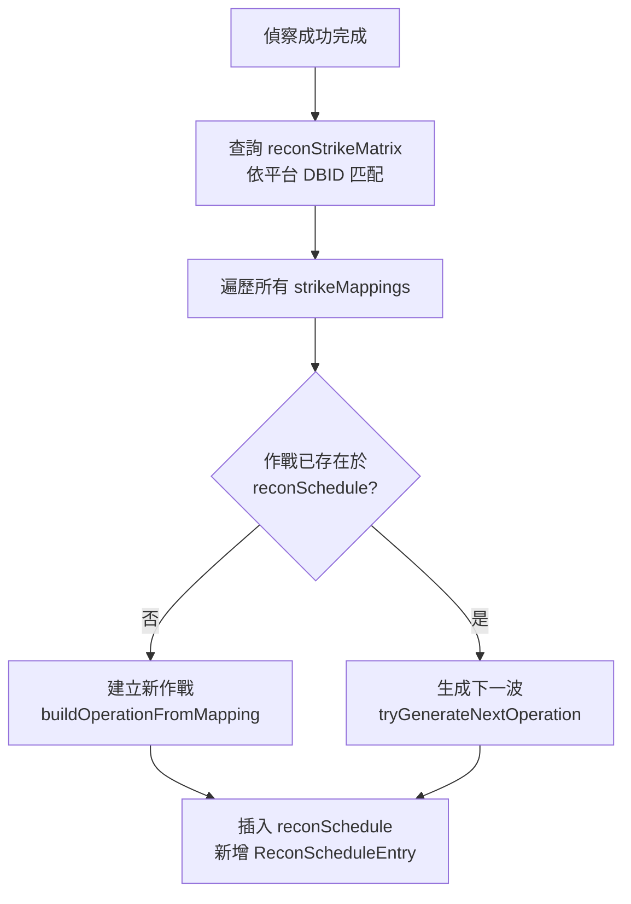

# recon — 偵察任務管理

> 原始碼：`src/modules/strikePlanner/recon.lua`

**職責**：UAV 發射、飛行監控、任務完成判定、動態作戰排程、目標追蹤

---

## 概述

recon 模組管理偵察佇列中所有 UAV 與衛星任務的完整生命週期。偵察成功完成後，會根據平台類型與 `reconStrikeMatrix` 配置，自動排程後續打擊作戰至 `reconSchedule`。

---

## 偵察佇列生命週期

---

## 支援的偵察類型

| 類型 | 處理函數 | 完成條件 |
|---|---|---|
| UAV | `processUAVEntry` | 航線完成 + endTime 到達（或 endTime 後被擊落） |
| satellite | `processSatelliteEntry` | endTime 到達即完成 |

### UAV 處理階段

1. **發射階段**：`takeoffTime` 到達後從基地發射指定數量的 UAV
2. **飛行階段**：監控 UAV 航線進度與存活狀態
3. **完成判定**：
   - UAV 被擊落 → 若 endTime 已過視為成功，否則失敗
   - 航線完成且 endTime 到達 → 成功
4. **追蹤模式**：`isTracking=true` 時持續更新航向至 `trackingTargetGUID`

---

## WZ-8 偵察無人機發射

`Recon.launchWZ8` 從 H-6N 轟炸機發射超高速偵察無人機：

- 初始高度 20,574m、航向 180°、速度 3,300kts
- 自動掛載 WZ-8 雷達感測器（`constants.SENSORS.WZ8_RADAR`）
- 設定感測器弧段：PB1、PB2、SB1、SB2、SMF1、PMF2
- 設定 EMCON 為 Radar=Active
- H-6N 發射後自動 RTB

---

## 動態作戰排程

偵察任務成功完成後，`scheduleDynamicReconOperations` 根據平台類型生成後續打擊作戰：

### 特殊規則

- `STRIKE/AB/E/1`（LACM 打擊）：僅在 `LACMContext.enabled` 時生成
- 下一波生成：呼叫 `DynamicOperationsUtils.generateNextOperation` 遞增模板編號

---

## 目標追蹤

`Recon.trackTarget` 指派空中 UAV 持續追蹤特定目標（用於飛彈中途導引）：

1. 檢查目標是否已被其他 UAV 追蹤（`isTargetAlreadyTracked`）
2. 搜尋最近的可用 UAV（`findClosestUAV`，限距 1,000nm 內）
3. 在偵察佇列中找到對應項目（`findQueueEntryByUnitGUID`）
4. 標記追蹤任務（`assignTrackingMission`）

追蹤模式下，每次 tick 更新 UAV 航線至目標當前位置。

---

## 公開 API

| 函數 | 說明 |
|---|---|
| `handleReconQueue(config, reconContext, reconSchedule, LACMContext)` | 處理偵察佇列，管理完整 UAV/衛星生命週期 |
| `launchWZ8(h6n, course)` | 從 H-6N 發射 WZ-8 偵察無人機 |
| `trackTarget(reconContext, units, UAVDBID, target)` | 指派 UAV 追蹤特定目標 |
| `initReconQueueEntries(reconConfig, reconContext)` | 初始化偵察佇列項目 |

---

## 相關模組

- [dynamicOperationsUtils](dynamicOperationsUtils.md) — 作戰搜尋、名稱生成、下一波生成
- [targetingProcess](targetingProcess.md) — 呼叫 `trackTarget` 進行偵察追蹤觸發
- [系統架構](README.md)
